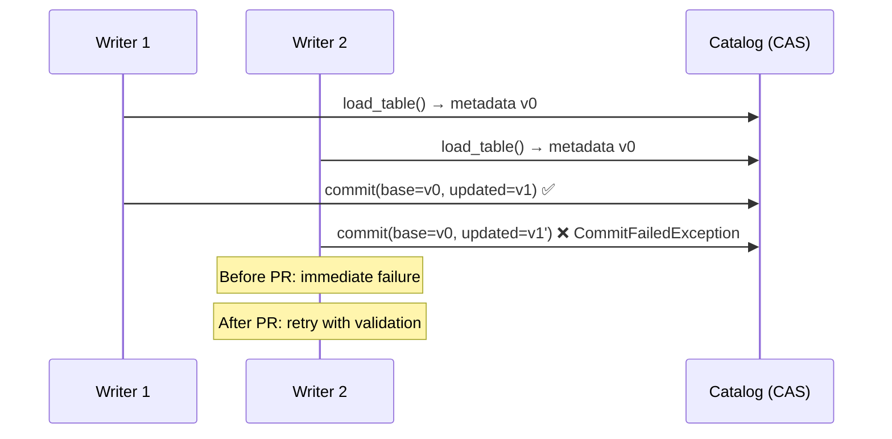
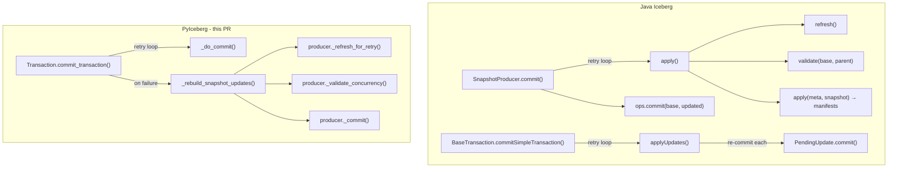
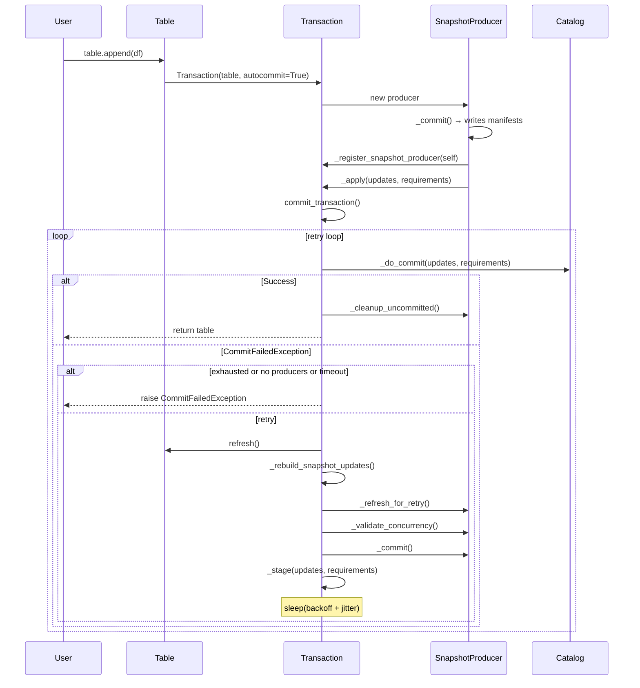

# PR #3320 Review: Add Commit Retry and Concurrency Validation for Writes

**Reviewer:** Jared Yu
**PR:** [#3320](https://github.com/apache/iceberg-python/pull/3320) by @lawofcycles
**Issue:** [#3319](https://github.com/apache/iceberg-python/issues/3319)
**Also closes:** #819, #269
**Branch under review:** `feat/commit-retry-and-validation`
**Date:** 2026-05-13

---

## 1. Executive Summary

PR #3320 adds **automatic commit retry with exponential backoff** and **data conflict validation** to PyIceberg's write path. This is the single most critical infrastructure gap in PyIceberg's maintenance subsystem — without it, no write operation is production-safe under concurrent load.

**Verdict: Architecturally sound, correctly positioned, with a few design divergences from Java that are well-justified by PyIceberg's structural differences.**

This PR is **Phase 0** of the pyiceberg maintenance roadmap — every subsequent phase (RewriteFiles, file cleanup, compaction actions) depends on the retry infrastructure introduced here.

---

## 2. Architectural Context: Why This PR Matters

### 2.1 The Fundamental Problem



Without retry, PyIceberg's success rate under concurrency degrades linearly: N concurrent writers → only 1/N succeeds. The PR's benchmarks confirm this: 8 workers → 12.5% success → 100% with retry.

### 2.2 Where Retry Lives: Java vs PyIceberg



**Key Design Decision:** Java has retry in *two* places — `SnapshotProducer.commit()` (per-producer) and `BaseTransaction.commitSimpleTransaction()` (per-transaction). PyIceberg places retry **only** in `Transaction.commit_transaction()`. This is correct because PyIceberg's `Transaction.delete()` uses two producers (`_DeleteFiles` + `_OverwriteFiles`) that must be committed atomically. Retrying at the producer level would break this atomicity.

---

## 3. Code Analysis: File-by-File

### 3.1 Transaction Retry Loop — `commit_transaction()` (lines 971–1025)

The retry loop follows Java's `Tasks.foreach().retry().exponentialBackoff()` pattern:

| Aspect | Java (`BaseTransaction`) | PyIceberg (this PR) | Assessment |
|--------|-------------------------|-------------------|------------|
| Retry trigger | `CommitFailedException` | `CommitFailedException` | ✅ Identical |
| Backoff | `exponentialBackoff(min, max, total, 2.0)` | `min * 2^attempt` capped at max, with jitter | ✅ Equivalent |
| Total timeout | `COMMIT_TOTAL_RETRY_TIME_MS` | `COMMIT_TOTAL_RETRY_TIME_MS` | ✅ Matches |
| Re-apply logic | `applyUpdates()` re-commits each `PendingUpdate` | `_rebuild_snapshot_updates()` re-executes each producer | ✅ Equivalent |
| Skip retry when no producers | N/A (always has updates) | `not self._snapshot_producers` → raise immediately | ✅ Good optimization |
| Cleanup after success | Deletes uncommitted manifests via `committedFiles` diff | `_cleanup_uncommitted_manifests()` | ✅ Simplified but correct |

**Jitter implementation** (line 1016): `jitter = random.uniform(0, 0.25 * wait)` — adds 0–25% jitter. Java uses a fixed 2.0 exponential factor without explicit jitter (handled by `Tasks` internals). The explicit jitter here is a reasonable adaptation.

**Property reading** (lines 981–998): Correctly reads from `self._table.metadata.properties` (the *committed* metadata, not the transaction-local view). This matches Java's `base.propertyAsInt(...)`.

### 3.2 `_rebuild_snapshot_updates()` (lines 1032–1043)

```python
self._updates = tuple(u for u in self._updates if not isinstance(u, (AddSnapshotUpdate, SetSnapshotRefUpdate)))
self._requirements = tuple(r for r in self._requirements if not isinstance(r, (AssertRefSnapshotId, AssertTableUUID)))
```

This correctly strips snapshot-specific updates/requirements while preserving non-snapshot updates (e.g., `SetPropertiesUpdate`). Then re-executes each producer in registration order.

**Comparison to Java:** Java's `applyUpdates()` (line 443–458 of BaseTransaction.java) does a full reset: `this.current = underlyingOps.current()` then re-commits every `PendingUpdate`. PyIceberg's approach is more surgical — it only strips snapshot updates and re-derives them. Both are correct; PyIceberg's approach avoids re-executing schema/property changes.

### 3.3 Producer Lifecycle — `_SnapshotProducer._refresh_for_retry()` (lines 381–390)

**Critical correctness property:** `_added_data_files` and `_deleted_data_files` are **NOT** reset. This is correct — data files written to storage are content-addressed and reusable across retry attempts. Only manifests (which encode snapshot IDs and parent references) need regeneration. This is the key insight that makes internal retry 1.3–1.8x faster than user-side retry (per the PR benchmarks).

**Comparison to Java:** Java's `SnapshotProducer.apply()` (line 272) is called fresh each retry, but the data files added via `add(DataFile)` persist in `MergingSnapshotProducer`'s internal state across calls. Same pattern.

### 3.4 `_DeleteFiles._refresh_for_retry()` (lines 535–541)

Correctly clears the `@cached_property` `_compute_deletes` by removing it from the instance dict. `_compute_deletes` depends on `_parent_snapshot_id` which changes on retry. Python-idiomatic cache invalidation.

### 3.5 Validation: `_validate_concurrency()` in `_DeleteFiles` and `_OverwriteFiles`

Both implementations follow the same structure matching Java's `BaseOverwriteFiles.validate()`:

| Check | Java | PyIceberg | Match? |
|-------|------|-----------|--------|
| Added data files (serializable) | `validateAddedDataFiles(base, startingSnapshotId, filter, parent)` | `_validate_added_data_files(table, parent_snapshot, filter, parent_snapshot)` | ⚠️ See below |
| No new delete files | `validateNoNewDeleteFiles(base, startingSnapshotId, filter, parent)` | `_validate_no_new_delete_files(table, parent_snapshot, filter, None, parent_snapshot)` | ✅ |
| Deleted data files | `validateDeletedDataFiles(base, startingSnapshotId, filter, parent)` | `_validate_deleted_data_files(table, parent_snapshot, filter, parent_snapshot)` | ✅ |
| No new deletes for data files | `validateNoNewDeletesForDataFiles(...)` | `_validate_no_new_deletes_for_data_files(...)` | ✅ |
| Skip when `rowFilter == AlwaysFalse()` | Yes (line 168) | Yes (`conflict_detection_filter is None`) | ✅ |

**`startingSnapshotId` vs `parent_snapshot` note:** Java passes `startingSnapshotId` (set explicitly via `validateFromSnapshot()`), while PyIceberg passes `parent_snapshot` (the current branch head). In the retry context, `parent_snapshot` IS the refreshed branch head, which is the correct starting point. The semantics are equivalent for the retry use case.

**Intentional duplication note:** The comment at line 546–549 explains why `_validate_concurrency()` is duplicated between `_DeleteFiles` and `_OverwriteFiles` rather than extracted to the base class. Java's `BaseOverwriteFiles` and `BaseRowDelta` have divergent validation. Keeping them separate enables future `RowDelta`-specific validation without refactoring. This is forward-thinking.

### 3.6 Isolation Level Routing

The PR introduces `_isolation_level_property` on `_SnapshotProducer` (line 144), defaulting to `WRITE_DELETE_ISOLATION_LEVEL`. When called from `Transaction.overwrite()`, it overrides with `WRITE_UPDATE_ISOLATION_LEVEL`. This matches Java Spark's behavior:

| PyIceberg API | Isolation Property | Matches Java? |
|--------------|-------------------|--------------|
| `table.delete("x == 1")` | `write.delete.isolation-level` | ✅ |
| `table.overwrite(df, "x > 0")` | `write.update.isolation-level` | ✅ |

### 3.7 Table Properties — All Match Java Defaults

| Property | Default | Java Default | Match? |
|----------|---------|-------------|--------|
| `commit.retry.num-retries` | 4 | 4 | ✅ |
| `commit.retry.min-wait-ms` | 100 | 100 | ✅ |
| `commit.retry.max-wait-ms` | 60000 | 60000 | ✅ |
| `commit.retry.total-timeout-ms` | 1800000 | 1800000 | ✅ |

---

## 4. Test Coverage Assessment

The test file (`test_commit_retry.py`, 559 lines, 17 tests) covers:

| Scenario | Test | Validates |
|----------|------|-----------|
| Concurrent appends | `test_commit_retry_on_commit_failed` | Retry succeeds, data integrity |
| Property-only tx | `test_no_retry_without_snapshot_producers` | No retry attempted |
| Mixed updates | `test_rebuild_snapshot_updates_preserves_non_snapshot_updates` | Property changes survive retry |
| Producer state reset | `test_refresh_for_retry_resets_producer_state` | Snapshot ID, UUID reset |
| Delete vs delete | `test_concurrent_delete_delete_raises_validation_exception` | ValidationException |
| Append vs delete (serializable) | `test_concurrent_append_delete_raises_validation_exception` | ValidationException |
| Delete vs append | `test_concurrent_delete_append_retries_successfully` | Retry succeeds |
| Retry exhaustion | `test_retry_exhaustion_raises_commit_failed` | CommitFailedException propagated |
| Cache invalidation | `test_delete_files_refresh_clears_compute_deletes_cache` | `_compute_deletes` cleared |
| Overwrite vs overwrite | `test_concurrent_overwrite_overwrite_raises_validation_exception` | ValidationException |
| Overwrite vs append | `test_concurrent_overwrite_append_retries_successfully` | Retry succeeds |
| Snapshot isolation | `test_snapshot_isolation_allows_concurrent_append_delete` | No ValidationException |
| Manifest tracking | `test_uncommitted_manifests_tracked_correctly` | Uncommitted manifests populated |
| Partition-level full delete | `test_concurrent_deletes_on_different_partitions_succeed` | Non-overlapping succeeds |
| Partition-level CoW | `test_concurrent_partial_deletes_on_different_partitions_succeed` | Non-overlapping CoW succeeds |
| Isolation routing | `test_overwrite_uses_update_isolation_level` | Correct property read |
| Serializable overwrite | `test_overwrite_with_serializable_update_isolation_raises` | ValidationException |

**Assessment:** Comprehensive coverage of the full conflict matrix and edge cases.

---

## 5. End-to-End Commit Flow (Post-PR)



---

## 6. Design Divergences from Java (Justified)

### 6.1 Retry Location
**Java:** Two retry loops (producer + transaction). **PyIceberg:** One (transaction only). **Reason:** PyIceberg's multi-producer atomic commit model requires transaction-level retry.

### 6.2 Validation Timing
**Java:** Inside `apply()` in producer. **PyIceberg:** Inside `_rebuild_snapshot_updates()` in transaction. **Same semantic position** — after refresh, before manifest generation.

### 6.3 No `validateFromSnapshot()` API
**PyIceberg** uses refreshed `_parent_snapshot_id` directly. Correct for retry use case; can be extended for `_RewriteFiles` later.

### 6.4 No `cleanAll()` on Non-Retryable Failures
Minor gap — orphaned manifests from `ValidationException` are not cleaned. Acceptable scope limitation; future `DeleteOrphanFiles` covers this.

---

## 7. Issues and Recommendations

### 7.1 Minor: `AssertTableUUID` Accumulation

In `commit_transaction()` (line 1003), `AssertTableUUID` is appended inside the retry loop. While `_rebuild_snapshot_updates()` strips it, the pattern is fragile. **Recommendation:** Move addition outside the loop or add it in `_rebuild_snapshot_updates()`.

### 7.2 Acknowledged Limitation: Conflict Detection Filter

Filter-less full-table overwrites use `AlwaysTrue` as the conflict detection filter, which is more conservative than Spark. This is a safe-side limitation documented transparently in the issue. No action needed.

---

## 8. Phase 0 Assessment: Foundation for Maintenance Roadmap

| Future Phase | Dependency on PR #3320 | How |
|-------------|----------------------|-----|
| Phase 1: `_RewriteFiles` | `_validate_concurrency()` hook | Override with compaction validation |
| Phase 1: `_RewriteFiles` | `_refresh_for_retry()` | Reuse base implementation |
| Phase 2: File Cleanup | `_cleanup_uncommitted()` | Extend to `cleanAll()` |
| Phase 3: Compaction Planning | Retry infrastructure | `RewriteCommitManager` uses retry |
| Phase 4: `RewriteDataFiles` | All of the above | Full compaction pipeline |

---

## 9. Dev Discussion Proposal

This PR should trigger a **dev@ discussion** to align stakeholders on the maintenance roadmap.

### Proposed Thread: "[DISCUSS] PyIceberg Maintenance Roadmap: Commit Retry → Compaction Pipeline"

**Key points:**
1. PR #3320 as Phase 0: consensus that commit retry is the foundational prerequisite
2. `_RewriteFiles` as Phase 1: extend `_SnapshotProducer` with `Operation.REPLACE`
3. Validation function ownership: #3320 wires the existing `validate.py` functions (from #1935, #1938, #2050, #3049) into the commit path, completing #819's intent
4. Cross-cutting concerns: manifest tracking infrastructure enables file cleanup
5. DV validation: plan for `validateAddedDVs()` as part of future MoR support

---

## 10. Conclusion

PR #3320 is a **high-quality, well-scoped, architecturally sound** contribution that fills PyIceberg's most critical infrastructure gap. The design decisions are well-justified, Java parity is thorough, test coverage is comprehensive, and the PR is correctly positioned as Phase 0 of the maintenance roadmap.

**Recommendation: Approve with minor suggestion (§7.1).**
