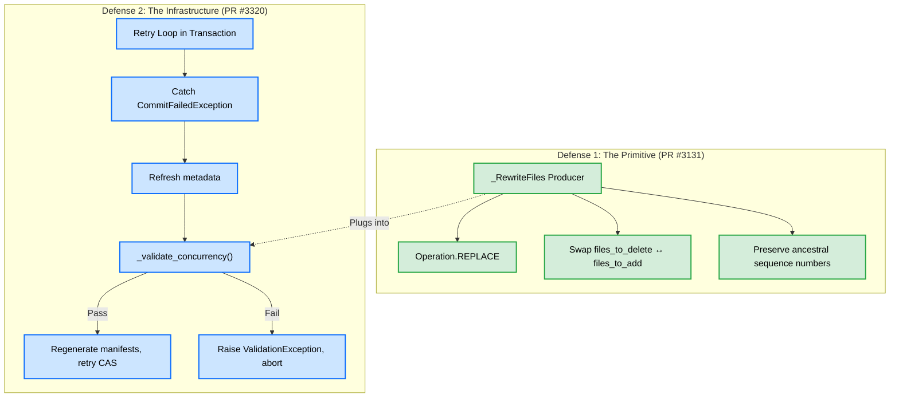
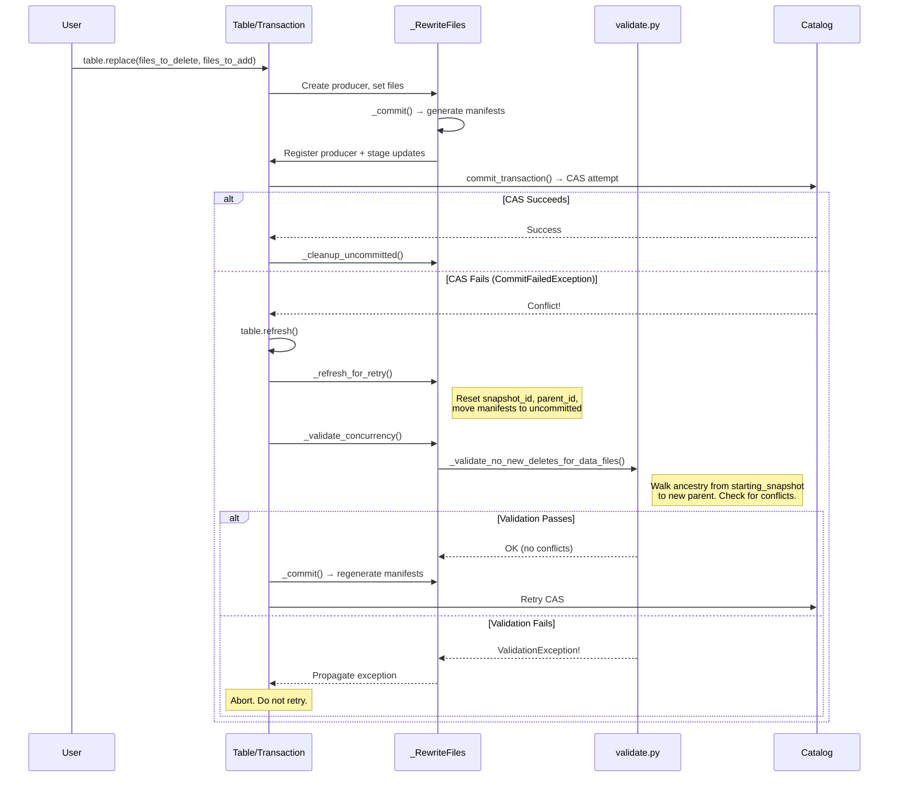
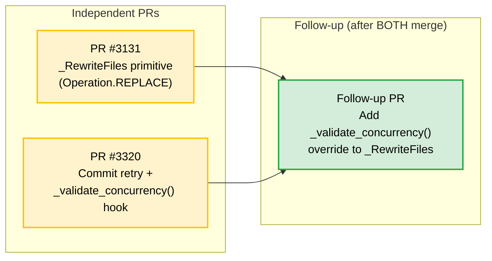
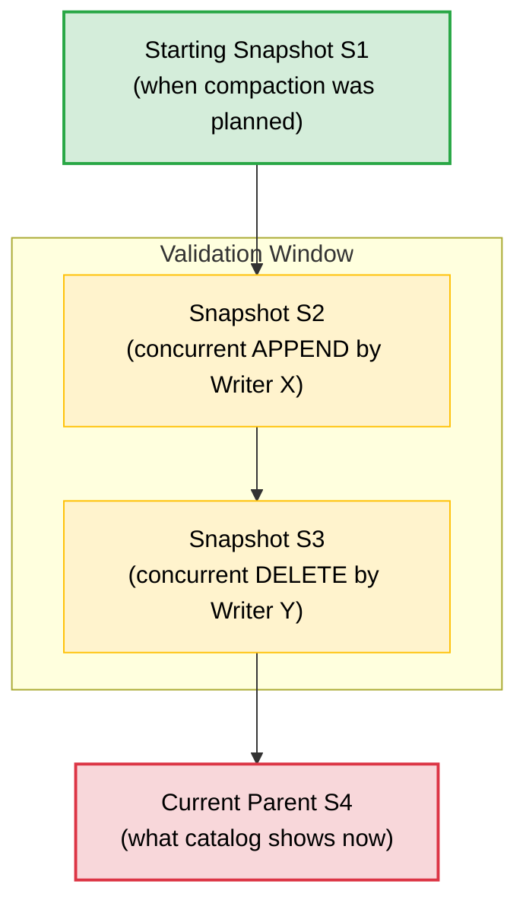

# PR #3320 ↔ PR #3131 Interaction: Exhaustive Architectural Analysis

## 0. The Core Confusion — Stated and Resolved

**The question**: Issue #3319 says "_RewriteFiles validation (follow-up after #3131 merges)_". Does #3131 need to merge first? Is there a circular dependency? What does "override `_validate_concurrency()`" actually mean for #3131?

**The answer**: **There is no circular dependency.** The two PRs are **complementary layers in a strict dependency chain**, not circular references. The confusion arises from conflating two distinct concerns:

| Concern | PR | What It Does |
|---------|-----|-------------|
| **The primitive** (what to commit) | #3131 | Adds `_RewriteFiles` — a new `_SnapshotProducer` subclass that swaps data files atomically using `Operation.REPLACE` |
| **The infrastructure** (how to commit safely) | #3320 | Adds the retry loop + `_validate_concurrency()` hook to `Transaction.commit_transaction()` |

#3131 creates a **new kind of snapshot producer**. #3320 creates the **lifecycle that all snapshot producers run inside**. Neither depends on the other to function at a basic level, but they compose to form the complete solution.

---

## 1. First Principles: What Problem Are We Solving?

### The Compaction Problem

Compaction rewrites data files to optimize physical layout. It must:

1. **Read** old files (File_A, File_B) from a snapshot (the "starting snapshot")
2. **Write** new files (Compacted_AB) — slow, distributed I/O
3. **Commit** a metadata swap: remove File_A, File_B; add Compacted_AB

Step 3 is the dangerous step. Between steps 1 and 3, another writer may have:
- Appended new data to the same partition
- Written a delete file targeting File_A
- Deleted File_A entirely

Without conflict detection, the commit blindly succeeds, silently dropping the concurrent writer's changes.

### The Two Defenses



---

## 2. How Each PR Works Independently

### 2.1 PR #3131: `_RewriteFiles` — The Metadata Swap Primitive

**What it adds**: A new `_SnapshotProducer` subclass that accepts `files_to_delete` and `files_to_add`, producing a snapshot with `Operation.REPLACE`.

**Key behaviors**:
- `_deleted_entries()`: Scans existing manifests, finds entries matching `files_to_delete`, emits them as `DELETED` while preserving their original `sequence_number` (critical for time-travel)
- `_existing_manifests()`: Returns all manifests NOT affected by the delete set, unchanged. Rewrites only the manifests containing deleted files.
- Sets `Operation.REPLACE` (not `OVERWRITE`) — semantically distinct: "physical layout changed, data unchanged"

**What it does NOT do** (as of current PR):
- No `_validate_concurrency()` override — uses the base class no-op
- No `validate_from_snapshot()` — no starting snapshot tracking
- No retry awareness — works in single-shot mode

**This is correct and sufficient for the initial PR.** The primitive works for the happy path (no concurrent conflicts). Validation is a follow-up.

### 2.2 PR #3320: Commit Retry + Validation Infrastructure

**What it adds**: The retry loop in `Transaction.commit_transaction()` and the `_validate_concurrency()` lifecycle hook.

The current code (already in your branch):

```python
# Transaction.commit_transaction() — the retry loop
for attempt in range(num_retries + 1):
    try:
        self._table._do_commit(updates=self._updates, requirements=self._requirements)
        self._cleanup_uncommitted_manifests()
        break
    except CommitFailedException:
        if attempt == num_retries or not self._snapshot_producers or elapsed_ms >= total_timeout_ms:
            raise
        self._table.refresh()
        self._rebuild_snapshot_updates()

# Transaction._rebuild_snapshot_updates() — re-executes producers
def _rebuild_snapshot_updates(self):
    # Strip old snapshot updates/requirements
    self._updates = tuple(u for u in self._updates if not isinstance(u, (AddSnapshotUpdate, SetSnapshotRefUpdate)))
    self._requirements = tuple(r for r in self._requirements if not isinstance(r, (AssertRefSnapshotId, AssertTableUUID)))
    
    for producer in self._snapshot_producers:
        producer._refresh_for_retry()       # Reset snapshot_id, parent, manifests
        producer._validate_concurrency()     # THE HOOK — subclasses override this
        producer._commit()                   # Regenerate manifests against fresh metadata
```

**What it provides for ALL producers**:
- `_refresh_for_retry()`: Resets `_snapshot_id`, `_parent_snapshot_id`, `commit_uuid`, `_manifest_num_counter`. Moves written manifests to uncommitted list.
- `_validate_concurrency()`: **No-op by default.** Subclasses override to add operation-specific conflict checks.
- `_cleanup_uncommitted()`: Deletes manifest files from failed attempts.

**Currently wired validations**:
- `_DeleteFiles._validate_concurrency()` — validates no conflicting appends/deletes
- `_OverwriteFiles._validate_concurrency()` — same validation set
- `_FastAppendFiles` / `_MergeAppendFiles` — inherits no-op (appends never conflict)

---

## 3. The Interaction: How They Compose

### 3.1 The Lifecycle of a RewriteFiles Commit (Final Integrated State)



### 3.2 The Key Insight: `_validate_concurrency()` Is Just a Hook

The base class defines:
```python
class _SnapshotProducer:
    def _validate_concurrency(self) -> None:
        """No-op by default."""
```

The retry loop in `Transaction._rebuild_snapshot_updates()` **always calls this hook** for every registered producer. If a producer doesn't override it, validation is skipped (no-op), and the retry proceeds blindly.

This means:
- **#3131 without #3320**: `_RewriteFiles` works, but has no retry and no validation. Single-shot commit. If a concurrent writer interferes, `CommitFailedException` propagates to the user.
- **#3320 without #3131**: The retry infrastructure exists, but there's no `_RewriteFiles` producer to use it. Other producers (`_DeleteFiles`, `_OverwriteFiles`) benefit immediately.
- **#3131 merged, then #3320**: `_RewriteFiles` gains retry automatically (the loop calls `_refresh_for_retry()` and `_commit()` on it). But validation is still no-op until someone overrides `_validate_concurrency()`.
- **#3320 merged, then #3131**: `_RewriteFiles` is built atop the infrastructure. Can include `_validate_concurrency()` override from day one, or defer it.

**There is no scenario where the combination produces incorrect behavior.** The worst case is a no-op validation (retry without conflict checking), which is strictly more correct than the current state (no retry at all).

---

## 4. The Dependency Graph — No Chicken-and-Egg



**Why it's not circular**:
- #3131 does NOT need `_validate_concurrency()` to merge. The no-op default is correct for an initial implementation.
- #3320 does NOT need `_RewriteFiles` to exist. It provides infrastructure that any producer can use.
- The follow-up PR is a **small, surgical change**: add a `_validate_concurrency()` method to the `_RewriteFiles` class. It depends on both PRs having merged, but neither PR depends on the follow-up.

---

## 5. What the Follow-up PR Contains (The ~30 Lines of Code)

After both #3131 and #3320 merge, the follow-up adds exactly this to `_RewriteFiles`:

```python
class _RewriteFiles(_SnapshotProducer["_RewriteFiles"]):
    _starting_snapshot_id: int | None  # NEW FIELD

    def __init__(self, ...):
        super().__init__(Operation.REPLACE, ...)
        self._starting_snapshot_id = None  # Set by caller

    def validate_from_snapshot(self, snapshot_id: int) -> "_RewriteFiles":
        """Record the snapshot this rewrite was planned against."""
        self._starting_snapshot_id = snapshot_id
        return self

    def _validate_concurrency(self) -> None:
        """Validate no concurrent conflicts with rewritten files.
        
        Mirrors Java's BaseRewriteFiles.validate():
        - Checks no new delete files target the files being replaced
        """
        if self._parent_snapshot_id is None:
            return
        if self._starting_snapshot_id is None:
            return  # No starting snapshot = skip validation (matches Java)

        table = self._transaction._table
        starting_snapshot = table.metadata.snapshot_by_id(self._starting_snapshot_id)
        parent_snapshot = table.metadata.snapshot_by_id(self._parent_snapshot_id)

        if starting_snapshot is None or parent_snapshot is None:
            return

        if self._deleted_data_files:
            _validate_no_new_deletes_for_data_files(
                table, starting_snapshot, None, self._deleted_data_files, parent_snapshot
            )
```

**That's it.** The existing `validate.py` functions do all the heavy lifting. The hook just wires them in.

### Why This Matches Java Exactly

Java's `BaseRewriteFiles.validate()` ([source](file:///Users/jaredyu/Desktop/open_source/iceberg/core/src/main/java/org/apache/iceberg/BaseRewriteFiles.java#L135-L142)):

```java
@Override
protected void validate(TableMetadata base, Snapshot parent) {
    validateReplacedAndAddedFiles();  // Precondition checks
    if (!replacedDataFiles.isEmpty()) {
        validateNoNewDeletesForDataFiles(base, startingSnapshotId, replacedDataFiles, parent);
    }
}
```

The PyIceberg follow-up is a direct 1:1 port. Java's `validate()` hook is called inside `apply()`, which is called on each retry. PyIceberg's `_validate_concurrency()` hook is called inside `_rebuild_snapshot_updates()`, which is called on each retry. Same semantics, different method name.

---

## 6. Optimal Merge Strategy for Open-Source

### Recommended Order

| Step | Action | Rationale |
|------|--------|-----------|
| **1** | Merge **#3320** first | It's authored by a different contributor (@lawofcycles), has benchmarks, and provides infrastructure that benefits ALL existing producers immediately. No dependency on #3131. |
| **2** | Rebase **#3131** onto main (post-#3320) | `_RewriteFiles` now inherits `_refresh_for_retry()`, `_cleanup_uncommitted()`, and the no-op `_validate_concurrency()` for free. No code changes needed in #3131 — it just works. |
| **3** | Merge **#3131** | The primitive is complete. It works with retry (via #3320) but without validation (no-op hook). This is acceptable for an initial merge. |
| **4** | Submit **follow-up PR** | Add `_validate_concurrency()` override + `validate_from_snapshot()`. ~30 lines. Wire the existing `validate.py` functions. |

### Why This Order (Not #3131 First)

1. **#3320 has broader impact**: It fixes retry for `_DeleteFiles`, `_OverwriteFiles`, and `_FastAppendFiles` — all existing producers. Every PyIceberg user benefits immediately.
2. **#3131 doesn't need #3320 to function**: But if #3131 merges first, users get a `replace()` API with no retry and no validation. If they use it under concurrent load, it will fail with `CommitFailedException` with no recourse.
3. **Rebasing #3131 onto #3320 is trivial**: `_RewriteFiles` extends `_SnapshotProducer`. The new methods added by #3320 (`_refresh_for_retry`, `_validate_concurrency`, `_cleanup_uncommitted`) are on the base class. No conflicts.

### Alternative Order (if #3131 merges first)

This also works fine:
1. Merge #3131 → `_RewriteFiles` exists with no retry
2. Merge #3320 → `_RewriteFiles` automatically gains retry (no-op validation)
3. Follow-up → Add `_validate_concurrency()` override

The follow-up PR is identical in both orderings. The only difference is user experience between steps 1 and 2.

---

## 7. The Validation Flow in Detail

### What `_validate_concurrency()` Actually Checks for `_RewriteFiles`

Given a compaction that replaces `{File_A, File_B}` with `{Compacted_AB}`:



The validation walks from S4 back to S1, examining each snapshot in the window:

| Concurrent Operation | Validator | Outcome |
|---------------------|-----------|---------|
| S2: Append File_C to different partition | `_validate_no_new_deletes_for_data_files` | **PASS** — no delete files targeting File_A or File_B |
| S2: Append File_C to same partition | Same | **PASS** — appends don't create delete files |
| S3: Delete rows from File_C (not our files) | Same | **PASS** — delete file targets File_C, not File_A/File_B |
| S3: Delete rows from File_A | Same | **FAIL** — new delete file targets a file we're replacing. `ValidationException` raised. |

### Why `_RewriteFiles` Needs Fewer Checks Than `_OverwriteFiles`

Java's `BaseOverwriteFiles.validate()` runs 4 validators. `BaseRewriteFiles.validate()` runs only 1:

| Validator | `_OverwriteFiles` | `_RewriteFiles` | Why |
|-----------|-------------------|-----------------|-----|
| `_validate_added_data_files` | ✅ | ❌ | Compaction doesn't claim exclusive ownership of a partition. New appends are fine. |
| `_validate_no_new_delete_files` | ✅ | ❌ | Compaction doesn't use a row filter. No filter = no filter-based conflict. |
| `_validate_deleted_data_files` | ✅ | ❌ | Handled implicitly: if File_A was deleted, the manifest won't contain it, and `_deleted_entries()` will fail to find it. The commit will produce an inconsistent snapshot that `failMissingDeletePaths()` catches. |
| `_validate_no_new_deletes_for_data_files` | ✅ | ✅ | **The critical check.** If someone wrote a delete targeting File_A after we started compacting, our Compacted_AB won't include that delete. The rows would silently reappear. |

---

## 8. End-to-End Walkthrough: Concrete Scenario

### Setup
- Table has Partition_1 with File_A (1000 rows) and File_B (500 rows)
- Compaction job plans to merge them into Compacted_AB (1500 rows)
- Starting snapshot: S1

### Happy Path (No Conflict)
```
1. Compaction reads File_A + File_B from S1
2. Compaction writes Compacted_AB to storage (10 min)
3. table.replace(files_to_delete=[File_A, File_B], files_to_add=[Compacted_AB])
4. _RewriteFiles._commit() → generates manifests
5. Transaction.commit_transaction() → CAS succeeds
6. S2 created: Operation.REPLACE, -2 files, +1 file, 1500 records
```

### Conflict Path (Concurrent Append — Safe Retry)
```
1. Compaction reads File_A + File_B from S1
2. Concurrent writer appends File_C to Partition_2 → S2 committed
3. Compaction finishes writing Compacted_AB
4. table.replace(...) → CAS fails (expected S1, current is S2)
5. Transaction catches CommitFailedException
6. table.refresh() → sees S2
7. _refresh_for_retry() → new snapshot_id, parent = S2
8. _validate_concurrency():
   - Walk S1→S2: S2 is an APPEND, no delete files added
   - _validate_no_new_deletes_for_data_files → PASS
9. _commit() → regenerate manifests against S2
10. CAS succeeds → S3 created
```

### Conflict Path (Concurrent Delete on Our File — Fatal)
```
1. Compaction reads File_A + File_B from S1
2. Concurrent writer deletes 100 rows from File_A via position delete → S2
3. Compaction finishes writing Compacted_AB (still has those 100 rows!)
4. table.replace(...) → CAS fails
5. Transaction catches CommitFailedException  
6. table.refresh() → sees S2
7. _refresh_for_retry()
8. _validate_concurrency():
   - Walk S1→S2: S2 is a DELETE, added a delete file targeting File_A
   - _validate_no_new_deletes_for_data_files → FAIL
   - Raises ValidationException("Cannot commit, found new delete for replace data file File_A")
9. Transaction does NOT retry. Exception propagates to user.
10. User/orchestrator must re-plan compaction from S2.
```

---

## 9. Why the "Override `_validate_concurrency()`" Advice Is Not Circular

The advice was: "In #3131, override `_validate_concurrency()`."

This sounds circular because:
- `_validate_concurrency()` is defined by #3320
- #3131 is supposed to be independent of #3320

**Resolution**: The override is for the **follow-up PR**, not for #3131 itself. The conversation context was about the final integrated state, not the immediate PR scope.

**In #3131 as submitted**: `_RewriteFiles` inherits the base class no-op `_validate_concurrency()`. This is correct. It matches the pattern of `_FastAppendFiles` which also uses the no-op.

**In the follow-up**: After both merge, add the override. This is the "RewriteFiles validation" that issue #3319 references.

---

## 10. Summary: The Complete Mental Model

```
┌─────────────────────────────────────────────────────────┐
│                    Transaction                           │
│                                                         │
│  commit_transaction():                                  │
│    for attempt in range(retries):    ← PR #3320         │
│      try:                                               │
│        _do_commit(updates, reqs)     ← existing         │
│      except CommitFailedException:                      │
│        refresh()                     ← PR #3320         │
│        for producer in producers:                       │
│          producer._refresh_for_retry()  ← PR #3320     │
│          producer._validate_concurrency()               │
│            │                                            │
│            ├── _FastAppendFiles: no-op (existing)       │
│            ├── _DeleteFiles: validates (PR #3320)       │
│            ├── _OverwriteFiles: validates (PR #3320)    │
│            └── _RewriteFiles: no-op → validates         │
│                                  │         │            │
│                              PR #3131   Follow-up       │
│                                                         │
│          producer._commit()    ← regenerate manifests   │
└─────────────────────────────────────────────────────────┘
```

### The Three Deliverables

1. **PR #3320** (by @lawofcycles): The retry loop + validation hooks for `_DeleteFiles` and `_OverwriteFiles`. **Merge first.**
2. **PR #3131** (by you): The `_RewriteFiles` primitive with `Operation.REPLACE`. **Merge second.** No changes needed for #3320 compatibility — the no-op hook is correct.
3. **Follow-up PR** (by you): ~30 lines adding `_validate_concurrency()` + `validate_from_snapshot()` to `_RewriteFiles`. **Submit after both merge.**

There is no chicken-and-egg. There is no circular dependency. The three PRs form a clean, linear dependency chain that can be submitted and reviewed independently.
