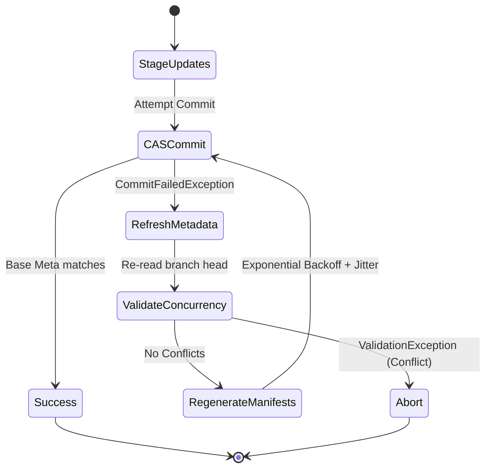
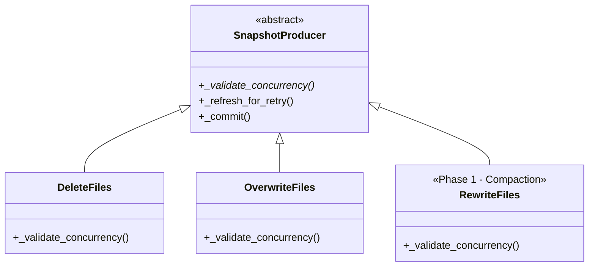

# PR #3320 Architectural Review: V2/V3 Spec Compatibility

## Executive Summary
This document provides a rigorous architectural review of PyIceberg PR #3320 (Commit Retry and Concurrency Validation) specifically focusing on its compatibility with the Iceberg V2 (Merge-on-Read) and V3 (Deletion Vectors) specifications. 

**Conclusion:** PR #3320 is structurally sound and fully compatible with the V2/V3 roadmap. The retry mechanism operates at a spec-agnostic level, serving as the foundational prerequisite (Phase 0) for future maintenance operations. V2/V3 features will seamlessly integrate by extending the `_validate_concurrency()` hooks introduced in this PR.

---

## 1. First Principles: Optimistic Concurrency Control (OCC)

Apache Iceberg relies on Optimistic Concurrency Control (OCC) to achieve ACID isolation at cloud scale without distributed locks. In an OCC system, the absolute theoretical lower bound for a transaction is dictated by the speed of light—specifically, the network latency required to perform a Compare-And-Swap (CAS) operation against the Catalog.

### 1.1 The Cost of Concurrency
Under concurrent write pressure, OCC guarantees isolation but results in `CommitFailedException` for the losing transactions. To prevent linear degradation of success rates, transactions must retry.

An optimal retry mechanism must:
1. **Minimize Network I/O:** Never re-upload data payloads (Parquet files) that have already been durably written.
2. **Minimize Compute:** Only regenerate the specific metadata tree nodes (Manifests) affected by the new base state.
3. **Guarantee Integrity:** Rigorously validate that the new base state does not semantically conflict with the staged updates.

PR #3320 satisfies these physical bounds by persisting `_added_data_files` across retries and only regenerating manifests after re-evaluating concurrency validation.

---

## 2. Architectural Analysis: The Retry Loop vs. Spec Versions

The retry mechanism introduced in PR #3320 is fundamentally decoupled from the Iceberg format versions (V1/V2/V3).

### 2.1 The Retry State Machine
The core loop resides in `Transaction.commit_transaction()`. When a CAS fails, the system executes the following state machine:

### 2.2 Why the Retry Loop is Spec-Agnostic
The retry infrastructure is completely indifferent to whether the payload contains V1 Data Files, V2 Position Deletes, or V3 Deletion Vectors. 
* **State Management:** The `_refresh_for_retry()` hook merely clears cached snapshot IDs and uncommitted manifests.
* **Manifest Generation:** Manifests are regenerated using the same spec-version writer that was initially selected.
* **Transaction Boundary:** Retrying at the `Transaction` level ensures atomic commits for multi-producer operations (e.g., `_DeleteFiles` + `_OverwriteFiles`), which is a structural necessity regardless of the spec version.

---

## 3. Concurrency Validation: The V2/V3 Interaction Point

While the retry loop is spec-agnostic, the **Concurrency Validation** layer is intimately tied to the spec versions. Validation is the mathematical proof that a concurrent change commutes with the local change.

### 3.1 Validation Extensibility Architecture
PR #3320 introduces a template method pattern via `_validate_concurrency()`. This design choice is critical for future V2/V3 compatibility.

### 3.2 V2 Compatibility: Merge-on-Read (MoR)
When MoR support (Issues #1078, #1808, #3270) is introduced, the system will begin encountering V2 Equality Deletes and Position Deletes generated concurrently by other engines (e.g., Flink) or by PyIceberg itself.

**Required Extensions:**
* `_validate_no_new_delete_files()`: Must be updated to parse concurrent V2 Equality/Position delete files and evaluate if their predicates or positional vectors intersect with the data files being updated/deleted by the local transaction.
* `_validate_no_new_deletes_for_data_files()`: Must ensure that a concurrent Position Delete does not invalidate a local update to a specific row.

### 3.3 V3 Compatibility: Deletion Vectors (DVs)
When Deletion Vectors are fully supported (Issues #1549, #2261), the validation model shifts from file-level granularity to sub-file vector granularity.

**Required Extensions:**
* `validateAddedDVs()`: As noted in the Java Iceberg parity roadmap, a new validation primitive must be introduced. If a concurrent transaction applies a DV to `file_A`, and the local transaction also applies a DV to `file_A` (or deletes it entirely), the validation layer must detect this overlap and raise a `ValidationException`.

---

## 4. Defense of PR #3320 Design Choices

Every architectural decision in PR #3320 optimally positions the codebase for V2/V3:

1. **Transaction-Level vs. Producer-Level Retry:**
   * *Choice:* PR #3320 loops at `Transaction.commit_transaction()`.
   * *Defense:* PyIceberg decomposes complex operations (like a filtered delete) into multiple producers (`_DeleteFiles` + `_OverwriteFiles`). Retrying at the producer level would break atomicity. V2/V3 operations (like MoR compaction) will similarly require atomic commits of data files and delete vectors. Transaction-level retry is the only mathematically sound approach.
2. **Duplication of `_validate_concurrency()`:**
   * *Choice:* The validation logic is intentionally duplicated across `_DeleteFiles` and `_OverwriteFiles` rather than abstracted into the base class.
   * *Defense:* V2 `RowDelta` (MoR) operations have fundamentally divergent validation requirements from `OverwriteFiles`. Hardcoding validation in the base class would require an invasive refactor when MoR is implemented. The current design preserves the Single Responsibility Principle.
3. **Data File Persistence Across Retries:**
   * *Choice:* `_added_data_files` are not cleared in `_refresh_for_retry()`.
   * *Defense:* Writing to S3 is bounded by network bandwidth and the speed of light. Data files are immutable and content-addressed. Discarding them on a CAS failure would violate optimal OCC principles. The PR correctly bounds the retry penalty strictly to metadata operations.

---

## 5. Conclusion & Roadmap Integration

PR #3320 introduces no technical debt regarding the V2/V3 specifications. Instead, it lays the mandatory Phase 0 foundation. 

The path forward for V2/V3 maintenance is highly deterministic:
1. **Phase 1 (Compaction):** Implement `_RewriteFiles` extending `_SnapshotProducer`. Implement `_validate_concurrency()` to ensure no concurrent deletes affect the compacted files. The PR #3320 retry loop will automatically handle the rest.
2. **Phase 2 (MoR / V2):** Extend `validate.py` with V2 delete file intersection logic. Wire these new checks into the existing `_validate_concurrency()` overrides.
3. **Phase 3 (DVs / V3):** Introduce `validateAddedDVs()` to `validate.py` and inject it into the producer validation hooks.

Because the retry state machine and the validation logic are cleanly decoupled, these future spec implementations can be developed with high velocity and zero disruption to the core commit infrastructure.
