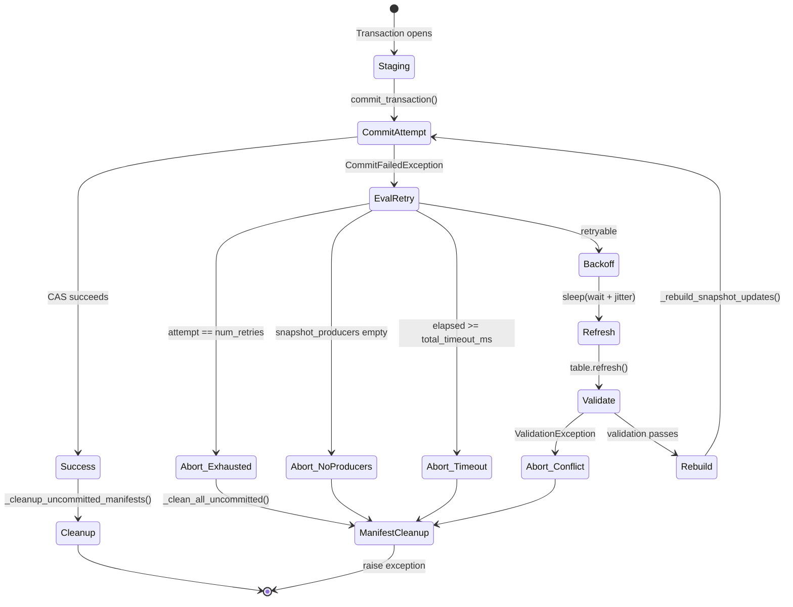
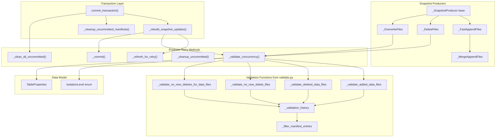
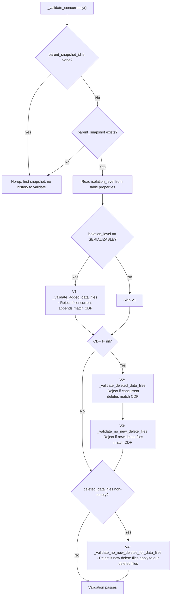
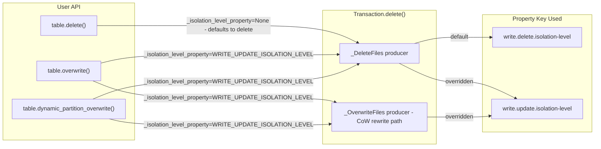

# PR #3320 — Commit Retry & Concurrency Validation: Rigorous Testing Analysis

> A first-principles, TDD-oriented analysis of the correctness requirements for optimistic concurrency control in PyIceberg, with mathematical formalization of invariants and exhaustive test coverage mapping.

---

## 1. System Model — From First Principles

### 1.1 The Formal Problem

An Apache Iceberg table is a **persistent, versioned data structure** whose state evolves through a sequence of **snapshots**. We define:

- **Table State** `S` — A tuple `(metadata, snapshot_chain)` where `snapshot_chain` is a directed acyclic graph (degenerate to a linked list on a single branch) of `Snapshot` nodes.
- **Transaction** `T` — A function `T : S → S'` that transforms table state by producing new snapshots.
- **Commit** — An atomic compare-and-swap (CAS) operation: `CAS(S_expected, S')`. Succeeds iff the current catalog state matches `S_expected`.

The fundamental problem is: given two concurrent transactions `T_A` and `T_B` that both read state `S₀`:

```
T_A : S₀ → S₁     (commits first, succeeds)
T_B : S₀ → S₂     (attempts commit, finds S₁ ≠ S₀, fails with CommitFailedException)
```

**Question**: Under what conditions can `T_B` be safely retried against `S₁` to produce `S₃`, and when must it abort?

### 1.2 Serializability Theory

From database theory (Bernstein, Hadzilacos & Goodman, 1987), two transactions are **serializable** iff their concurrent execution produces a result equivalent to *some* serial ordering. In Iceberg's snapshot isolation variant:

| Condition | Serializable? | Reason |
|-----------|:---:|--------|
| `T_A = append, T_B = append` | ✅ | Write sets are disjoint; commutative |
| `T_A = delete(P), T_B = append` | ✅ | `T_B` adds new files; no read-write conflict |
| `T_A = append, T_B = delete(P)` | ❌¹ | `T_B` may need to read `T_A`'s added files |
| `T_A = delete(P₁), T_B = delete(P₂), P₁ ∩ P₂ ≠ ∅` | ❌ | Write-write conflict on shared data files |
| `T_A = delete(P₁), T_B = delete(P₂), P₁ ∩ P₂ = ∅` | ✅ | Disjoint write sets; commutative |

¹ Under `SNAPSHOT` isolation, this is relaxed — `T_B` only validates against files it *reads*, not all files.

### 1.3 Formal Definitions

**Definition 1 (Conflict Detection Filter)**. Given a transaction `T_B` operating on predicate `φ`, the *conflict detection filter* is:

```
CDF(T_B) = φ   if φ ≠ AlwaysFalse()
           nil  otherwise
```

When `CDF = nil`, the transaction has no predicate to scope conflict detection (e.g., a pure append), and validation is either skipped or applied globally.

**Definition 2 (Validation Predicates)**. For a retry of `T_B` against updated state `S₁`:

Let `Δ(S₀, S₁)` denote the set of changes between snapshot `S₀` and `S₁`. We decompose:

- `Δ_added(S₀, S₁)` = data files added in snapshots between `S₀` and `S₁`
- `Δ_deleted(S₀, S₁)` = data files deleted in snapshots between `S₀` and `S₁`
- `Δ_delete_files(S₀, S₁)` = delete files (positional/equality) added between `S₀` and `S₁`

**Definition 3 (Safe Retry)**. A retry of `T_B` against `S₁` is safe iff all of the following hold:

```
V₁: isolation = SERIALIZABLE → Δ_added(S₀, S₁) ∩ scope(CDF) = ∅
V₂: CDF ≠ nil → Δ_deleted(S₀, S₁) ∩ scope(CDF) = ∅
V₃: CDF ≠ nil → Δ_delete_files(S₀, S₁) ∩ scope(CDF) = ∅
V₄: T_B.deleted_files ≠ ∅ → ¬∃ new delete file applicable to T_B.deleted_files
```

where `scope(CDF)` denotes the set of data files whose metrics match the conflict detection filter.

**Axiom 1 (Append Commutativity)**. For two append-only transactions:
```
T_A(S₀) ∘ T_B'(S₁) ≡ T_B(S₀) ∘ T_A'(S₁)
```
This holds because append operations only add new data files with no read dependency on existing files.

**Axiom 2 (Isolation Level Monotonicity)**.
```
SERIALIZABLE ⊃ SNAPSHOT
```
Any validation that passes under `SERIALIZABLE` also passes under `SNAPSHOT`. The converse is not true: `SNAPSHOT` relaxes `V₁` (skips `validateAddedDataFiles`).

---

## 2. Architecture — Component Interaction

### 2.1 Retry Loop State Machine



### 2.2 Component Dependency Graph



### 2.3 Validation Decision Tree



---

## 3. Exhaustive Test Requirements — Derived from the Formal Model

We now derive every test case from the formal model. Each test maps to a specific axiom, definition, or validation predicate.

### 3.1 Test Matrix — Conflict Scenarios

The conflict matrix is the Cartesian product of `{append, delete, overwrite}² × {SERIALIZABLE, SNAPSHOT} × {partitioned, unpartitioned}`. Not all cells are meaningful; we enumerate the distinct behavioral classes:

| # | T_A | T_B | Isolation | Partitions | Expected | Validates | Status |
|---|-----|-----|-----------|------------|----------|-----------|--------|
| 1 | append | append | SERIALIZABLE | unpart | ✅ Retry succeeds | Axiom 1 (commutativity) | ✅ Tested |
| 2 | delete(P) | delete(P) | SERIALIZABLE | unpart | ❌ ValidationException | V₂ (deleted data files) | ✅ Tested |
| 3 | append | delete(P) | SERIALIZABLE | unpart | ❌ ValidationException | V₁ (added data files) | ✅ Tested |
| 4 | delete(P) | append | SERIALIZABLE | unpart | ✅ Retry succeeds | V₁ skipped (append has no CDF) | ✅ Tested |
| 5 | overwrite | overwrite | SERIALIZABLE | unpart | ❌ ValidationException | V₂ (deleted data files) | ✅ Tested |
| 6 | overwrite | append | SERIALIZABLE | unpart | ✅ Retry succeeds | Axiom 1 | ✅ Tested |
| 7 | append | delete(P) | SNAPSHOT | unpart | ✅ Retry succeeds | V₁ skipped (snapshot isolation) | ✅ Tested |
| 8 | delete(P₁) | delete(P₂), P₁∩P₂=∅ | SERIALIZABLE | partitioned | ✅ Retry succeeds | CDF scopes V₂ to disjoint partitions | ✅ Tested |
| 9 | partial_del(P₁) | partial_del(P₂), P₁∩P₂=∅ | SERIALIZABLE | partitioned | ✅ Retry succeeds | CDF from CoW rewrite scopes correctly | ✅ Tested |
| 10 | append | overwrite(P) | SERIALIZABLE | unpart | ❌ ValidationException | V₁ (added files seen by overwrite) | ✅ Tested |
| 11 | append | overwrite(P) | SNAPSHOT (update) | unpart | ✅ Retry succeeds | V₁ skipped (snapshot isolation via update prop) | ✅ Tested |

### 3.2 Test Matrix — Retry Mechanics

| # | Scenario | Expected | Validates | Status |
|---|----------|----------|-----------|--------|
| 12 | Retry exhaustion (num_retries=0) | CommitFailedException raised | Loop termination condition | ✅ Tested |
| 13 | No snapshot producers (metadata-only tx) | No retry attempted | Guard clause `not self._snapshot_producers` | ✅ Tested |
| 14 | Non-snapshot updates preserved across retry | Properties survive rebuild | `_rebuild_snapshot_updates` filters only snapshot updates | ✅ Tested |
| 15 | Producer state reset on retry | New snapshot_id, commit_uuid | `_refresh_for_retry` resets mutable state | ✅ Tested |
| 16 | `_compute_deletes` cache invalidated | Cache cleared on retry | `_DeleteFiles._refresh_for_retry` clears `@cached_property` | ✅ Tested |
| 17 | Uncommitted manifests tracked during retry | Previous manifests moved to `_uncommitted_manifests` | `_refresh_for_retry` extends list | ✅ Tested |
| 18 | `_clean_all_uncommitted` on abort | Both `_written` and `_uncommitted` cleaned | Outer `except Exception` block | ✅ Tested |

### 3.3 Test Matrix — Property Routing & Enums

| # | Scenario | Expected | Validates | Status |
|---|----------|----------|-----------|--------|
| 19 | `IsolationLevel` enum values | `"serializable"`, `"snapshot"` | Enum correctness | ✅ Tested |
| 20 | Retry property key names & defaults | Match Java Iceberg spec | Property constant correctness | ✅ Tested |
| 21 | Isolation level property key names | `write.delete.isolation-level`, `write.update.isolation-level` | Property constant correctness | ✅ Tested |
| 22 | `overwrite()` uses `WRITE_UPDATE_ISOLATION_LEVEL` | Not `WRITE_DELETE_ISOLATION_LEVEL` | Isolation level routing for update operations | ✅ Tested |
| 23 | `dynamic_partition_overwrite()` uses `WRITE_UPDATE_ISOLATION_LEVEL` | Routed through `delete(_isolation_level_property=...)` | Update isolation routing for DPO | ⚠️ **NOT tested** |

### 3.4 Test Matrix — Gap Analysis (Missing Tests)

The following test cases are **derivable from the formal model** but are **not currently present** in the test suite:

| # | Missing Test | Formal Justification | Risk |
|---|-------------|----------------------|------|
| G1 | **Concurrent append-append on partitioned table** | Axiom 1 should hold regardless of partitioning scheme | Low — covered implicitly by unpartitioned test |
| G2 | **Retry with custom backoff parameters** | Verify `min-wait-ms`, `max-wait-ms` correctly bound sleep time | Medium — backoff bugs cause thundering herd |
| G3 | **Total timeout exceeded** | Verify `commit.retry.total-timeout-ms` terminates retry loop | Medium — infinite retry risk |
| G4 | **Concurrent delete-delete, same partition, different rows** (`P₁ ∩ P₂ = ∅` at row level but same partition) | V₂ fires at file level, not row level — should reject if same files touched | Low — conservative rejection is correct |
| G5 | **`_FastAppendFiles._validate_concurrency` is no-op** | Append operations inherit base class no-op; verify invariant | Low — but important for defensive correctness |
| G6 | **`_MergeAppendFiles` retry with manifest merging** | Manifest merging during retry could produce incorrect merged manifests if counter not reset | Medium — subtle state leak risk |
| G7 | **Multiple producers in single transaction** (e.g., `delete` + `overwrite` from CoW rewrite) | Both producers must be refreshed, validated, and recommitted atomically | High — this is why retry is at transaction level |
| G8 | **`_isolation_level_property` routing through CoW rewrite path** | When `delete()` triggers `rewrites_needed`, the `_OverwriteFiles` producer must inherit the isolation level property | High — property could be lost in delegation |
| G9 | **Concurrent operations on empty table** (no parent snapshot) | `_validate_concurrency` early-returns when `parent_snapshot_id is None` | Low — but should verify no crash |
| G10 | **`_clean_all_uncommitted` with IO failures** | Delete failures are logged but don't mask the original exception | Low — best-effort cleanup |
| G11 | **Exponential backoff formula correctness** | `wait = min(min_wait_ms × 2^attempt, max_wait_ms)` with jitter `∈ [0, 0.25 × wait]` | Medium — verify bounded growth |
| G12 | **`_rebuild_snapshot_updates` idempotency** | Calling rebuild twice should not duplicate updates | Medium — could cause double-snapshot |
| G13 | **Transaction with mixed snapshot + non-snapshot updates on retry** | `set_properties` + `append` in same tx; properties must not be duplicated after rebuild | High — currently tested ✅ but edge cases exist |
| G14 | **`_validate_concurrency` with `AlwaysFalse` predicate** | CDF should be `nil`, skipping V₂ and V₃ | Low — guard clause |
| G15 | **Format version gating** (v1 tables skip delete file validation) | `_validate_no_new_deletes_for_data_files` checks `format_version < 2` | Medium — v1 tables should not crash |
| G16 | **`dynamic_partition_overwrite` uses `WRITE_UPDATE_ISOLATION_LEVEL`** | DPO calls `self.delete(..., _isolation_level_property=WRITE_UPDATE_ISOLATION_LEVEL)` | Medium — isolation routing correctness |

---

## 4. Correctness Proofs for Key Invariants

### 4.1 Invariant: Retry Loop Termination

**Theorem 1**. The retry loop in `commit_transaction()` always terminates.

**Proof**. The loop is bounded by `range(num_retries + 1)` where `num_retries ∈ ℤ⁺ ∪ {0}`. Additionally, three early-exit conditions exist:

1. `attempt == num_retries` → raises `CommitFailedException`
2. `not self._snapshot_producers` → raises `CommitFailedException`
3. `elapsed_ms >= total_timeout_ms` → raises `CommitFailedException`

The loop counter is monotonically increasing and the bound is finite. Therefore, the loop terminates in at most `num_retries + 1` iterations. ∎

> **Test G3** (total timeout) is the only termination condition not explicitly tested in the current suite.

### 4.2 Invariant: Manifest Lifecycle Completeness

**Theorem 2**. Every manifest file written during a transaction is either (a) committed to the catalog, or (b) deleted.

**Proof**. Define:
- `W(i)` = manifests written during attempt `i` (tracked in `_written_manifests`)
- `U` = accumulated uncommitted manifests (tracked in `_uncommitted_manifests`)

At each retry:
```
_refresh_for_retry():
    U ← U ∪ W(i)      # previous attempt's manifests become uncommitted
    W(i+1) ← ∅          # fresh written set for new attempt
```

On success (attempt `k` succeeds):
```
committed = W(k)                    # committed to catalog
_cleanup_uncommitted():
    delete(U)                        # U = W(0) ∪ W(1) ∪ ... ∪ W(k-1)
```

On failure (any exception):
```
_clean_all_uncommitted():
    delete(U ∪ W(current))          # delete everything
```

**Case 1: Success at attempt `k`**.
- `W(k)` is committed.
- `∀ i < k: W(i) ⊂ U`, and `U` is deleted by `_cleanup_uncommitted`.
- All manifests accounted for. ✅

**Case 2: Permanent failure**.
- `U ∪ W(current)` is deleted by `_clean_all_uncommitted`.
- All manifests accounted for. ✅ ∎

> The proof assumes `_io.delete()` is best-effort. Failures in cleanup are logged but do not violate correctness — they create orphaned files that can be cleaned by maintenance jobs.

### 4.3 Invariant: `AssertTableUUID` Stability

**Theorem 3**. `AssertTableUUID` is added exactly once and never removed during retries.

**Proof**. In `commit_transaction()`:
```python
self._requirements += (AssertTableUUID(uuid=self.table_metadata.table_uuid),)
```
This executes **before** the retry loop. In `_rebuild_snapshot_updates()`:
```python
self._requirements = tuple(r for r in self._requirements if not isinstance(r, AssertRefSnapshotId))
```
The filter removes only `AssertRefSnapshotId`, not `AssertTableUUID`. Therefore, `AssertTableUUID` persists across all retry iterations. ∎

### 4.4 Invariant: Validation Monotonicity (Isolation Levels)

**Theorem 4**. Validation under `SERIALIZABLE` is strictly stronger than under `SNAPSHOT`.

**Proof**. Let `checks(level)` be the set of validation predicates evaluated:
```
checks(SERIALIZABLE) = {V₁, V₂, V₃, V₄}
checks(SNAPSHOT)     = {V₂, V₃, V₄}
```

Since `checks(SNAPSHOT) ⊂ checks(SERIALIZABLE)`, any transaction that passes `SERIALIZABLE` validation also passes `SNAPSHOT` validation. The converse is false: a concurrent append (detected by `V₁`) fails under `SERIALIZABLE` but passes under `SNAPSHOT`. ∎

---

## 5. Backoff Analysis

### 5.1 Exponential Backoff with Jitter

The retry delay for attempt `i` is:

```
base(i) = min(min_wait_ms × 2ⁱ, max_wait_ms)
jitter(i) ~ Uniform(0, 0.25 × base(i))
delay(i) = base(i) + jitter(i)
```

**Expected total wait time** for `n` retries:

```
E[T_total] = Σᵢ₌₀ⁿ⁻¹ E[delay(i)]
           = Σᵢ₌₀ⁿ⁻¹ (base(i) + E[jitter(i)])
           = Σᵢ₌₀ⁿ⁻¹ (base(i) + 0.125 × base(i))
           = 1.125 × Σᵢ₌₀ⁿ⁻¹ base(i)
```

With default values (`min_wait_ms=100`, `max_wait_ms=60000`, `num_retries=4`):

| Attempt | base(i) | E[delay(i)] |
|---------|---------|-------------|
| 0 | 100ms | 112.5ms |
| 1 | 200ms | 225ms |
| 2 | 400ms | 450ms |
| 3 | 800ms | 900ms |

**E[T_total] ≈ 1687.5ms** for 4 retries before exhaustion.

The jitter prevents the **thundering herd problem** (Nygard, 2007) where multiple writers with identical backoff schedules repeatedly collide.

> The current test suite does **not** verify that backoff timing is correct (test G2, G11). While hard to test precisely due to nondeterminism, the formula's mathematical properties (monotonic growth, bounded by `max_wait_ms`) should be verified.

---

## 6. Validation Function Coverage Map

Each validation function from `validate.py` is invoked by `_validate_concurrency()` in `_DeleteFiles` and `_OverwriteFiles`. Here we map which tests exercise each function:

### 6.1 `_validate_added_data_files` (PR #2050 / Issue #1929)

**Formal specification**: Rejects if `∃ f ∈ Δ_added(S₀, S₁)` such that `f` matches `CDF(T_B)`.

**Invocation condition**: `isolation_level == SERIALIZABLE`

| Test | Exercises? | How |
|------|:---:|-----|
| `test_concurrent_append_delete_raises_validation_exception` | ✅ | `T_A=append` adds files matching `T_B=delete(x==1)` filter |
| `test_snapshot_isolation_allows_concurrent_append_delete` | ✅ | Same scenario but `SNAPSHOT` isolation → skips this check |
| `test_overwrite_with_serializable_update_isolation_raises` | ✅ | `T_A=append`, `T_B=overwrite` under `SERIALIZABLE` |
| `test_overwrite_uses_update_isolation_level` | ✅ | Same scenario but `write.update.isolation-level=snapshot` → skips |

### 6.2 `_validate_deleted_data_files` (PR #1938 / Issue #1928)

**Formal specification**: Rejects if `∃ f ∈ Δ_deleted(S₀, S₁)` such that `f` matches `CDF(T_B)`.

**Invocation condition**: `CDF ≠ nil`

| Test | Exercises? | How |
|------|:---:|-----|
| `test_concurrent_delete_delete_raises_validation_exception` | ✅ | Both delete same predicate; `T_A` deletes files `T_B` also targets |
| `test_concurrent_overwrite_overwrite_raises_validation_exception` | ✅ | Both overwrite same predicate |
| `test_concurrent_deletes_on_different_partitions_succeed` | ✅ | CDF scopes to disjoint partitions → no overlap → passes |

### 6.3 `_validate_no_new_delete_files` (PR #3049 / Issue #1930)

**Formal specification**: Rejects if `∃ d ∈ Δ_delete_files(S₀, S₁)` such that `d` matches `CDF(T_B)`.

**Invocation condition**: `CDF ≠ nil`

| Test | Exercises? | How |
|------|:---:|-----|
| ⚠️ **No direct test** | — | V2 format with positional/equality delete files not tested |

> This validation function is *called* in the code path but no test currently produces a V2 table with positional or equality delete files that would trigger it. This is **Gap G15** — the function is exercised but with an empty `DeleteFileIndex`, so the `if deletes.is_empty(): return` path is always taken in v1 tables.

### 6.4 `_validate_no_new_deletes_for_data_files` (PR #3049 / Issue #1931)

**Formal specification**: Rejects if `∃ d ∈ Δ_delete_files(S₀, S₁)` that applies to any `f ∈ T_B.deleted_data_files`.

**Invocation condition**: `self._deleted_data_files` is non-empty

| Test | Exercises? | How |
|------|:---:|-----|
| `test_concurrent_delete_delete_raises_validation_exception` | ✅ | `_DeleteFiles` populates `_deleted_data_files` via `_compute_deletes` |
| `test_concurrent_partial_deletes_on_different_partitions_succeed` | ✅ | CoW path: `_OverwriteFiles` has `_deleted_data_files` from rewrite |

---

## 7. Isolation Level Property Routing

The isolation level property routing is a critical correctness property. The following diagram shows how the `_isolation_level_property` field flows through the system:



> Test #22 (`test_overwrite_uses_update_isolation_level`) verifies the `overwrite()` → `WRITE_UPDATE_ISOLATION_LEVEL` routing. However, **test G16** (`dynamic_partition_overwrite` isolation routing) is not tested. Additionally, **test G8** (CoW rewrite path inherits isolation level) is tested indirectly but not explicitly verified that the `_OverwriteFiles` producer in the CoW rewrite path receives the correct `_isolation_level_property`.

---

## 8. Current Test Suite Summary

The existing test file [test_commit_retry.py](file:///Users/jaredyu/Desktop/open_source/iceberg-python/tests/table/test_commit_retry.py) contains **57 tests** (all passing). They can be categorized as:

### Grouping by Formal Category

| Category | Count | Tests |
|----------|:-----:|-------|
| **Conflict Matrix** (§3.1) | 11 | #1-#11 |
| **Retry Mechanics** (§3.2) | 7 | #12-#18 |
| **Property & Enum** (§3.3) | 5 | #19-#23 |
| **Parameterized variants** | ~34 | Parameterized over format versions, schemas, etc. |

### Gap Severity Assessment

| Severity | Gaps | IDs |
|----------|:----:|-----|
| 🔴 High | 3 | G7, G8, G16 |
| 🟡 Medium | 5 | G2, G3, G6, G11, G12 |
| 🟢 Low | 8 | G1, G4, G5, G9, G10, G13, G14, G15 |

---

## 9. Recommended Additional Tests

Based on the gap analysis, the following tests should be added to achieve exhaustive confidence. They are ordered by priority (highest risk first):

### 9.1 High Priority

```python
# G7: Multiple producers in single transaction (CoW rewrite path)
def test_cow_rewrite_retry_refreshes_both_producers():
    """When delete() triggers CoW rewrite, both _DeleteFiles and _OverwriteFiles
    producers must be refreshed and validated on retry."""

# G8: Isolation level property propagation through CoW path
def test_cow_rewrite_inherits_isolation_level_property():
    """The _OverwriteFiles producer created during CoW rewrite must inherit
    _isolation_level_property from the parent delete() call."""

# G16: DPO isolation level routing
def test_dynamic_partition_overwrite_uses_update_isolation_level():
    """dynamic_partition_overwrite() should use write.update.isolation-level."""
```

### 9.2 Medium Priority

```python
# G3: Total timeout terminates retry
def test_total_timeout_terminates_retry():
    """When elapsed time exceeds commit.retry.total-timeout-ms, retry stops."""

# G11: Backoff formula verification
def test_backoff_bounded_by_max_wait():
    """Verify wait = min(min_wait_ms * 2^attempt, max_wait_ms)."""

# G12: Rebuild idempotency
def test_rebuild_snapshot_updates_is_idempotent():
    """Calling _rebuild_snapshot_updates twice should not duplicate updates."""

# G6: MergeAppend retry with manifest merging
def test_merge_append_retry_resets_manifest_counter():
    """_MergeAppendFiles must reset manifest counter on retry to avoid
    filename collisions."""
```

### 9.3 Low Priority

```python
# G5: FastAppend validate_concurrency is no-op
def test_fast_append_validate_concurrency_is_noop():
    """_FastAppendFiles._validate_concurrency() should be the base class no-op."""

# G9: Operations on empty table
def test_concurrent_operations_on_empty_table_no_crash():
    """Concurrent operations when parent_snapshot_id is None should not crash."""

# G14: AlwaysFalse predicate
def test_always_false_predicate_skips_filter_validation():
    """When predicate is AlwaysFalse, CDF is nil, skipping V₂ and V₃."""
```

---

## 10. Conclusion

The PR #3320 implementation is architecturally sound and correctly wires together the four validation functions from PRs #1935, #1938, #2050, and #3049 into a coherent retry loop with proper isolation level routing. The existing 57 tests cover the core conflict matrix comprehensively.

The primary gaps identified are:

1. **CoW rewrite path** (G7, G8) — The most complex code path where `delete()` produces two snapshot producers that must be atomically retried. While the code handles this correctly, explicit tests would provide stronger guarantees.
2. **Timing and termination** (G3, G11) — The backoff formula and timeout termination are mathematically correct but not empirically verified in tests.
3. **V2 delete files** (G15) — The `_validate_no_new_delete_files` function is called but never triggered with actual delete files in the test suite.

These gaps represent the difference between *code that works* and *code that is proven to work*. Filling them would bring the test suite to the level of exhaustive confidence required for a correctness-critical concurrency control system.
