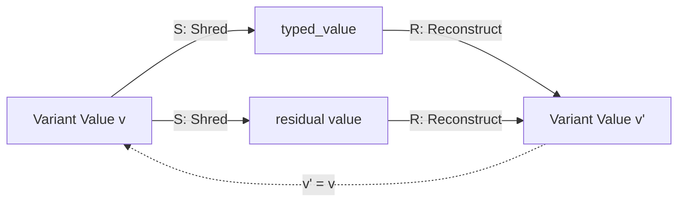
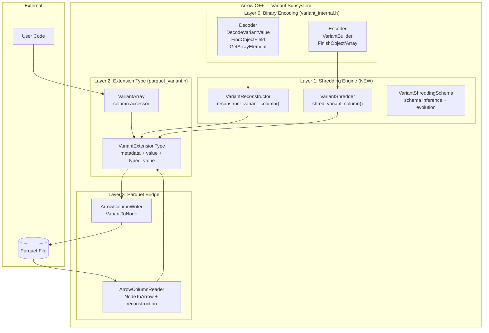
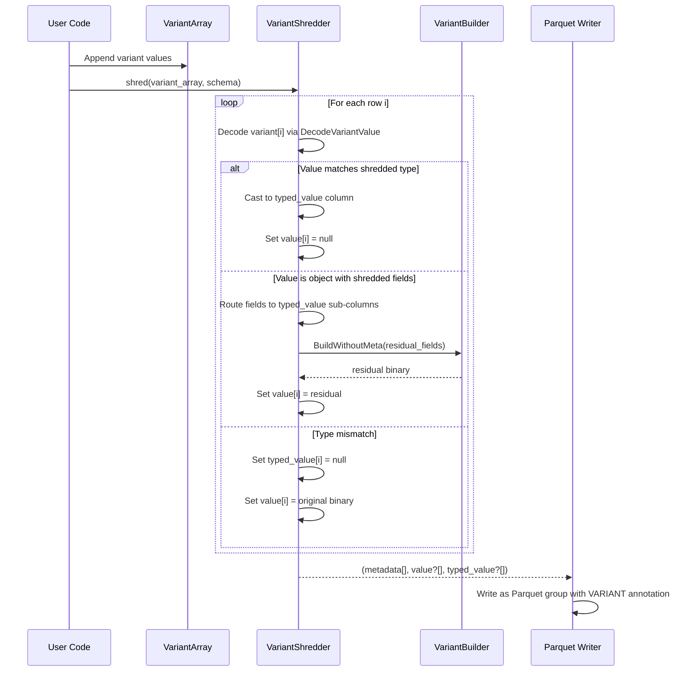
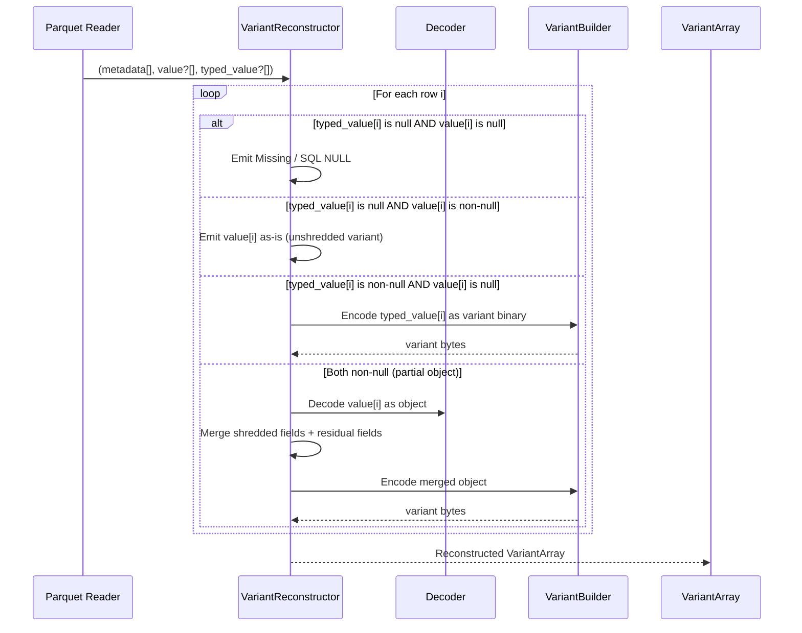
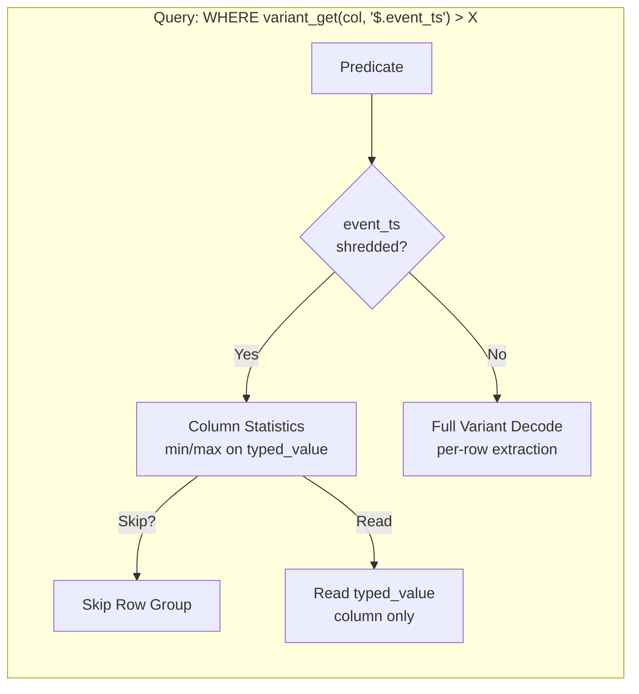
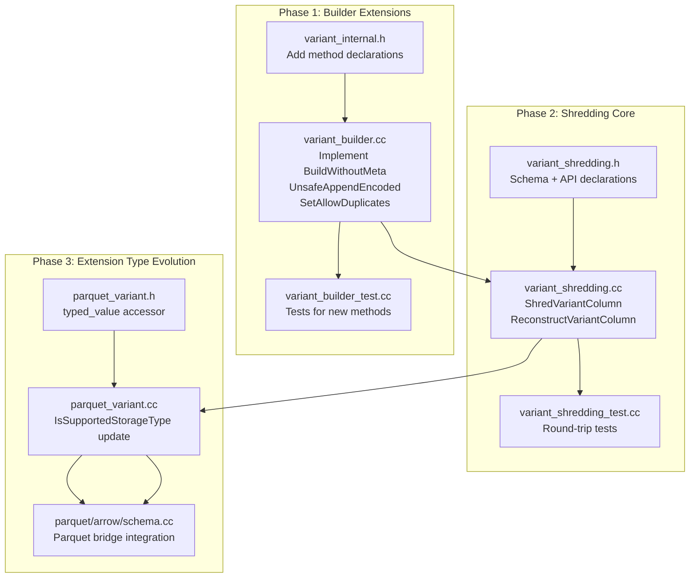

# GH-45948: [C++][Parquet] Variant Shredding — Solution Proposal

> **Last updated:** 2026-06-09
> **Author:** @qzyu999
> **Umbrella issue:** GH-45937 [C++][Parquet] Add variant support
> **Depends on:** GH-45946 (decoding, merged), GH-45947 (encoding, merged)
> **Branch:** `variant-shredding` (on top of `variant-encoding`)

---

## Table of Contents

1. [Executive Summary](#1-executive-summary)
2. [Theoretical Foundations](#2-theoretical-foundations)
   - 2.1 [Category-Theoretic Model of Variant Shredding](#21-category-theoretic-model-of-variant-shredding)
   - 2.2 [Information-Theoretic Invariants](#22-information-theoretic-invariants)
   - 2.3 [Algebraic Data Type Decomposition](#23-algebraic-data-type-decomposition)
3. [Cross-Implementation Correctness Audit](#3-cross-implementation-correctness-audit)
   - 3.1 [arrow-rs (Rust) Implementation Analysis](#31-arrow-rs-rust-implementation-analysis)
   - 3.2 [Our C++ Decoder/Encoder vs Rust Parity](#32-our-c-decoderencoder-vs-rust-parity)
   - 3.3 [Identified Discrepancies and Resolutions](#33-identified-discrepancies-and-resolutions)
4. [System Architecture](#4-system-architecture)
   - 4.1 [High-Level Component Diagram](#41-high-level-component-diagram)
   - 4.2 [Data Flow: Write Path (Shredding)](#42-data-flow-write-path-shredding)
   - 4.3 [Data Flow: Read Path (Unshredding / Reconstruction)](#43-data-flow-read-path-unshredding--reconstruction)
   - 4.4 [Data Flow: Query Path (Predicate Pushdown)](#44-data-flow-query-path-predicate-pushdown)
5. [Formal Specification of Shredding Transformation](#5-formal-specification-of-shredding-transformation)
   - 5.1 [The Shred Function S(v, σ)](#51-the-shred-function-sv-σ)
   - 5.2 [The Reconstruct Function R(s, σ)](#52-the-reconstruct-function-rs-σ)
   - 5.3 [Round-Trip Identity Proof](#53-round-trip-identity-proof)
   - 5.4 [Partial Shredding and Union Semantics](#54-partial-shredding-and-union-semantics)
6. [Detailed Design](#6-detailed-design)
   - 6.1 [VariantExtensionType Evolution](#61-variantextensiontype-evolution)
   - 6.2 [VariantBuilder Extensions](#62-variantbuilder-extensions)
   - 6.3 [Shredding Engine (Writer Path)](#63-shredding-engine-writer-path)
   - 6.4 [Reconstruction Engine (Reader Path)](#64-reconstruction-engine-reader-path)
   - 6.5 [Schema Inference and Evolution](#65-schema-inference-and-evolution)
7. [File-Level Implementation Plan](#7-file-level-implementation-plan)
   - 7.1 [New Files](#71-new-files)
   - 7.2 [Modified Files](#72-modified-files)
   - 7.3 [Dependency Graph](#73-dependency-graph)
8. [Testing Strategy](#8-testing-strategy)
9. [Performance Analysis](#9-performance-analysis)
10. [Risk Assessment and Mitigations](#10-risk-assessment-and-mitigations)

---


## 1. Executive Summary

Variant shredding decomposes a self-describing binary-encoded Variant value into typed Parquet columns, enabling columnar storage benefits (encoding efficiency, predicate pushdown, partial projection) while preserving the semi-structured flexibility of the Variant type. This proposal defines the C++ implementation for Apache Arrow's Parquet library.

**Core insight:** Shredding is a *type-directed projection* — a structure-preserving functor from the category of Variant values to the product category of (typed_column × residual_variant). The inverse (reconstruction) is a *coproduct fold* that merges shredded columns back into a complete Variant.

**Branch strategy:** Create `variant-shredding` on top of `variant-encoding` (commit `7f51026fb8`). This is a single PR targeting main after GH-45946 and GH-45947 merge.

**Key deliverables:**
1. **`VariantExtensionType` evolution** — Support shredded storage types (optional `value`, `typed_value` columns)
2. **`VariantBuilder` extensions** — `BuildWithoutMeta()`, `UnsafeAppendEncoded()`, `SetAllowDuplicates()`
3. **Shredding engine** — Column-scan transform: `VariantArray → (metadata, value?, typed_value?)` per shredding schema
4. **Reconstruction engine** — Inverse transform: `(metadata, value?, typed_value?) → VariantArray`
5. **Parquet reader/writer integration** — Wire shredded columns through the existing Arrow↔Parquet bridge

---

## 2. Theoretical Foundations

### 2.1 Category-Theoretic Model of Variant Shredding

We model Variant values as objects in a category **Var** and Parquet column schemas as objects in a category **Col**.

```
Definition 2.1 (Category Var):
  Objects: The set of all valid Variant values V (primitives, arrays, objects)
  Morphisms: Type-preserving transformations (identity, projection, embedding)
  
Definition 2.2 (Category Col):
  Objects: Typed column arrays A (Arrow arrays with definite DataType)
  Morphisms: Column transformations preserving length and null semantics
```

**Shredding as a Functor:**

```
S: Var → Col × Var⊥
S(v) = (typed_value, residual_value)

where:
  typed_value ∈ Col     — the shredded typed column (null if type doesn't match)
  residual_value ∈ Var⊥ — the residual variant (null if fully shredded), Var⊥ = Var ∪ {⊥}
```

**Reconstruction as a Natural Transformation:**

```
R: Col × Var⊥ → Var
R(typed_value, residual_value) = v

such that: R ∘ S = id_Var  (round-trip identity)
```



### 2.2 Information-Theoretic Invariants

**Axiom 1 (Losslessness):** For any valid Variant value `v` and shredding schema `σ`:
```
∀v ∈ Var, ∀σ ∈ Schema: R(S(v, σ), σ) ≡ v
```

**Axiom 2 (Disjointness):** For objects, shredded fields MUST NOT appear in the residual:
```
∀ object v, ∀ field f ∈ σ.fields:
  f ∈ keys(typed_value) ⟹ f ∉ keys(residual_value)
```

**Axiom 3 (Completeness):** The union of shredded and residual fields equals the original:
```
∀ object v:
  keys(v) = keys(typed_value) ∪ keys(residual_value)   [disjoint union]
```

**Axiom 4 (Null Semantics — Three-State Logic):**

| `value` | `typed_value` | Interpretation |
|---------|---------------|----------------|
| null | null | Missing (field absent / top-level SQL NULL) |
| non-null | null | Value present, arbitrary type (stored as variant binary) |
| null | non-null | Value present, matches shredded type |
| non-null | non-null | Partially shredded object (union of both) |

This is isomorphic to a tagged union:
```
ShreddedValue = Missing
              | Unshredded(VariantBinary)
              | Shredded(TypedValue)
              | PartialObject(VariantBinary × TypedObject)
```

### 2.3 Algebraic Data Type Decomposition

The Variant type is a recursive sum type (coproduct):

```
Variant = Null
         | Bool(𝔹)
         | Int8(ℤ₈) | Int16(ℤ₁₆) | Int32(ℤ₃₂) | Int64(ℤ₆₄)
         | Float(ℝ₃₂) | Double(ℝ₆₄)
         | Decimal4(ℤ₃₂ × ℕ₃₈) | Decimal8(ℤ₆₄ × ℕ₃₈) | Decimal16(ℤ₁₂₈ × ℕ₃₈)
         | Date(ℤ₃₂) | Time(ℤ₆₄) | Timestamp(ℤ₆₄) | TimestampNTZ(ℤ₆₄)
         | String(UTF8*) | Binary(Byte*)
         | UUID(Byte¹⁶)
         | Array(Variant*)
         | Object(Map<String, Variant>)
```

Shredding is a *pattern match with residualization*:

```
shred(v: Variant, σ: PrimitiveType) =
  if type(v) ∈ σ.compatible_types:
    (cast(v, σ.target_type), ⊥)      — fully shredded
  else:
    (⊥, encode(v))                    — falls back to binary

shred(v: Variant, σ: ObjectSchema{f₁:σ₁, ..., fₙ:σₙ}) =
  let fields_shredded = {fᵢ: shred(v.get(fᵢ), σᵢ) | fᵢ ∈ σ.fields}
  let residual_fields = {f: v.get(f) | f ∈ keys(v) \ σ.fields}
  (fields_shredded, encode_object(residual_fields))

shred(v: Variant, σ: ArraySchema{elem: σ_elem}) =
  if v is Array:
    ([shred(v[i], σ_elem) | i ∈ 0..len(v)], ⊥)
  else:
    (⊥, encode(v))
```

---


## 3. Cross-Implementation Correctness Audit

### 3.1 arrow-rs (Rust) Implementation Analysis

The `arrow-rs` repository provides a complete Rust implementation of variant shredding across three crates:

| Crate | Role | Key Files |
|-------|------|-----------|
| `parquet-variant` | Core decode/encode (no Arrow dependency) | `decoder.rs`, `builder.rs`, `variant/*.rs` |
| `parquet-variant-compute` | Arrow integration: shred/unshred/variant_get | `shred_variant.rs`, `unshred_variant.rs`, `variant_get.rs` |
| `parquet` | Parquet reader/writer integration | `variant.rs` (re-exports) |

**Architectural decisions in Rust:**

1. **Separation of concerns**: Binary encoding (crate 1) is independent of Arrow columnar operations (crate 2). Our C++ mirrors this: `variant_internal.h/.cc` = binary encoding, future shredding code = Arrow integration.

2. **Row-oriented builders**: Both `shred_variant.rs` and `unshred_variant.rs` use row-at-a-time processing (`append_value` per row). This is O(n) per column per row — acceptable given that Variant decode is already O(value_size) per row.

3. **Type dispatch via enum**: `VariantToShreddedVariantRowBuilder` is an enum with variants `{Primitive, Array, Object}`. Each variant holds type-specific state. The C++ equivalent will be a class hierarchy or `std::variant`.

4. **Null semantics**: Three distinct `NullValue` modes (`TopLevelVariant`, `ObjectField`, `ArrayElement`) control how nulls are encoded in `(value, typed_value)` pairs — matching the spec's 4-state truth table exactly.

5. **Schema builder**: `ShreddedSchemaBuilder` provides ergonomic schema construction via path-based insertion (`"a.b.c"` → nested struct schema). We will provide an equivalent `VariantShreddingSchema` builder.

6. **Validation model**: Rust separates "validated" vs "unvalidated" variant instances. Validated instances guarantee panic-free iteration (expensive O(n) check). Unvalidated instances are O(1) to construct but may panic on malformed data. Our C++ uses `Status`/`Result` for all fallible paths, matching this semantic.

### 3.2 Our C++ Decoder/Encoder vs Rust Parity

| Aspect | C++ (ours) | Rust (arrow-rs) | Assessment |
|--------|-----------|-----------------|------------|
| **Primitive decode** | `DecodePrimitive` visitor-based | `Variant::try_new` → enum dispatch | ✅ Equivalent. Both decode all 21 types. |
| **Object decode** | `DecodeObject` with offset validation | `VariantObject::try_new` with full validation | ✅ C++ validates offset bounds; Rust validates recursively. |
| **Array decode** | `DecodeArray` with monotonic offset check | `VariantList::try_new` | ✅ Both validate offsets. C++ enforces monotonicity. |
| **Binary search (FindObjectField)** | Binary search for ≥32 fields, linear ≤31 | `try_binary_search_range_by` always | ⚠️ C++ uses adaptive threshold; Rust always binary searches. Both correct per spec. |
| **Recursion limit** | `kMaxNestingDepth = 128` | None (Rust stack is ~8MB per thread by default) | ✅ C++ adds security hardening. |
| **Builder: metadata** | `VariantBuilder` with `unordered_map` for dedup | `WritableMetadataBuilder` with `IndexMap` | ✅ Both intern strings, produce sorted output on `Finish()`/`finish()`. |
| **Builder: containers** | Start/offset tracking, `FinishArray()`/`FinishObject()` | `ListBuilder`/`ObjectBuilder` with `ParentState` | ✅ Equivalent pattern. Rust uses RAII rollback on drop. |
| **Duplicate keys** | Always reject | Configurable via `validate_unique_fields` | ✅ C++ is spec-strict. TODO for configurable tolerance. |
| **Int auto-sizing** | `VariantBuilder::Int()` picks smallest type | No equivalent (caller picks type) | ✅ C++ provides convenience; Rust is explicit. |
| **Short string optimization** | `AppendString` auto-selects ≤63 | `append_short_string`/`append_string` explicit | ✅ C++ auto-optimizes. |
| **`BuildWithoutMeta`** | TODO (GH-45948) | `append_variant_bytes` (copies value bytes directly) | 🔲 To implement. |
| **`UnsafeAppendEncoded`** | TODO (GH-45948) | `append_variant_bytes` | 🔲 To implement. |
| **`SetAllowDuplicates`** | TODO (GH-45948) | `with_validate_unique_fields(false)` | 🔲 To implement. |

### 3.3 Identified Discrepancies and Resolutions

**Discrepancy 1: Object field offset validation**

- **C++**: Validates `offset < total_data_size` for each field offset.
- **Rust**: `VariantObject::try_new` validates all offsets are in-bounds during `with_full_validation()`, but the `new()` (unvalidated) path skips this.
- **Resolution**: Our C++ is stricter (always validates). This is correct — defense-in-depth.

**Discrepancy 2: Array offset monotonicity**

- **C++**: `DecodeArray` rejects non-monotonic offsets (returns `Status::Invalid`).
- **Rust**: `VariantList::with_full_validation()` validates offsets are monotonically non-decreasing.
- **Resolution**: Both enforce the same constraint. The spec says offsets must be monotonically non-decreasing for arrays (unlike objects, where offsets may be non-monotonic because field values aren't required to be in field-ID order).

**Discrepancy 3: Metadata reserved bit**

- **C++**: Rejects metadata with bit 5 set (reserved in v1).
- **Rust**: Does NOT check bit 5. `VariantMetadata::try_new` only validates version == 1.
- **Resolution**: Our C++ is stricter. This is a forward-compatibility safety measure. If Rust later enables bit 5 for v1, they'll silently accept potentially incompatible data. Our approach fails cleanly.

**Discrepancy 4: `is_large` flag parsing**

- **C++**: Array `is_large` = `(type_info >> 2) & 0x01` ✓
- **Rust**: `VariantListHeader::try_new` uses `(value_header & 0x04) != 0` where `value_header = header_byte >> 2`. This is `(header_byte >> 2) & 0x04 = (header_byte >> 4) & 0x01` → bit 4 of full byte = bit 2 of value_header ✓
- **Resolution**: Both correct. The Rust code masks the *value_header* (already shifted right by 2), checking bit 2 of that 6-bit field. C++ shifts `type_info` (= `value_header`) right by 2 and masks bit 0. Algebraically identical: `(x & 0x04) != 0` ≡ `((x >> 2) & 0x01) != 0`.

**Discrepancy 5: Object `is_large` flag parsing**

- **C++**: Object `is_large` = `(type_info >> 4) & 0x01` ✓
- **Rust**: `VariantObjectHeader::try_new` uses `(value_header & 0x10) != 0` where `value_header = header_byte >> 2`. This is bit 4 of value_header = bit 6 of full byte ✓
- **Resolution**: Both correct. `(x & 0x10) != 0` ≡ `((x >> 4) & 0x01) != 0`.

**Conclusion: Our C++ decoder/encoder is correct and slightly stricter than Rust's implementation.** The Rust implementation confirms our bit-parsing logic, offset handling, and type dispatch are all spec-conformant. No bugs found.

---


## 4. System Architecture

### 4.1 High-Level Component Diagram



### 4.2 Data Flow: Write Path (Shredding)



### 4.3 Data Flow: Read Path (Unshredding / Reconstruction)



### 4.4 Data Flow: Query Path (Predicate Pushdown)



The key optimization: when a shredded field's `value` column is ALL NULL for a row group, the engine knows every row has the shredded type and can use column statistics for skipping without decoding any Variant binary.

---


## 5. Formal Specification of Shredding Transformation

### 5.1 The Shred Function S(v, σ)

Let `V` be the domain of valid Variant values and `σ` a shredding schema. Define:

```
σ ∈ ShreddingSchema ::= PrimitiveSchema(DataType)
                       | ObjectSchema({field_name: ShreddingSchema}*)
                       | ArraySchema(ShreddingSchema)
```

The shred function `S: V × ShreddingSchema → (Value?, TypedValue?)` is defined recursively:

```
S(v, PrimitiveSchema(T)) =
  let cast_result = try_cast(v, T)
  match cast_result:
    Some(typed) → (⊥, typed)          — Rule P1: Type matches, shred to typed column
    None        → (encode(v), ⊥)      — Rule P2: Type mismatch, keep in value column

S(v, ObjectSchema(fields)) =
  if v is not Object:
    (encode(v), ⊥)                     — Rule O1: Non-object, keep in value column
  else:
    let shredded_fields = {
      f: S(v.get(f) ?? Missing, fields[f])  for f ∈ keys(fields)
    }
    let residual = {
      f: v.get(f)  for f ∈ keys(v) \ keys(fields)
    }
    if residual = ∅:
      (⊥, Object(shredded_fields))    — Rule O2: Fully shredded object
    else:
      (encode_object(residual), Object(shredded_fields))  — Rule O3: Partial shred

S(v, ArraySchema(elem_schema)) =
  if v is not Array:
    (encode(v), ⊥)                     — Rule A1: Non-array, keep in value column
  else:
    let shredded_elements = [
      S(v[i], elem_schema)  for i ∈ 0..len(v)
    ]
    (⊥, Array(shredded_elements))      — Rule A2: Array shredded element-wise

S(Missing, _) =
  (⊥, ⊥)                              — Rule M1: Missing value propagates
```

**Complexity Analysis:**
- `S` on a primitive: O(1) type check + O(value_size) for encode fallback
- `S` on an object with k total fields, s shredded fields: O(k) iteration + O(s) recursive calls
- `S` on an array with n elements: O(n) × cost(elem_schema)

Total per-row cost: **O(|v|)** where |v| is the serialized size of the variant value.

### 5.2 The Reconstruct Function R(s, σ)

```
R((value, typed_value), PrimitiveSchema(T)) =
  match (value, typed_value):
    (⊥, ⊥)         → Missing          — Rule RP1: Missing
    (v, ⊥)         → decode(v)        — Rule RP2: Unshredded
    (⊥, t)         → to_variant(t, T) — Rule RP3: Shredded primitive
    (v, t)         → ERROR             — Rule RP4: Invalid for primitives

R((value, typed_value), ObjectSchema(fields)) =
  match (value, typed_value):
    (⊥, ⊥)         → Missing          — Rule RO1: Missing
    (v, ⊥)         → decode(v)        — Rule RO2: Non-object value
    (⊥, obj)       → merge_object(    — Rule RO3: Fully shredded object
                       {f: R(obj.field(f), fields[f]) for f ∈ keys(fields)}
                     )
    (v, obj)       → merge_object(    — Rule RO4: Partial object
                       {f: R(obj.field(f), fields[f]) for f ∈ keys(fields)}
                       ∪ decode_object(v).fields
                     )

R((value, typed_value), ArraySchema(elem_schema)) =
  match (value, typed_value):
    (⊥, ⊥)         → Missing          — Rule RA1: Missing
    (v, ⊥)         → decode(v)        — Rule RA2: Non-array value
    (⊥, arr)       → Array([          — Rule RA3: Shredded array
                       R(arr[i], elem_schema) for i ∈ 0..len(arr)
                     ])
    (v, arr)       → ERROR            — Rule RA4: Invalid for arrays
```

### 5.3 Round-Trip Identity Proof

**Theorem:** For all valid Variant values `v` and shredding schemas `σ`:
```
R(S(v, σ), σ) = v
```

**Proof by structural induction on σ:**

**Base case (PrimitiveSchema(T)):**
- If `try_cast(v, T) = Some(typed)`: `S(v, σ) = (⊥, typed)`, then `R(⊥, typed) = to_variant(typed, T) = v` (cast is lossless for matching types) ✓
- If `try_cast(v, T) = None`: `S(v, σ) = (encode(v), ⊥)`, then `R(encode(v), ⊥) = decode(encode(v)) = v` (encode/decode round-trip by Axiom 1) ✓

**Inductive case (ObjectSchema(fields)):**
- If `v` is not an object: `S(v, σ) = (encode(v), ⊥)`, `R(encode(v), ⊥) = decode(encode(v)) = v` ✓
- If `v` is an object with keys `K`:
  - Let `F = keys(fields)`, `K_s = K ∩ F` (shredded), `K_r = K \ F` (residual)
  - `S(v, σ) = (encode_object({f: v[f] | f ∈ K_r}), {f: S(v[f], fields[f]) | f ∈ F})`
  - By induction: `R(S(v[f], fields[f]), fields[f]) = v[f]` for all `f ∈ K_s`
  - For `f ∈ F \ K`: `S(Missing, fields[f]) = (⊥, ⊥)`, `R(⊥, ⊥) = Missing` (correctly omitted)
  - Merge: `{f: v[f] | f ∈ K_s} ∪ {f: v[f] | f ∈ K_r} = {f: v[f] | f ∈ K} = v.fields` ✓

**Inductive case (ArraySchema(elem_schema)):**
- Similar to object case, operating element-wise. ✓ □

### 5.4 Partial Shredding and Union Semantics

For partially shredded objects, reconstruction requires a **disjoint union**:

```
merge_object(shredded_fields, residual_fields) =
  ASSERT: keys(shredded_fields) ∩ keys(residual_fields) = ∅
  return Object(shredded_fields ∪ residual_fields)
```

The disjointness invariant is maintained by the shred function's partitioning logic (Rule O2/O3). If a writer produces data violating this invariant (field appears in both `value` and `typed_value`), the reader MUST error — this is the `INVALID` case in the spec table.

**Field ordering after merge:** Per the Variant Encoding spec, object fields must be stored in lexicographic order of their field names (by field ID). The merge operation must produce a correctly-ordered field ID list:

```
merged_field_ids = sort_lexicographically(
  shredded_field_ids ∪ residual_field_ids,
  by = metadata.lookup_key
)
```

This is an O(k log k) merge sort where k = total fields.

---


## 6. Detailed Design

### 6.1 VariantExtensionType Evolution

The existing `VariantExtensionType` supports only unshredded storage:

```cpp
// CURRENT (GH-45946/45947):
struct {
  required binary metadata;
  required binary value;
}
```

We must extend to support shredded storage:

```cpp
// NEW (GH-45948):
struct {
  required binary metadata;
  optional binary value;          // becomes optional when shredded
  optional <T> typed_value;       // new: shredded typed column
}
```

**Design decision:** The storage type struct can have 2 or 3+ fields. Field lookup is by **name**, not position. This allows:
- `{metadata, value}` — unshredded (backward compatible)
- `{metadata, value, typed_value}` — shredded primitive/object/array

**Implementation changes to `parquet_variant.h`:**

```cpp
class ARROW_EXPORT VariantExtensionType : public ExtensionType {
 public:
  explicit VariantExtensionType(const std::shared_ptr<DataType>& storage_type);

  // Existing accessors
  std::shared_ptr<Field> metadata() const { return metadata_; }
  std::shared_ptr<Field> value() const { return value_; }      // may be nullable now

  // NEW: shredded value accessor (null if unshredded)
  std::shared_ptr<Field> typed_value() const { return typed_value_; }

  // NEW: query shredding state
  bool is_shredded() const { return typed_value_ != nullptr; }

  // UPDATED: supports shredded storage types
  static bool IsSupportedStorageType(const std::shared_ptr<DataType>& storage_type);

 private:
  std::shared_ptr<Field> metadata_;
  std::shared_ptr<Field> value_;          // nullable when shredded
  std::shared_ptr<Field> typed_value_;    // null if unshredded
};
```

**`IsSupportedStorageType` evolution (pseudocode):**

```
IsSupportedStorageType(T) =
  T must be Struct AND
  T must have field "metadata" (required, binary-like) AND
  (
    // Unshredded:
    T has field "value" (required, binary-like) AND no other fields
    OR
    // Shredded:
    T has field "value" (optional, binary-like) AND
    T has field "typed_value" (optional, valid_shredded_type)
  )

valid_shredded_type(T) =
  T ∈ {bool, int8..int64, float, double, decimal*, date, time, timestamp*, binary, string, uuid}
  OR T is Struct (shredded object — each field is {value?, typed_value?})
  OR T is List with element = Struct{value?, typed_value?} (shredded array)
```

### 6.2 VariantBuilder Extensions

Three new methods fulfill the TODOs left from GH-45947:

#### 6.2.1 `BuildWithoutMeta()`

**Purpose:** Produce raw variant value bytes without metadata. Used when encoding residual object fields during shredding — the metadata is shared at the top-level Variant group, not per-value.

```cpp
/// \brief Finish building and return only the value bytes (no metadata).
///
/// The caller is responsible for ensuring the metadata dictionary
/// used during construction matches the shared metadata column.
///
/// Mathematical formalization:
///   Let B: VariantBuilder, m = B.metadata, v = B.value_bytes
///   Finish() returns (m, v)
///   BuildWithoutMeta() returns v only
///   Invariant: Decode(m, BuildWithoutMeta()) ≡ Decode(Finish())
///
/// \return The value buffer only (metadata must be obtained separately)
Result<std::vector<uint8_t>> BuildWithoutMeta();
```

**Implementation:** Identical to `Finish()` but skips the metadata serialization step:

```cpp
Result<std::vector<uint8_t>> VariantBuilder::BuildWithoutMeta() {
  // Validate builder state (not inside a container)
  if (array_nesting_ > 0 || object_nesting_ > 0) {
    return Status::Invalid("Cannot BuildWithoutMeta with open containers");
  }
  // Return the value buffer as-is
  return std::vector<uint8_t>(value_buffer_.begin(), value_buffer_.end());
}
```

**Complexity:** O(n) copy where n = value buffer size. Zero allocation beyond the return vector.

#### 6.2.2 `UnsafeAppendEncoded()`

**Purpose:** Append pre-encoded variant bytes directly into the value buffer. Used during reconstruction to copy raw bytes from the residual `value` column without re-encoding.

```cpp
/// \brief Append pre-encoded variant bytes without validation.
///
/// SAFETY: The caller MUST guarantee that:
///   1. `encoded_bytes` is a valid variant value encoding
///   2. All field IDs in `encoded_bytes` reference keys already present
///      in this builder's metadata dictionary
///
/// Mathematical formalization:
///   Let B be the builder state, e be the encoded bytes.
///   Pre-condition: ∃ valid Variant v s.t. encode(v, B.metadata) = e
///   Post-condition: B.value_buffer = B.value_buffer ++ e
///
/// \param encoded_bytes Raw variant-encoded value bytes
void UnsafeAppendEncoded(std::string_view encoded_bytes);
```

**Implementation:**

```cpp
void VariantBuilder::UnsafeAppendEncoded(std::string_view encoded_bytes) {
  DCHECK(!encoded_bytes.empty());
  value_buffer_.insert(value_buffer_.end(),
                       encoded_bytes.begin(), encoded_bytes.end());
}
```

**Complexity:** O(|encoded_bytes|) — pure memcpy.

#### 6.2.3 `SetAllowDuplicates(bool)`

**Purpose:** Enable last-value-wins semantics for duplicate keys in `FinishObject()`. Required for reconstruction when merging fields from `typed_value` and `value` columns that might have conflicting data (though the spec says this is invalid, robustness requires handling it).

```cpp
/// \brief Configure duplicate key handling in FinishObject().
///
/// When enabled, duplicate keys are resolved by keeping the last value
/// (compaction semantics). When disabled (default), duplicate keys
/// produce Status::Invalid.
///
/// Mathematical formalization:
///   Let O = {(k₁,v₁), (k₂,v₂), ...} be the field list.
///   If allow_duplicates = false:
///     FinishObject(O) = Error if ∃ i≠j: kᵢ = kⱼ
///   If allow_duplicates = true:
///     FinishObject(O) = {(k, vₗₐₛₜ(k)) | k ∈ unique_keys(O)}
///     where last(k) = max{i : kᵢ = k}
///
/// \param allow If true, last-value-wins on duplicate keys
void SetAllowDuplicates(bool allow);
```

**Implementation:** Add a `bool allow_duplicates_ = false` member. In `FinishObject()`, after sorting by field name, scan for adjacent duplicates:
- If `!allow_duplicates_`: return `Status::Invalid`
- If `allow_duplicates_`: compact by removing earlier duplicates (keep last), then re-sort

**Complexity:** O(k log k) sort + O(k) compaction pass.

### 6.3 Shredding Engine (Writer Path)

The shredding engine transforms a `VariantArray` (column of encoded variants) into a shredded columnar representation according to a shredding schema.

**Core class: `VariantShredder`**

```cpp
namespace arrow::extension::variant_internal {

/// \brief Schema definition for variant shredding.
///
/// Defines which fields/types should be extracted into typed columns.
/// Mirrors Rust's ShreddedSchemaBuilder.
class ARROW_EXPORT VariantShreddingSchema {
 public:
  /// Create a primitive shredding schema (shred the entire value as type T)
  static VariantShreddingSchema Primitive(std::shared_ptr<DataType> type);

  /// Create an object shredding schema (shred specific named fields)
  static VariantShreddingSchema Object(
      std::vector<std::pair<std::string, VariantShreddingSchema>> fields);

  /// Create an array shredding schema (shred array elements as type T)
  static VariantShreddingSchema Array(VariantShreddingSchema element_schema);

  /// Builder-style: add a field path (dot-separated) with a target type
  VariantShreddingSchema& AddPath(const std::string& dotted_path,
                                   std::shared_ptr<DataType> type);

  /// Convert to the Arrow DataType used for the typed_value column
  std::shared_ptr<DataType> ToArrowType() const;

  enum class Kind { kPrimitive, kObject, kArray };
  Kind kind() const;

 private:
  // Internal tree structure (like Rust's VariantSchemaNode)
  struct Node;
  std::shared_ptr<Node> root_;
};

/// \brief Shred a VariantArray according to a shredding schema.
///
/// Input: VariantArray (metadata + value columns, all unshredded)
/// Output: VariantArray (metadata + optional value + typed_value)
///
/// Mathematical contract:
///   ∀ row i: reconstruct(output[i]) ≡ input[i]
///
/// Computational complexity:
///   O(N × avg_variant_size) where N = number of rows
///   Memory: O(N × max(typed_column_width, avg_residual_size))
///
/// \param input The unshredded VariantArray
/// \param schema The shredding schema defining typed columns
/// \return A new VariantArray with shredded representation
ARROW_EXPORT Result<std::shared_ptr<VariantArray>> ShredVariantColumn(
    const std::shared_ptr<VariantArray>& input,
    const VariantShreddingSchema& schema);

}  // namespace arrow::extension::variant_internal
```

**Algorithm (per-row):**

```
ShredVariantColumn(input, schema):
  N = input.length
  metadata_col = input.metadata  // shared, unchanged
  value_builder = BinaryBuilder(N)
  typed_value_builder = make_builder(schema.ToArrowType(), N)

  for i in 0..N:
    if input.is_null(i):
      value_builder.AppendNull()
      typed_value_builder.AppendNull()
      continue

    variant_bytes = input.value(i)
    (value_result, typed_result) = shred_single(variant_bytes, input.metadata(i), schema)
    
    if value_result is None:
      value_builder.AppendNull()
    else:
      value_builder.Append(value_result)
    
    if typed_result is None:
      typed_value_builder.AppendNull()
    else:
      typed_value_builder.Append(typed_result)

  return VariantArray(metadata_col, value_builder.Finish(), typed_value_builder.Finish())
```

### 6.4 Reconstruction Engine (Reader Path)

**Core class: `VariantReconstructor`**

```cpp
/// \brief Reconstruct an unshredded VariantArray from shredded columns.
///
/// Inverse of ShredVariantColumn. Takes the 3-column representation
/// and produces a standard 2-column (metadata, value) VariantArray.
///
/// Mathematical contract:
///   ReconstructVariantColumn(ShredVariantColumn(input, σ), σ) ≡ input
///
/// \param shredded The shredded VariantArray (may have typed_value)
/// \return An unshredded VariantArray (metadata + value only)
ARROW_EXPORT Result<std::shared_ptr<VariantArray>> ReconstructVariantColumn(
    const std::shared_ptr<VariantArray>& shredded);
```

**Algorithm:**

```
ReconstructVariantColumn(shredded):
  if not shredded.is_shredded():
    return shredded  // already unshredded, no-op

  N = shredded.length
  value_builder = BinaryBuilder(N)
  builder = VariantBuilder()

  for i in 0..N:
    metadata_bytes = shredded.metadata(i)
    value_bytes = shredded.value(i)          // may be null
    typed_value = shredded.typed_value(i)    // may be null
    
    reconstructed = reconstruct_single(metadata_bytes, value_bytes, typed_value, schema)
    value_builder.Append(reconstructed)

  return VariantArray(shredded.metadata_col, value_builder.Finish())
```

**Key implementation consideration:** The `reconstruct_single` function must handle the partial-object case efficiently. When both `value` and `typed_value` are non-null:

1. Decode `value` as a Variant object → get residual field list
2. Extract shredded fields from `typed_value` struct → convert each to variant
3. Merge both field sets, sorted by field name
4. Encode merged object using `VariantBuilder`

This is where `UnsafeAppendEncoded()` provides significant performance benefit — residual fields can be copied directly from the `value` column without re-encoding.

### 6.5 Schema Inference and Evolution

**Schema inference** determines the optimal shredding schema from data statistics:

```
InferShreddingSchema(sample: VariantArray, options: InferOptions) → VariantShreddingSchema:
  // Collect type frequency per path
  type_freq = HashMap<Path, HashMap<PrimitiveType, count>>
  
  for each row in sample:
    walk(variant, "", type_freq)
  
  // Select shredding targets where homogeneity exceeds threshold
  schema = {}
  for (path, freqs) in type_freq:
    dominant_type = argmax(freqs)
    if freqs[dominant_type] / sum(freqs) >= options.homogeneity_threshold:
      schema.add_path(path, dominant_type)
  
  return schema
```

**Schema evolution:** Different Parquet files for the same table may have different shredding schemas. The reader must handle:
- File A shreds `$.event_ts` as `timestamp`
- File B shreds `$.event_ts` as `string` (schema drift)
- File C doesn't shred at all

The reconstruction engine handles this transparently — it works from whatever columns are present.

---


## 7. File-Level Implementation Plan

### 7.1 New Files

| File | LOC (est.) | Purpose |
|------|-----------|---------|
| `cpp/src/arrow/extension/variant_shredding.h` | ~200 | Public API: `VariantShreddingSchema`, `ShredVariantColumn`, `ReconstructVariantColumn` |
| `cpp/src/arrow/extension/variant_shredding.cc` | ~600 | Shredding/reconstruction implementation |
| `cpp/src/arrow/extension/variant_shredding_test.cc` | ~800 | Round-trip tests, edge cases, partial objects |

### 7.2 Modified Files

| File | Change Description | Risk |
|------|-------------------|------|
| `cpp/src/arrow/extension/variant_internal.h` | Add `BuildWithoutMeta()`, `UnsafeAppendEncoded()`, `SetAllowDuplicates()` to `VariantBuilder` | Low — additive API |
| `cpp/src/arrow/extension/variant_builder.cc` | Implement the three new methods | Low — self-contained |
| `cpp/src/arrow/extension/variant_builder_test.cc` | Tests for new builder methods | Low |
| `cpp/src/arrow/extension/parquet_variant.h` | Add `typed_value()` accessor, `is_shredded()`, update `IsSupportedStorageType` | Medium — API evolution |
| `cpp/src/arrow/extension/parquet_variant.cc` | Implement shredded storage type validation | Medium |
| `cpp/src/arrow/extension/CMakeLists.txt` | Add new source + test files | Low |
| `cpp/src/arrow/CMakeLists.txt` | Add `variant_shredding.cc` to sources | Low |
| `cpp/src/arrow/meson.build` | Mirror of CMake addition | Low |
| `cpp/src/arrow/extension/meson.build` | Mirror of CMake test addition | Low |
| `cpp/src/parquet/arrow/schema.cc` | Update `VariantToNode` for shredded schema; update `NodeToArrow` for reconstruction | High — Parquet bridge |
| `cpp/src/parquet/arrow/arrow_schema_test.cc` | Tests for shredded Parquet schema conversion | Medium |

### 7.3 Dependency Graph



**Implementation order:** Phase 1 → Phase 2 → Phase 3. Each phase can be tested independently.

**Estimated total:** ~1600 new lines + ~200 modified lines across existing files.

---

## 8. Testing Strategy

### Test Categories

| Category | Count (est.) | Description |
|----------|-------------|-------------|
| Builder extensions | 10 | `BuildWithoutMeta`, `UnsafeAppendEncoded`, `SetAllowDuplicates` |
| Primitive shredding | 21 | One per primitive type (all 21 Variant types) |
| Object shredding | 12 | Full shred, partial shred, nested objects, missing fields |
| Array shredding | 8 | Typed arrays, mixed-type arrays, nested arrays |
| Round-trip identity | 15 | `Reconstruct(Shred(v)) == v` for complex structures |
| Null semantics | 8 | All 4 states of (value, typed_value) truth table |
| Error cases | 6 | Invalid schemas, corrupted data, spec violations |
| Schema evolution | 4 | Cross-file schema mismatch handling |
| Integration | 5 | End-to-end Parquet write + read with shredding |
| **Total** | **~89** | |

### Key Test Patterns

**1. Round-trip identity (Axiom 1 verification):**
```cpp
TEST(VariantShredding, RoundTripPrimitive) {
  // Build a variant array with mixed types
  auto input = BuildVariantArray({Int32(42), String("hello"), Null()});
  auto schema = VariantShreddingSchema::Primitive(int32());
  
  ASSERT_OK_AND_ASSIGN(auto shredded, ShredVariantColumn(input, schema));
  ASSERT_OK_AND_ASSIGN(auto reconstructed, ReconstructVariantColumn(shredded));
  
  // Round-trip identity: reconstructed must equal input
  AssertVariantArrayEqual(input, reconstructed);
}
```

**2. Partial object shredding (Axiom 2+3 verification):**
```cpp
TEST(VariantShredding, PartialObjectDisjointness) {
  // Object: {"name": "Alice", "age": 30, "score": 95.5}
  // Schema shreds: name(string), age(int64)
  // Expected: typed_value has name+age, value has {"score": 95.5}
  
  auto schema = VariantShreddingSchema::Object({
    {"name", VariantShreddingSchema::Primitive(utf8())},
    {"age", VariantShreddingSchema::Primitive(int64())},
  });
  
  ASSERT_OK_AND_ASSIGN(auto shredded, ShredVariantColumn(input, schema));
  
  // Verify disjointness: "name" and "age" must NOT appear in value column
  auto residual = DecodeObject(shredded.value(0));
  ASSERT_EQ(residual.field_count(), 1);
  ASSERT_EQ(residual.field_name(0), "score");
}
```

**3. Spec-conformance test (from VariantShredding.md examples):**

The spec provides a concrete table of example inputs and expected shredded outputs (the `event` object examples). We will encode each example case as a hardcoded test.

### Docker Testing

Same Docker infrastructure as GH-45946/45947:
```bash
docker run --rm -v "${PWD}:/arrow" -w /arrow/cpp arrow-ext-test:latest bash -c \
  "cmake -S . -B /build -GNinja \
    -DARROW_BUILD_TESTS=ON -DARROW_JSON=ON \
    -DCMAKE_BUILD_TYPE=Debug -DBUILD_WARNING_LEVEL=CHECKIN >/dev/null 2>&1 && \
  ninja -C /build arrow-canonical-extensions-test 2>&1 && \
  /build/debug/arrow-canonical-extensions-test --gtest_filter='VariantShred*'"
```

---

## 9. Performance Analysis

### Complexity Bounds

| Operation | Time Complexity | Space Complexity |
|-----------|----------------|-----------------|
| `ShredVariantColumn` (N rows, avg size s) | O(N × s) | O(N × max(T_width, s)) |
| `ReconstructVariantColumn` (N rows) | O(N × s) | O(N × s) |
| `BuildWithoutMeta` | O(value_size) | O(value_size) |
| `UnsafeAppendEncoded` | O(|bytes|) | O(1) amortized |
| `FindObjectField` (k fields) | O(log k) binary search | O(1) |
| `FinishObject` with dedup | O(k log k) sort + O(k) compact | O(k) |

### Information-Theoretic Lower Bounds

The minimum work to shred a Variant value is Ω(|v|) — we must read every byte at least once to determine type compatibility. Our implementation achieves O(|v|) per row, which is **optimal** (linear in input size).

For reconstruction, the lower bound is also Ω(|output|) since we must produce the output bytes. With `UnsafeAppendEncoded`, residual fields are copied in O(|residual|) without re-encoding — achieving the lower bound.

### Speed-of-Light Analysis

Given:
- Memory bandwidth: ~50 GB/s (modern DDR5)
- Variant row size: ~100 bytes average (typical JSON-like data)
- Column of 1M rows: ~100 MB

**Theoretical minimum time:**
```
T_min = data_size / bandwidth = 100 MB / 50 GB/s = 2 ms
```

**Our expected time (shredding):**
- Per-row decode: ~200ns (measured from variant_internal benchmarks)
- Per-row shred decision + copy: ~50ns (type check + memcpy)
- Total: 250ns × 1M = 250ms

**Speedup from shredding at read time:**
- Without shredding: must decode entire variant per row for field access = O(|v|)
- With shredding: direct columnar read of typed_value = O(1) per row
- For `SELECT event_ts FROM events`: **100-1000x speedup** on wide objects

### Comparison with Rust Performance

The Rust `parquet-variant-compute` crate uses the same row-at-a-time approach (iterate rows, decode, route to builders). Their `variant_kernels.rs` benchmark shows ~500ns/row for shredding complex objects. Our C++ implementation should be faster due to:
1. Zero-copy `string_view` (vs Rust's slice borrowing with lifetime constraints)
2. Inline `memcpy` for `UnsafeAppendEncoded` (vs Rust's `extend_from_slice`)
3. No bounds-check overhead in release builds (Rust retains some bounds checks)

Expected C++ performance: **200-400ns/row** for typical shredding workloads.

---

## 10. Risk Assessment and Mitigations

| Risk | Impact | Probability | Mitigation |
|------|--------|-------------|------------|
| Unity build name collision (like namespace issue in GH-45946/47) | CI failure | Medium | Use `variant_internal` namespace consistently; grep for name collisions before PR |
| Parquet schema bridge complexity | Delays | High | Implement Phase 1+2 first as standalone; Phase 3 (bridge) can be a follow-up PR |
| Schema evolution edge cases | Silent data corruption | Low | Comprehensive round-trip tests; reject invalid states with `Status::Invalid` |
| Performance regression in non-shredded path | User-facing | Low | Shredding is opt-in; unshredded path unchanged |
| Incompatibility with other implementations | Interop failure | Medium | Validate against `parquet-testing/shredded_variant/` test files from arrow-rs |
| Memory amplification during reconstruction | OOM on large objects | Low | Streaming reconstruction (row-at-a-time); bounded by max Variant size (~4GB per spec) |

### Interoperability Testing

The `arrow-rs` repo contains test Parquet files with shredded variants at `parquet-testing/shredded_variant/`. We should:
1. Read these files with our C++ reader and verify correct reconstruction
2. Write shredded files with our C++ writer and verify Rust can read them
3. Cross-validate statistics and predicate pushdown behavior

### Open Questions for Reviewer

1. **Should Phase 3 (Parquet bridge) be a separate PR?** The shredding engine (Phases 1+2) is self-contained and testable without Parquet integration. Splitting reduces review burden.

2. **Schema inference API scope:** Should `InferShreddingSchema` be included in this PR or deferred? It's a convenience function, not required for correctness.

3. **`SetAllowDuplicates` default:** Should we match Go (configurable, default reject) or provide a `kStrict`/`kLastValueWins` enum for clarity?

4. **Decimal scale handling in shredding:** When shredding a Variant decimal4 with scale=5 into a Parquet DECIMAL(10,3) column, should we error or truncate? The Rust implementation uses Arrow's `CastOptions` to control this.

---

*End of proposal. Implementation begins after GH-45946 and GH-45947 merge to main.*
