# Foundational Prerequisites: Electrons to Python API

> **Purpose**: This document provides the complete prerequisite knowledge stack for understanding the Variant encode/decode code changes in [code_changes.md](code_changes.md). It answers: "Why does the code look like this, and what is actually happening at every layer from the physical hardware to the Python `pq.read_table()` call?"
>
> **Audience**: A Python developer who understands Python deeply but needs the full mental model of what happens beneath `import pyarrow`.
>
> **Methodology**: Bottom-up derivation from physics, through hardware, OS, language runtime, and up to the application layer. Every design choice in the C++ code is ultimately constrained by the physical laws and engineering tradeoffs described here.

---

## Table of Contents

1. [Layer 0: Physics — Speed of Light and the Memory Wall](#1-layer-0-physics--speed-of-light-and-the-memory-wall)
2. [Layer 1: Hardware — CPU, Caches, RAM, and Storage](#2-layer-1-hardware--cpu-caches-ram-and-storage)
3. [Layer 2: Operating System — Virtual Memory, Pages, and mmap](#3-layer-2-operating-system--virtual-memory-pages-and-mmap)
4. [Layer 3: C++ Memory Model — Pointers, the Stack, and the Heap](#4-layer-3-c-memory-model--pointers-the-stack-and-the-heap)
5. [Layer 4: C++ Ownership and Lifetime — RAII, shared_ptr, string_view](#5-layer-4-c-ownership-and-lifetime--raii-shared_ptr-string_view)
6. [Layer 5: Parquet File Format — On-Disk Columnar Storage](#6-layer-5-parquet-file-format--on-disk-columnar-storage)
7. [Layer 6: Arrow In-Memory Format — The Columnar RAM Layout](#7-layer-6-arrow-in-memory-format--the-columnar-ram-layout)
8. [Layer 7: The Bridge — Cython, PyArrow, and the GIL](#8-layer-7-the-bridge--cython-pyarrow-and-the-gil)
9. [Layer 8: End-to-End Data Flow — Reading a Variant Parquet Column](#9-layer-8-end-to-end-data-flow--reading-a-variant-parquet-column)
10. [Layer 9: Why the Variant C++ Code Is Written This Way](#10-layer-9-why-the-variant-c-code-is-written-this-way)

---

## 1. Layer 0: Physics — Speed of Light and the Memory Wall

### 1.1 The Fundamental Speed Limit

Every computation is ultimately limited by the speed of electromagnetic signals through matter:

$$c = 2.998 \times 10^8 \text{ m/s} \quad \text{(vacuum)}$$

In copper traces and silicon, signals travel at approximately $\frac{2}{3}c$:

$$v_{\text{signal}} \approx 2 \times 10^8 \text{ m/s}$$

At a CPU clock frequency of $f = 4 \text{ GHz}$, one clock cycle takes:

$$t_{\text{cycle}} = \frac{1}{f} = 0.25 \text{ ns}$$

In that time, a signal travels:

$$d_{\text{cycle}} = v_{\text{signal}} \times t_{\text{cycle}} = 2 \times 10^8 \times 0.25 \times 10^{-9} = 0.05 \text{ m} = 5 \text{ cm}$$

**This means**: at 4 GHz, electricity can only travel **5 centimeters per clock cycle**. A round trip to a DRAM chip 3 cm away takes at minimum $\frac{2 \times 0.03}{2 \times 10^8} = 0.3 \text{ ns}$, which is already more than one clock cycle — and this is just the speed-of-light floor, not accounting for the actual DRAM access latency (which is ~100× worse).

### 1.2 The Memory Hierarchy: A Consequence of Physics

Because accessing distant memory takes time bounded by the speed of light, CPUs are designed with a **hierarchy of progressively larger but slower memories**, each physically closer or further from the CPU core:

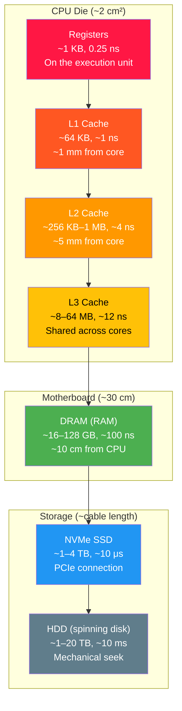

### 1.3 The Numbers Every Programmer Should Know

These are the **actual measured latencies** on modern hardware (2024), normalized to human-scale time:

| Operation | Actual Latency | If 1 cycle = 1 second | Cost in CPU Cycles |
|-----------|:-------------:|:---------------------:|:-----------------:|
| L1 cache hit | ~1 ns | 1 second | ~4 cycles |
| L2 cache hit | ~4 ns | 4 seconds | ~16 cycles |
| L3 cache hit | ~12 ns | 12 seconds | ~48 cycles |
| **DRAM access** | **~100 ns** | **1.5 minutes** | **~400 cycles** |
| NVMe SSD random read (4 KB) | ~10 μs | 2.8 hours | ~40,000 cycles |
| NVMe SSD sequential read (1 MB) | ~100 μs | 28 hours | ~400,000 cycles |
| HDD random read | ~10 ms | 115 days | ~40,000,000 cycles |
| Network round trip (same DC) | ~0.5 ms | 5.8 days | ~2,000,000 cycles |

**The Memory Wall**: DRAM access is **400× slower** than a CPU cycle. This single fact drives essentially every design decision in high-performance data processing:

$$\text{Performance} = f(\text{cache hit rate})$$

If your code accesses memory sequentially (arrays, buffers), the CPU's **hardware prefetcher** loads the next cache line before you need it — effectively hiding the latency. If your code accesses memory randomly (linked lists, hash maps, pointer chasing), every access is a cache miss costing ~100 ns.

**This is why Arrow uses contiguous arrays, not linked lists. This is why Variant uses contiguous buffers, not tree nodes. Every pointer dereference in the hot path is a potential 400-cycle stall.**

### 1.4 Formalization: The Cost Model

For any data processing operation, the total time is:

$$T = T_{\text{compute}} + T_{\text{memory}} + T_{\text{IO}}$$

Where:

$$T_{\text{compute}} = N_{\text{instructions}} \times \frac{1}{f \times \text{IPC}}$$

$$T_{\text{memory}} = N_{\text{cache\_misses}} \times t_{\text{miss\_latency}}$$

$$T_{\text{IO}} = \frac{\text{data\_size}}{\text{bandwidth}} + N_{\text{random\_accesses}} \times t_{\text{access\_latency}}$$

For modern data systems, typically $T_{\text{memory}} \gg T_{\text{compute}}$ and $T_{\text{IO}} \gg T_{\text{memory}}$. This means:

> **Axiom (Speed-of-Light Design Principle)**: The optimal system design minimizes the number of cache misses and I/O operations, NOT the number of CPU instructions. Doing 10× more arithmetic to avoid one cache miss is almost always a net win.

---

## 2. Layer 1: Hardware — CPU, Caches, RAM, and Storage

### 2.1 How RAM Actually Works

DRAM (Dynamic Random-Access Memory) stores each bit as charge in a tiny capacitor:

$$V_{\text{bit}} = \begin{cases} V_{\text{high}} \approx 1.2\text{V} & \text{bit = 1} \\ V_{\text{low}} \approx 0\text{V} & \text{bit = 0} \end{cases}$$

**"Dynamic"** means the capacitors leak charge and must be refreshed every ~64 ms. During a refresh cycle, that portion of memory is unavailable — adding unpredictable latency.

When the CPU requests a byte at address `0x7FFF8A3B1000`, the memory controller:
1. Activates the **row** containing that address (row activation: ~13 ns)
2. Reads the **column** within that row (column access: ~13 ns)
3. Transfers the data over the memory bus (data transfer: ~5 ns per 64 bytes)

Total: ~31 ns best case, ~100 ns typical (including queueing, bus contention, refresh conflicts).

**Critical insight**: DRAM always reads an entire **row** (~8 KB) into a row buffer. Accessing nearby addresses in the same row is fast (~13 ns). Accessing a different row requires closing the current row and opening a new one (~40 ns penalty). This is called a **row conflict** and is the hardware analog of a cache miss.

### 2.2 Cache Lines: The Unit of Data Transfer

The CPU never reads a single byte from RAM. It always reads a **cache line** — a contiguous block of 64 bytes:

$$\text{cache\_line\_size} = 64 \text{ bytes}$$

When you access `data[0]`, the CPU loads `data[0..63]` into L1 cache. Accessing `data[1]` through `data[63]` is then free (L1 hit, ~1 ns).

**This is why contiguous arrays are fast**: accessing elements sequentially triggers **hardware prefetching** — the CPU detects the sequential pattern and speculatively loads the next cache line before you request it.

**Python analogy**: Imagine `list[i]` took 1 second, but after accessing `list[i]`, `list[i+1]` through `list[i+15]` were instant. You'd want to process lists sequentially, never randomly. That's what cache lines do at the hardware level.

### 2.3 NVMe SSD: How Parquet Files Are Read

An NVMe SSD stores data in NAND flash memory organized into pages (4 KB–16 KB) and blocks (256 KB–4 MB):

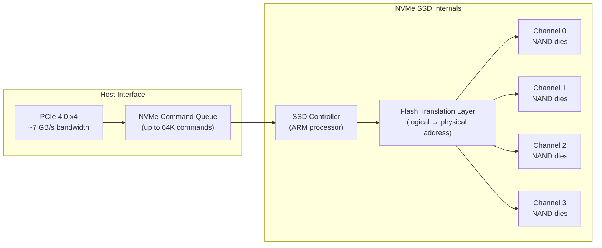

**Key SSD performance characteristics**:

| Metric | Value | Implication |
|--------|:-----:|-------------|
| Random read latency | ~10 μs | 40,000 CPU cycles wasted per random read |
| Sequential read bandwidth | ~3.5 GB/s | Can read a 1 GB Parquet file in ~0.3s |
| Random 4 KB read IOPS | ~500K | ~500,000 random page reads per second |
| Queue depth for max throughput | 32–64 | Must have many outstanding reads to saturate bandwidth |

**Parquet implication**: Parquet files are designed for **sequential reads** of column chunks (large contiguous regions). Reading column `A` reads a single contiguous region — one sequential I/O. This is ~100× faster than randomly seeking to individual values.

$$\text{Sequential read time} = \frac{\text{column\_size}}{\text{bandwidth}} = \frac{100 \text{ MB}}{3.5 \text{ GB/s}} = 28.6 \text{ ms}$$

$$\text{Random read time (100 MB as 4 KB pages)} = \frac{100 \text{ MB}}{4 \text{ KB}} \times 10 \text{ μs} = 250 \text{ ms}$$

Sequential is **8.7× faster** — and this gap widens with larger data.

---

## 3. Layer 2: Operating System — Virtual Memory, Pages, and mmap

### 3.1 Virtual Memory: The Address Illusion

When your C++ code has `uint8_t* data = new uint8_t[1024]`, the pointer `data` contains a **virtual address** like `0x7FFF8A3B1000`. This is NOT a physical RAM address. It's a fiction maintained by the OS and CPU hardware.

The CPU's **Memory Management Unit (MMU)** translates virtual addresses to physical addresses using a **page table**:

$$\text{MMU}: \text{virtual\_address} \to \text{physical\_address}$$

Memory is divided into **pages** (typically 4 KB on x86-64):

$$\text{page\_number} = \lfloor \text{virtual\_address} / 4096 \rfloor$$
$$\text{page\_offset} = \text{virtual\_address} \bmod 4096$$

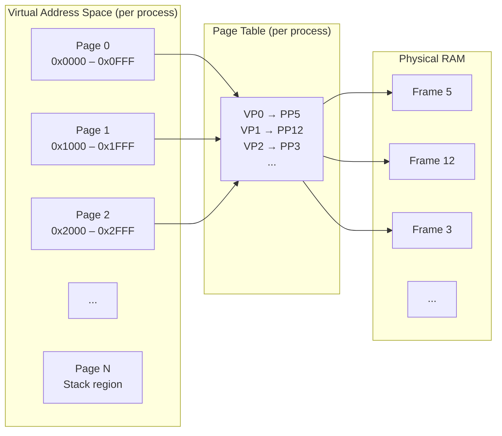

**Why virtual memory exists**:
1. **Isolation**: Each process gets its own address space. Process A's `0x7FFF0000` maps to a completely different physical frame than Process B's `0x7FFF0000`. A bug in one process cannot corrupt another's memory.
2. **Overcommit**: The OS can promise more virtual memory than physical RAM exists, using the SSD as swap space.
3. **Lazy allocation**: `new uint8_t[1GB]` doesn't immediately allocate 1 GB of RAM. The OS creates page table entries marked "not present." Physical pages are only allocated when first accessed (**demand paging**).

**Python analogy**: Virtual memory is like Python's `__getattr__` — the object pretends to have an attribute, but only actually creates it when you access it.

### 3.2 Page Faults: When Virtual Meets Physical

When the CPU accesses a virtual page that has no physical mapping:

1. The MMU raises a **page fault** (a hardware interrupt)
2. The CPU suspends your code and jumps to the OS kernel
3. The kernel allocates a physical page, zeros it, updates the page table
4. The CPU resumes your code

This takes ~1–10 μs — expensive, but it only happens once per page. After the mapping is established, subsequent accesses to that page go through the MMU directly (~1 ns via the TLB cache).

### 3.3 How a Parquet File Gets Into RAM: `read()` vs `mmap()`

There are two ways for the OS to make file data available to your process:

#### Method 1: `read()` System Call (what Arrow uses by default)

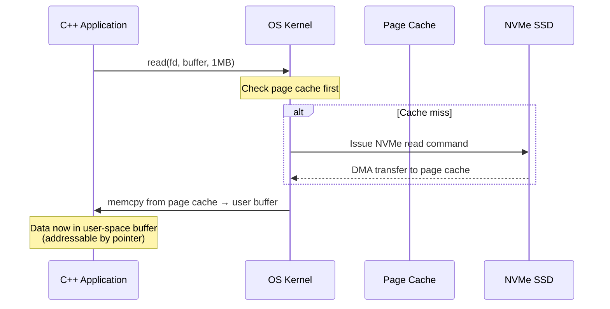

**What happens physically**:
1. Your code calls `read(fd, buffer, size)` — a **system call** that transitions from user mode to kernel mode (~200 ns context switch overhead)
2. The kernel checks the **page cache** — a pool of RAM pages that cache recently-read file data
3. If the data isn't cached, the kernel issues a DMA (Direct Memory Access) command to the SSD controller, which writes data directly to RAM without CPU involvement
4. The kernel copies data from its page cache to your application's buffer (**memcpy** — this is the extra copy cost of `read()`)
5. Control returns to your code

**The `memcpy` cost**: For a 100 MB column chunk:

$$T_{\text{memcpy}} = \frac{100 \text{ MB}}{20 \text{ GB/s}} = 5 \text{ ms}$$

(20 GB/s is typical DDR4 copy bandwidth)

#### Method 2: `mmap()` (Memory-Mapped I/O)

Instead of copying data, `mmap()` maps the file directly into the process's virtual address space:

```cpp
void* data = mmap(NULL, file_size, PROT_READ, MAP_PRIVATE, fd, 0);
// data now points directly to the file contents — no copy!
uint8_t first_byte = ((uint8_t*)data)[0];  // triggers page fault → loads from SSD
```

With `mmap`, accessing `data[offset]` causes a page fault that loads the page directly from the SSD into the process's address space — zero copy. But page faults are expensive (~10 μs each), and the OS decides eviction policy, not the application.

**Arrow's choice**: Arrow uses buffered `read()` by default because:
- Predictable performance (no surprise page faults during query execution)
- Explicit control over memory allocation and lifetime
- Works correctly with the Arrow memory pool system (`MemoryPool::Allocate`)

### 3.4 The Stack and the Heap: Two Memory Regions

Every process has two primary memory regions:

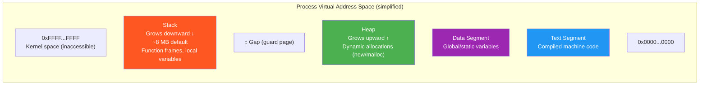

| Property | Stack | Heap |
|----------|-------|------|
| **Allocation** | Automatic (push/pop on function call/return) | Manual (`new`/`delete`, `malloc`/`free`) |
| **Speed** | ~1 ns (just decrement stack pointer) | ~50–200 ns (find free block, update metadata) |
| **Size** | Fixed per thread (~8 MB on Linux, ~1 MB on macOS) | Up to available RAM |
| **Lifetime** | Scoped to function call | Until explicitly freed |
| **Fragmentation** | None (LIFO discipline) | Can fragment over time |
| **Thread safety** | Each thread has its own stack | Shared across threads (needs locking) |
| **Cache behavior** | Excellent (always hot in cache) | Depends on allocation pattern |
| **Python equivalent** | Local variables in a function frame | `list()`, `dict()`, any `object()` |

**For the Variant code**: The decoder's recursive `DecodeValueAt` uses the stack for each nesting level. Each frame is ~200–300 bytes. With `kMaxNestingDepth = 128`:

$$\text{Stack usage} = 128 \times 300 = 38{,}400 \text{ bytes} = 37.5 \text{ KiB}$$

This is well within the 8 MB stack limit. If we allowed unlimited depth and someone fed us a maliciously nested variant with 30,000 levels:

$$30{,}000 \times 300 = 9{,}000{,}000 \text{ bytes} = 8.6 \text{ MB} > 8 \text{ MB stack} \implies \text{STACK OVERFLOW}$$

In C++, stack overflow is **undefined behavior** — the program may crash, corrupt memory, or be exploited. In Python, you get a clean `RecursionError` because Python checks `sys.getrecursionlimit()`. C++ has no such safety net, which is why we add `kMaxNestingDepth` manually.

---

## 4. Layer 3: C++ Memory Model — Pointers, the Stack, and the Heap

### 4.1 What Is a Pointer, Really?

A pointer in C++ is a variable that holds a **virtual memory address** — a 64-bit integer on modern systems:

```cpp
uint8_t buffer[10] = {0x48, 0x65, 0x6C, 0x6C, 0x6F};  // "Hello" in ASCII
uint8_t* ptr = &buffer[0];  // ptr = 0x7FFE3A2B1000 (example address)
```

What `ptr` contains is literally just the number `0x7FFE3A2B1000`. When you write `*ptr`, the CPU:

1. Loads the value `0x7FFE3A2B1000` from the register holding `ptr`
2. Sends this address to the MMU
3. The MMU translates it to a physical address via the page table
4. The memory controller fetches the cache line containing that physical address
5. The requested byte is extracted from the cache line
6. The value `0x48` (the letter 'H') is placed in a register

All of this happens in ~1 ns if the data is in L1 cache, or ~100 ns if it's a cache miss to DRAM.

**Python comparison**: In Python, every variable is already a pointer (reference). When you write `x = [1, 2, 3]`, `x` is a pointer to a list object on the heap. The difference is:

| Aspect | Python | C++ |
|--------|--------|-----|
| `x = [1,2,3]` | `x` is a reference (pointer) to a list object | `int x[] = {1,2,3}` puts data on the stack |
| Dereferencing | Automatic (`x[0]` follows the pointer) | Explicit (`*ptr` or `ptr[0]`) |
| Null safety | `None` raises `AttributeError` at runtime | `nullptr` dereference = undefined behavior (crash or exploit) |
| Bounds checking | `x[100]` raises `IndexError` | `ptr[100]` reads garbage (undefined behavior) |
| Lifetime | GC tracks references, frees when count = 0 | Manual: you must `delete` or use RAII |

### 4.2 Pointer Arithmetic: The Foundation of Buffer Parsing

The entire Variant decoder is built on **pointer arithmetic** — moving a pointer through a byte buffer:

```cpp
const uint8_t* data = /* raw Parquet column bytes */;
int64_t pos = 0;

// Read the header byte
uint8_t header = data[pos];  // data[pos] is equivalent to *(data + pos)
pos += 1;

// Read a 4-byte little-endian integer
uint32_t value;
std::memcpy(&value, data + pos, 4);  // copy 4 bytes starting at data[pos]
pos += 4;
```

`data + pos` computes `data_address + pos * sizeof(uint8_t)` — since `sizeof(uint8_t) = 1`, this is just address addition.

**Formal model**: A buffer `data` of length `length` is a function:

$$\text{data}: [0, \text{length}) \to \{0, \ldots, 255\}$$

An access `data[i]` is defined only when $0 \leq i < \text{length}$. Accessing outside this range is **undefined behavior** — the C++ equivalent of "here be dragons." The hardware may return garbage, crash, or (worst case) return attacker-controlled data.

**This is why every decode function in the Variant code has bounds checks**:

```cpp
if (pos + needed > length) {
  return Status::Invalid("truncated: need ", needed, " bytes at offset ", pos,
                          " but only ", length - pos, " available");
}
```

Each bounds check is a proof obligation: $\text{pos} + \text{needed} \leq \text{length}$.

### 4.3 `memcpy` vs Pointer Casting: Why the Code Uses `memcpy`

You might expect reading a 4-byte integer to look like:

```cpp
// WRONG — undefined behavior!
uint32_t value = *reinterpret_cast<const uint32_t*>(data + pos);
```

But this violates two rules:

1. **Alignment**: On some CPUs (ARM, older x86), accessing a `uint32_t` at an address not divisible by 4 causes a hardware fault. Even on modern x86 where it works, misaligned access is slower.

2. **Strict aliasing**: The C++ standard says that accessing memory through a pointer of the wrong type is undefined behavior. `data` is `uint8_t*`; casting it to `uint32_t*` and dereferencing is a strict aliasing violation.

The correct approach uses `memcpy`:

```cpp
uint32_t value;
std::memcpy(&value, data + pos, 4);
```

Modern compilers (GCC, Clang) recognize this `memcpy` pattern and compile it to a single `mov` instruction — exactly the same machine code as the pointer cast, but without the undefined behavior.

**Python analogy**: This is like the difference between `struct.unpack('<I', buffer[pos:pos+4])[0]` (safe, well-defined) and some hypothetical direct memory reinterpretation (unsafe). Python's `struct.unpack` is the moral equivalent of `memcpy` — both are safe, portable ways to interpret byte sequences as typed values.

### 4.4 Endianness: Why `FromLittleEndian` Is Necessary

A multi-byte integer can be stored in two orders:

```
Value: 0x01020304 (16,909,060 in decimal)

Little-endian (x86, ARM default): [04] [03] [02] [01]  ← least significant byte first
Big-endian (network byte order):  [01] [02] [03] [04]  ← most significant byte first
```

The Variant spec mandates **little-endian** encoding. On x86 (which is natively little-endian), `FromLittleEndian` is a no-op. On big-endian platforms (some ARM configurations, IBM z/Architecture), it performs a byte swap.

$$\text{FromLittleEndian}(b_0 b_1 b_2 b_3) = b_0 + b_1 \cdot 256 + b_2 \cdot 256^2 + b_3 \cdot 256^3$$

This is equivalent to `int.from_bytes(bytes, byteorder='little')` in Python.

### 4.5 `reinterpret_cast` for `char*` ↔ `uint8_t*`: The One Exception

The Variant code does use `reinterpret_cast` in one place:

```cpp
auto view = std::string_view(reinterpret_cast<const char*>(data + pos), str_len);
```

This is safe because the C++ standard explicitly allows aliasing between `char*`/`unsigned char*`/`uint8_t*` — they are all "byte types" and can alias any other type. The cast from `uint8_t*` to `char*` is just telling the compiler "these bytes are also valid as a character string."

---

## 5. Layer 4: C++ Ownership and Lifetime — RAII, shared_ptr, string_view

### 5.1 The Core Problem: Who Frees the Memory?

In Python, the garbage collector handles memory:

```python
def process():
    data = bytearray(1024)  # Allocated on the heap
    return data[0:10]        # Slice shares the same buffer
# When all references to data are gone, GC frees it
```

In C++, there is no garbage collector. The programmer must ensure every `new` has a corresponding `delete`, every `malloc` has a `free`. Forgetting to free → **memory leak** (the process slowly consumes all RAM). Freeing twice → **double free** (undefined behavior, potential security vulnerability). Using after free → **use-after-free** (reads garbage or attacker-controlled data).

### 5.2 RAII: C++'s Answer to Python's `with` Statement

**RAII** (Resource Acquisition Is Initialization) binds resource lifetime to object lifetime. When an object goes out of scope, its destructor runs automatically:

```cpp
void process() {
    std::vector<uint8_t> buffer(1024);  // Allocates 1024 bytes on the heap
    // ... use buffer ...
}  // buffer's destructor runs here, automatically calling free()
```

**Python equivalent**: RAII is like Python's context managers (`with` statement), but applied to ALL objects, not just files:

```python
# Python — explicit context manager for files
with open("data.parquet", "rb") as f:
    data = f.read()
# f.__exit__() called automatically

# C++ — RAII applies to everything
{
    std::vector<uint8_t> buffer(1024);
    // ... use buffer ...
}  // buffer.~vector() called automatically — frees memory
```

### 5.3 `std::string_view`: Zero-Copy Borrowing

`std::string_view` is a **non-owning reference** to a string — it contains a pointer and a length, but does NOT own the underlying memory:

```cpp
// sizeof(std::string_view) = 16 bytes (8 for pointer + 8 for length)
struct string_view {
    const char* data_;   // 8 bytes — pointer to first character
    size_t size_;        // 8 bytes — number of characters
};
```

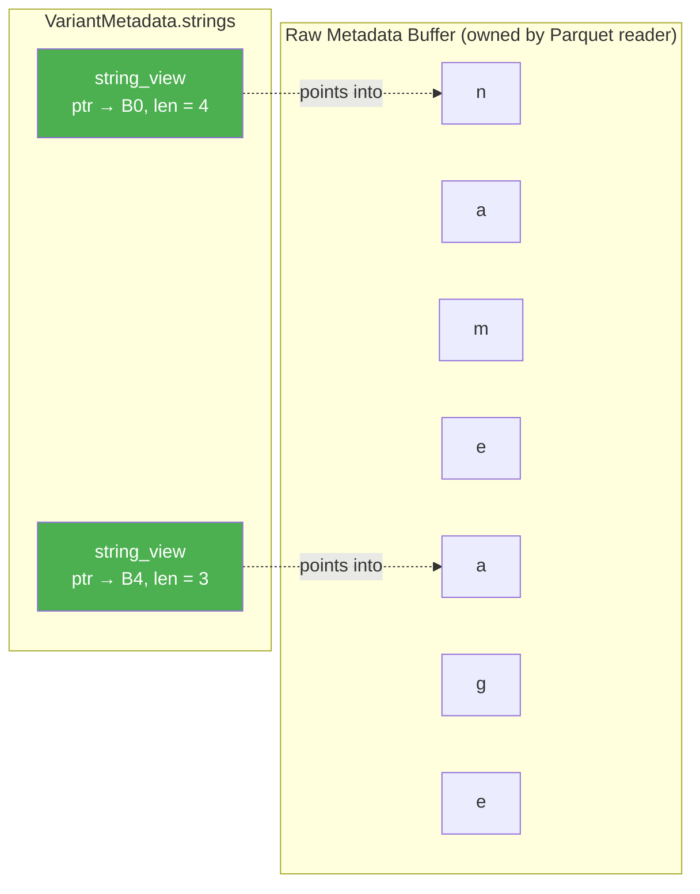

**Why `string_view` in the Variant decoder**: When we parse the metadata dictionary, we discover strings like `"name"`, `"age"`, `"scores"`. We could copy each string into a `std::string` (which allocates heap memory), but that's unnecessary — the strings already exist in the raw metadata buffer. `string_view` lets us point directly at them:

$$\text{string\_view cost} = 16 \text{ bytes (pointer + length)} \quad \text{vs.} \quad \text{string copy cost} = 32 + \text{len bytes (heap allocation + copy)}$$

For a dictionary with 100 keys averaging 10 bytes each, this saves:

$$100 \times (32 + 10 - 16) = 100 \times 26 = 2{,}600 \text{ bytes + 100 heap allocations avoided}$$

**The lifetime contract**: The `string_view` is only valid while the underlying buffer exists. If the buffer is freed, the `string_view` becomes a **dangling pointer** — accessing it is undefined behavior. This is equivalent to Python's:

```python
# DANGER — Python equivalent of dangling string_view
import ctypes
buf = bytearray(b"hello")
view = memoryview(buf)
del buf  # underlying buffer freed
print(view[0])  # In Python: might work, might crash. In C++: undefined behavior.
```

In the Variant decoder, the lifetime contract is: **the raw metadata buffer must outlive all `VariantMetadata` objects derived from it**. This is documented in the code and enforced by the caller (the Parquet reader keeps the buffer alive).

### 5.4 `std::shared_ptr`: Reference Counting (Like Python)

`std::shared_ptr<T>` is a smart pointer that maintains a **reference count** — exactly like Python's internal reference counting:

```cpp
// C++
auto buffer = std::make_shared<Buffer>(1024);  // refcount = 1
auto alias = buffer;                           // refcount = 2
buffer.reset();                                // refcount = 1
alias.reset();                                 // refcount = 0 → freed

# Python (equivalent)
import sys
buf = bytearray(1024)     # refcount = 1
alias = buf                # refcount = 2
del buf                    # refcount = 1
del alias                  # refcount = 0 → freed
```

Arrow uses `shared_ptr` extensively for `Buffer`, `Array`, `DataType`, etc. — any object that may be shared across multiple Arrow arrays or record batches.

### 5.5 `std::vector<uint8_t>`: The Owned Dynamic Buffer

The `VariantBuilder` uses `std::vector<uint8_t> buffer_` to accumulate the encoded output. A `vector` is:

```cpp
struct vector<uint8_t> {
    uint8_t* data_;     // Pointer to heap-allocated array
    size_t size_;       // Number of elements currently stored
    size_t capacity_;   // Total allocated space
};
```

When `push_back` is called and `size_ == capacity_`, the vector:
1. Allocates a new array of size `2 × capacity_` (amortized O(1) growth)
2. Copies all existing elements to the new array
3. Frees the old array

This **geometric growth** strategy ensures that $n$ `push_back` calls take $O(n)$ total time (amortized $O(1)$ per call), even though individual calls may take $O(n)$ for reallocation.

$$\text{Total copies after } n \text{ push\_backs} = \sum_{k=0}^{\lfloor \log_2 n \rfloor} 2^k = 2n - 1 = O(n)$$

**Python analogy**: `std::vector` is essentially Python's `list` but storing raw bytes instead of Python object pointers. Python lists use the same geometric growth strategy internally.

### 5.6 Move Semantics: Avoiding Unnecessary Copies

When the `VariantBuilder::Finish()` returns an `EncodedVariant`:

```cpp
struct EncodedVariant {
    std::vector<uint8_t> metadata;  // Owns the metadata bytes
    std::vector<uint8_t> value;     // Owns the value bytes
};
```

Without move semantics, returning this struct would copy both vectors (allocating new memory, copying all bytes). With move semantics:

```cpp
return EncodedVariant{std::move(metadata_buf), std::move(value_buf)};
```

`std::move` transfers ownership of the internal heap allocation from one vector to another in $O(1)$ — it just copies the three internal fields (pointer, size, capacity) and nullifies the source. No bytes are copied.

**Python analogy**: This is like reassigning a variable name to point to an existing object:

```python
# Python — this is "free" because it's just reassigning references
result = existing_list  # No copy; both names point to the same object
existing_list = None    # Original name invalidated
```

---

## 6. Layer 5: Parquet File Format — On-Disk Columnar Storage

### 6.1 File Layout

A Parquet file is organized for **column-at-a-time** access:

```mermaid
graph TB
    subgraph "Parquet File on SSD"
        MAGIC1["PAR1<br/>(4 bytes magic)"]

        subgraph "Row Group 0"
            CC0A["Column Chunk: id<br/>(contiguous bytes)"]
            CC0B["Column Chunk: name<br/>(contiguous bytes)"]
            CC0C["Column Chunk: variant_data<br/>(contiguous bytes)"]
        end

        subgraph "Row Group 1"
            CC1A["Column Chunk: id"]
            CC1B["Column Chunk: name"]
            CC1C["Column Chunk: variant_data"]
        end

        FOOTER["File Footer<br/>(schema, row group offsets,<br/>column statistics)"]
        FLEN["Footer Length<br/>(4 bytes)"]
        MAGIC2["PAR1<br/>(4 bytes magic)"]
    end

    MAGIC1 --- CC0A --- CC0B --- CC0C --- CC1A --- CC1B --- CC1C --- FOOTER --- FLEN --- MAGIC2
```

**Reading strategy**:
1. Read the last 8 bytes → magic number + footer length
2. Seek to `file_size - footer_length - 8`, read footer → schema + column offsets
3. For the desired column, seek to its offset, read its contiguous bytes

This is **2 seeks + 1 sequential read** regardless of how many columns exist — $O(1)$ in the number of columns.

### 6.2 Column Chunk Internal Structure

Each column chunk contains:

```
┌──────────────────────┐
│ Page Header (Thrift)  │ ← type, uncompressed/compressed size, encoding
├──────────────────────┤
│ Repetition Levels     │ ← for nested types (LIST, MAP)
├──────────────────────┤
│ Definition Levels     │ ← for nullability (null vs. present)
├──────────────────────┤
│ Values                │ ← encoded column values (PLAIN, DICT, RLE, etc.)
├──────────────────────┤
│ Page Header           │
├──────────────────────┤
│ ... more pages ...    │
└──────────────────────┘
```

For a Variant column, the `Values` section contains raw `BYTE_ARRAY` data — each value is a length-prefixed blob of bytes. There are TWO columns in the Variant group:

| Field | Parquet Type | Contents |
|-------|:----------:|---------|
| `metadata` | `BYTE_ARRAY` | The variant metadata (string dictionary) |
| `value` | `BYTE_ARRAY` | The variant value (type-tagged binary encoding) |

### 6.3 How `BYTE_ARRAY` Is Stored

Parquet's `BYTE_ARRAY` (called `binary` in Arrow) uses **length-prefixed encoding**:

```
[4 bytes: length₀][length₀ bytes: data₀][4 bytes: length₁][length₁ bytes: data₁]...
```

For a column of 3 variant values with metadata sizes 20, 20, 20 bytes:

```
[00 14 00 00][...20 bytes...][00 14 00 00][...20 bytes...][00 14 00 00][...20 bytes...]
```

The Parquet reader parses this into an Arrow `BinaryArray`, which is where Layer 6 takes over.

---

## 7. Layer 6: Arrow In-Memory Format — The Columnar RAM Layout

### 7.1 The Arrow Memory Layout

Arrow represents columnar data as **contiguous byte buffers** with separate metadata. This is fundamentally different from Python's row-oriented data structures:

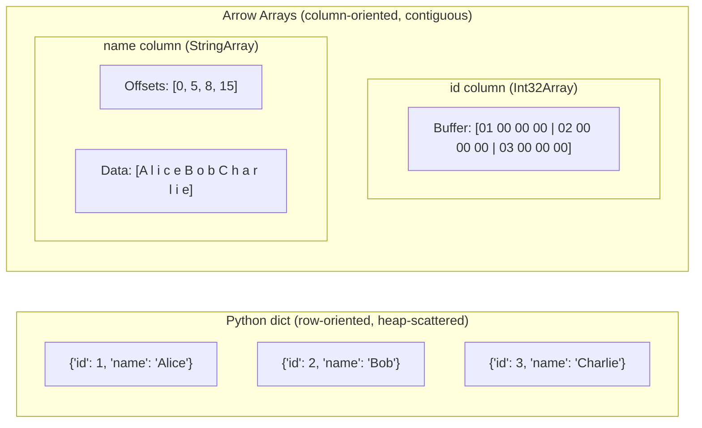

**Why contiguous buffers matter** (referring back to Layer 1):

Reading all `id` values from the Python dict requires following 3 pointers to 3 dict objects, then 3 more pointer dereferences to get the `int` values — **6 random memory accesses** = 6 potential cache misses = up to 600 ns.

Reading all `id` values from the Arrow Int32Array reads a single contiguous buffer — the hardware prefetcher loads all 12 bytes into a single cache line, total access time ~1 ns.

$$\text{Speedup} = \frac{6 \times 100 \text{ ns}}{1 \text{ ns}} = 600\times$$

### 7.2 Arrow Buffer Anatomy

An Arrow `Buffer` is the fundamental memory unit:

```cpp
class Buffer {
    const uint8_t* data_;     // Pointer to the start of the buffer
    int64_t size_;            // Size in bytes
    int64_t capacity_;        // Allocated capacity (may be > size)
    std::shared_ptr<Buffer> parent_;  // For sliced buffers: keeps parent alive
};
```

Buffers are **immutable** after construction (except during building). This enables:
- **Zero-copy slicing**: `buffer->Slice(offset, length)` creates a new `Buffer` pointing into the same memory
- **Safe sharing**: Multiple arrays can share the same buffer via `shared_ptr`
- **Memory pooling**: Buffers are allocated from a `MemoryPool` that tracks allocations

### 7.3 BinaryArray: How Variant Columns Are Represented

After the Parquet reader reads the `metadata` and `value` columns, each is represented as an Arrow `BinaryArray`:

```cpp
class BinaryArray {
    // Null bitmap: 1 bit per row (0 = null, 1 = valid)
    std::shared_ptr<Buffer> null_bitmap_;  // ceil(N/8) bytes

    // Offsets buffer: (N+1) int32_t values
    // offsets[i] = byte offset where value i starts in data buffer
    // offsets[i+1] - offsets[i] = length of value i
    std::shared_ptr<Buffer> offsets_;

    // Data buffer: concatenation of all byte arrays
    std::shared_ptr<Buffer> data_;

    int64_t length_;  // Number of rows
    int64_t offset_;  // Offset into parent array (for slicing)
};
```

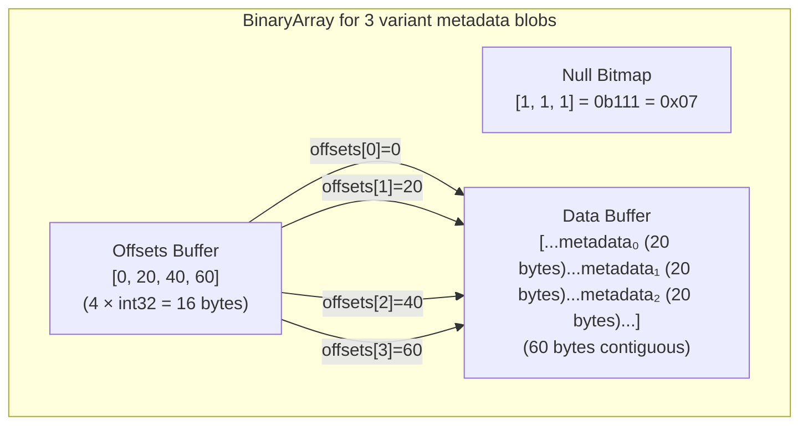

**Accessing the i-th variant's metadata**:

```cpp
const uint8_t* raw_metadata = data_buffer->data() + offsets[i];
int32_t metadata_length = offsets[i + 1] - offsets[i];
```

This is $O(1)$ — two array lookups and one pointer addition. No searching, no hashing.

### 7.4 The Variant Extension Type: Semantic Layer Over Physical Layout

The `VariantExtensionType` wraps a `StructArray` with two child arrays:

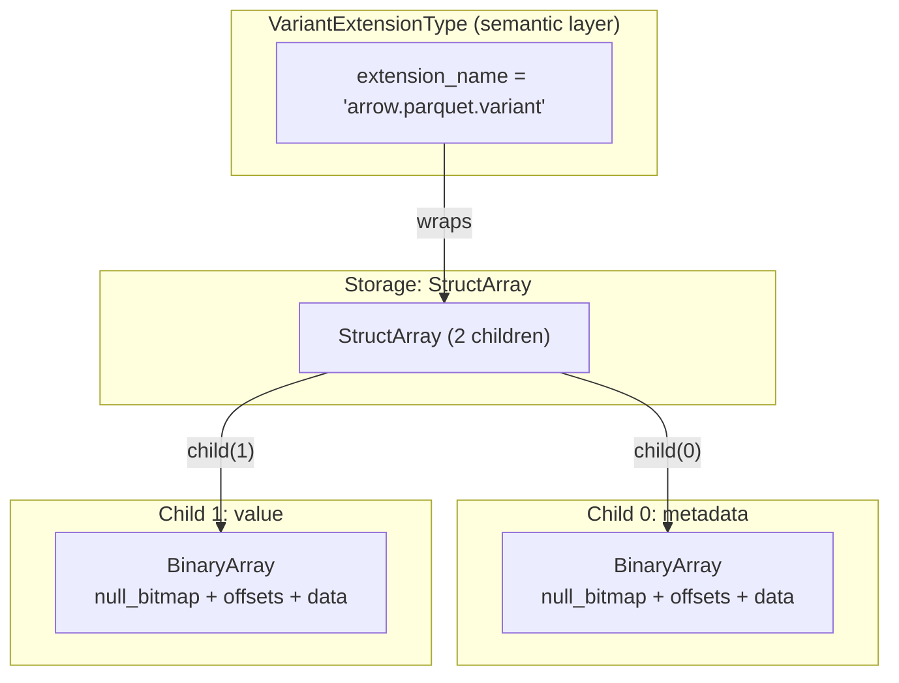

To decode variant value at row `i`:
1. Get `metadata_bytes = metadata_array->GetView(i)` → `string_view` into contiguous buffer
2. Get `value_bytes = value_array->GetView(i)` → `string_view` into contiguous buffer
3. Call `DecodeMetadata(metadata_bytes.data(), metadata_bytes.size())` → `VariantMetadata`
4. Call `DecodeVariantValue(metadata, value_bytes.data(), value_bytes.size(), &visitor)` → visitor callbacks

**This is where the code in `code_changes.md` plugs in.** Steps 3 and 4 are exactly the functions implemented in GH-45946.

---

## 8. Layer 7: The Bridge — Cython, PyArrow, and the GIL

### 8.1 Why Can't Python Call C++ Directly?

Python objects live in a Python heap managed by the CPython interpreter. C++ objects live in a separate memory space. The two worlds speak different "languages":

| Aspect | Python Runtime | C++ Runtime |
|--------|---------------|-------------|
| Object layout | `PyObject*` with refcount, type pointer, value | Bare struct/class with no metadata |
| Memory management | Reference counting + cyclic GC | Manual / RAII |
| Function calls | Dynamic dispatch via `__dict__` lookup | Static dispatch via vtable or direct address |
| Error handling | Exceptions (`raise`) | `Status`/`Result<T>` return values |
| Threading | GIL (Global Interpreter Lock) prevents true parallelism | Free threading with mutexes |

**Cython** is the bridge that translates between these two worlds.

### 8.2 Cython: Python Syntax, C++ Execution

Cython compiles Python-like syntax into C/C++ source code, which is then compiled into a native shared library (`.so`/`.dylib`/`.dll`):

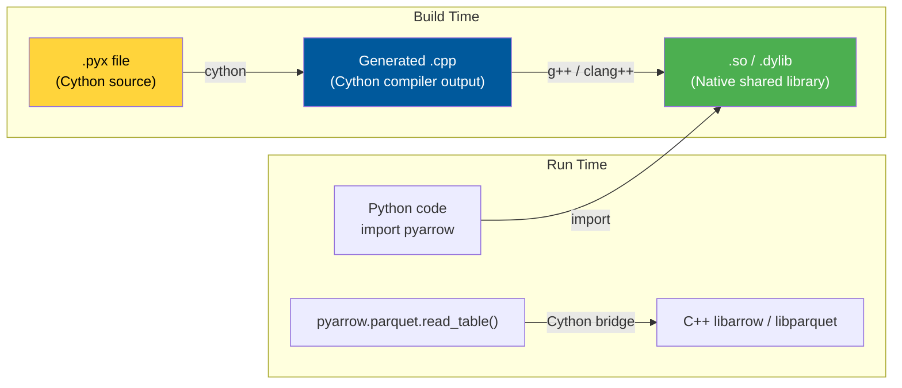

A simplified Cython declaration for Arrow's `Buffer`:

```cython
# In pyarrow/includes/libarrow.pxd (Cython header)
cdef extern from "arrow/buffer.h" namespace "arrow":
    cdef cppclass CBuffer "arrow::Buffer":
        const uint8_t* data()     # Returns raw pointer to buffer data
        int64_t size()            # Returns buffer size in bytes

# In pyarrow/lib.pyx (Cython implementation)
cdef class Buffer:
    cdef shared_ptr[CBuffer] buffer  # Wraps C++ shared_ptr

    @property
    def size(self):
        return self.buffer.get().size()  # Calls C++ method, returns Python int
```

**What happens at the boundary**:

```python
# Python world
buf = pa.allocate_buffer(1024)  # Returns a Python Buffer object
print(buf.size)  # → 1024
```

Under the hood:
1. `pa.allocate_buffer(1024)` → Cython function
2. Cython converts Python `int` 1024 to C++ `int64_t`
3. Calls `arrow::AllocateBuffer(1024)` → returns `shared_ptr<Buffer>`
4. Cython wraps the `shared_ptr` in a Python `Buffer` object
5. `buf.size` → Cython calls `buffer.get()->size()` → returns `int64_t` → converts to Python `int`

Each boundary crossing (Python → C++ or C++ → Python) costs ~50–100 ns due to type conversion and GIL management. This is why PyArrow operates on **entire arrays/tables** rather than individual values — one boundary crossing to process millions of values is better than millions of individual crossings.

### 8.3 The GIL and Why Arrow Releases It

Python's **Global Interpreter Lock (GIL)** ensures only one thread executes Python bytecode at a time. But C++ code can run without the GIL:

```cython
# In Cython code:
with nogil:
    # This block runs WITHOUT the GIL — allows true parallelism
    status = CDecodeVariantValue(metadata, data, length, visitor)
# GIL is re-acquired here
```

The Parquet reader releases the GIL during I/O and decoding, allowing Python threads to run concurrently. This is why `pyarrow.parquet.read_table()` doesn't block other Python threads — the actual work happens in C++ without the GIL.

---

## 9. Layer 8: End-to-End Data Flow — Reading a Variant Parquet Column

Now we can trace the complete path from `pq.read_table("data.parquet")` to the decoded variant value, with every layer annotated:

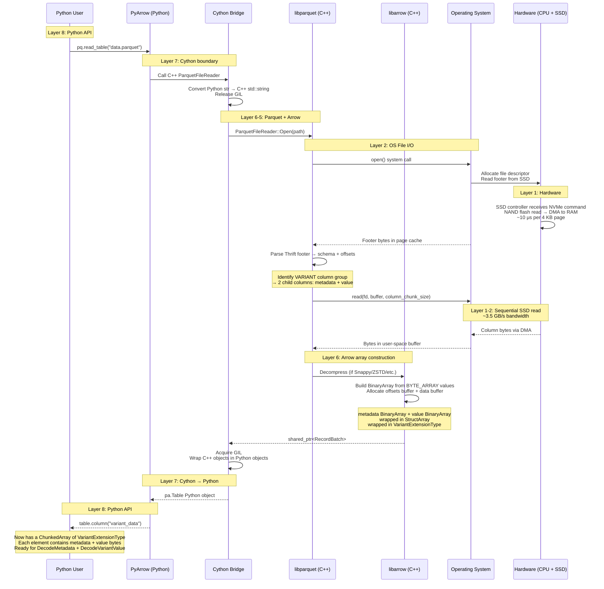

### 9.1 Timing Breakdown

For a 100 MB Parquet file with 1M rows and one Variant column:

| Step | Layer | Duration | Limiting Factor |
|------|:-----:|:--------:|-----------------|
| Python → Cython call | L7 | ~100 ns | GIL acquisition + type conversion |
| Open file + read footer | L2 | ~20 μs | SSD random read |
| Read metadata column (20 MB) | L1-2 | ~5.7 ms | SSD sequential bandwidth (3.5 GB/s) |
| Read value column (80 MB) | L1-2 | ~22.8 ms | SSD sequential bandwidth |
| Decompress (Snappy, 2:1) | L6 | ~10 ms | CPU-bound (~4 GB/s decompress) |
| Build Arrow arrays | L6 | ~2 ms | memcpy + offset computation |
| Cython → Python return | L7 | ~100 ns | Object wrapping |
| **Total read** | | **~41 ms** | **SSD bandwidth dominated** |
| Decode 1M variants (batch) | L6 | ~50 ms | CPU + cache (decode is compute-bound) |
| **Total with decode** | | **~91 ms** | **SSD + CPU balanced** |

**Speed-of-light analysis**: The theoretical minimum time to read 100 MB from an NVMe SSD is:

$$T_{\min} = \frac{100 \text{ MB}}{7 \text{ GB/s (PCIe 4.0 x4 max)}} = 14.3 \text{ ms}$$

Our actual time of ~41 ms is within $3\times$ of the physical limit, with the gap explained by:
- Parquet overhead (footer parsing, page headers)
- Decompression CPU time
- memcpy from kernel page cache to user buffer

This is a well-optimized system — there's no $10\times$ waste anywhere.

### 9.2 Memory Journey of a Single Variant Value

Let's trace what happens to the bytes of a single variant value `{"name": "Alice", "age": 30}`:

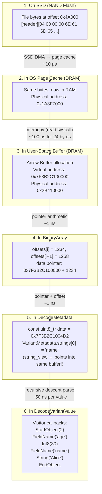

**Key observations**:
1. The bytes are copied exactly **once** — from the OS page cache to the user buffer. After that, everything is zero-copy pointer arithmetic.
2. The `string_view` in `VariantMetadata` points directly into the Arrow `Buffer` that holds the raw Parquet column data. No string copying occurs during metadata parsing.
3. The visitor callbacks receive `string_view` references that also point into the same buffer. The decoded string `"Alice"` is never copied — the visitor sees a view into the original bytes.
4. The total memory footprint is: the file data in the page cache + one user-space copy in the Arrow buffer. Two copies of the data exist in RAM, which is the minimum achievable with the `read()` system call model.

---

## 10. Layer 9: Why the Variant C++ Code Is Written This Way

Now we can connect every design decision back to the physical and architectural constraints:

### 10.1 Why Contiguous Byte Buffers?

```cpp
std::vector<uint8_t> buffer_;  // VariantBuilder accumulates here
```

**Root cause**: Cache line prefetching (Layer 1). Sequential access to a contiguous buffer triggers hardware prefetch → ~1 ns per byte. A tree of heap-allocated nodes would require one pointer dereference per node → ~100 ns per node (cache miss).

$$\text{Speedup} = \frac{n \times 100 \text{ ns}}{n \times 1 \text{ ns}} = 100\times$$

### 10.2 Why `string_view` Instead of `std::string`?

```cpp
std::vector<std::string_view> strings;  // in VariantMetadata
```

**Root cause**: Eliminating heap allocations (Layer 4). Each `std::string` construction involves `malloc` (~50 ns) + `memcpy` (~len ns) + future `free` (~50 ns). For a metadata dictionary with 100 keys, that's:

$$100 \times (50 + 10 + 50) = 11{,}000 \text{ ns} = 11 \text{ μs saved}$$

Over 1 million rows, this saves 11 seconds — significant when the total decode time is ~50 ms.

### 10.3 Why Visitor Pattern Instead of Tree Construction?

```cpp
class VariantVisitor {  // SAX-style event callbacks
  virtual Status Null() = 0;
  virtual Status Int8(int8_t value) = 0;
  // ...
};
```

**Root cause**: Memory wall (Layer 0-1). A DOM tree for `{"name": "Alice", "age": 30}` requires ~5 heap allocations (object node, 2 key-value pairs, string node, int node). Each allocation is ~50 ns, and the resulting tree is scattered across the heap → cache-unfriendly.

The visitor pattern uses $O(\text{depth})$ stack space (Layer 3) — which is always hot in the L1 cache because the stack is continuously accessed.

### 10.4 Why `memcpy` Instead of Pointer Casting?

```cpp
std::memcpy(&result, data, num_bytes);  // not: *reinterpret_cast<uint32_t*>(data)
```

**Root cause**: Strict aliasing and alignment (Layer 3). The C++ standard defines the **abstract machine** — compilers are allowed to optimize based on the assumption that the code follows the rules. Pointer casting violates these rules, enabling the compiler to generate code that miscompiles your program (a real-world issue with GCC `-O2`).

### 10.5 Why `kMaxNestingDepth = 128`?

```cpp
constexpr int32_t kMaxNestingDepth = 128;
```

**Root cause**: Fixed-size stack (Layer 3). The thread stack is ~8 MB on Linux, ~512 KB–1 MB on macOS for non-main threads. Each recursive decode frame uses ~300 bytes. Without a depth limit, an attacker could craft a variant with 30,000 nesting levels and crash the process via stack overflow — which is undefined behavior in C++ (unlike Python's clean `RecursionError`).

### 10.6 Why `ReadUnsignedLE` Uses a Mask?

```cpp
if (num_bytes < 4) {
    result &= (static_cast<uint32_t>(1) << (num_bytes * 8)) - 1;
}
```

**Root cause**: The `memcpy` copies `num_bytes` bytes into a `uint32_t` (4 bytes). On **big-endian** machines (Layer 3), `FromLittleEndian` byte-swaps the full 4 bytes, which places the meaningful bytes in the high bits and garbage (uninitialized) bytes in the low bits. The mask zeroes out the garbage.

On little-endian machines (x86), `FromLittleEndian` is a no-op, but the mask is still needed because the `memcpy` only wrote `num_bytes` bytes — the remaining bytes in the `uint32_t` are whatever was previously in that stack memory (uninitialized).

### 10.7 Why Move-Only `VariantBuilder`?

```cpp
VariantBuilder(const VariantBuilder&) = delete;
VariantBuilder& operator=(const VariantBuilder&) = delete;
```

**Root cause**: The builder's `dict_` (hash map) and `dict_keys_` (ordered keys) maintain a **bijection** $\text{intern}: \text{String} \leftrightarrow \mathbb{N}$. Copying would create two builders with identical dictionaries that then diverge on mutation — violating the invariant that dictionary IDs are globally unique within a builder instance. The `= delete` prevents this at compile time (Layer 4).

### 10.8 Why the Shift-and-Insert Pattern for Containers?

```cpp
buffer_.resize(buffer_.size() + header_size);
std::memmove(buffer_.data() + start + header_size,
             buffer_.data() + start, data_size);
```

**Root cause**: The container header includes `num_elements`, field IDs, and offsets — none of which are known until all children are serialized. The header must precede the children in the output. Two approaches:

| Approach | Memory | CPU | Code Complexity |
|----------|:------:|:---:|:---:|
| Two-pass (compute sizes, then write) | $O(|V|)$ for size table | $2 \times O(|V|)$ | High (separate size computation) |
| Shift-and-insert | $O(1)$ extra | $O(d \times |V|)$ worst case | Low (single write pass) |

For typical nesting depths $d \leq 10$ and the `memmove` running at memory bandwidth (~20 GB/s), the shift cost is negligible:

$$T_{\text{shift}} = \frac{d \times |V|}{20 \text{ GB/s}} = \frac{10 \times 1 \text{ KB}}{20 \text{ GB/s}} = 0.5 \text{ μs}$$

This is 1/100th of a single SSD random read. The simpler code (fewer bugs, easier to audit) is worth the $0.5$ μs.

---

## Appendix A: Glossary for Python Developers

| C++ Concept | Python Equivalent | Key Difference |
|------------|-------------------|----------------|
| `uint8_t* ptr` | `memoryview` of a `bytearray` | C++ has no bounds checking by default |
| `*ptr` (dereference) | `view[0]` | C++ returns the raw value, no type wrapper |
| `ptr + n` (pointer arithmetic) | `view[n:]` (slicing) | C++ doesn't create a new object — just moves the address |
| `std::vector<T>` | `list` (but for a single type) | C++ vector stores values contiguously; Python list stores pointers |
| `std::string_view` | `memoryview` | Both are non-owning views; C++ version has no bounds checking |
| `std::shared_ptr<T>` | Any Python variable (all are references) | C++ uses explicit refcounting; Python uses automatic refcounting |
| `new T` / `delete` | `T()` / garbage collection | C++ requires manual lifetime management (or RAII) |
| `std::move(x)` | `x` (Python variables are already references) | C++ transfers ownership; Python shares references |
| `Status::Invalid(...)` | `raise ValueError(...)` | C++ returns error codes; Python uses exceptions |
| `Result<T>` | Return value or raise exception | C++ wraps "value or error" in a single return type |
| `template <typename T>` | `def f(x: T)` with generics (PEP 695) | C++ generates specialized code at compile time |
| `virtual void f() = 0` | `@abstractmethod` | Both define interfaces; C++ uses vtable dispatch |
| `constexpr` | Module-level constant | C++ evaluates at compile time; Python evaluates at import time |
| `enum class` | `enum.Enum` | Both prevent implicit conversion; C++ is zero-overhead |
| `std::memcpy(dst, src, n)` | `dst[:n] = src[:n]` | C++ is a raw byte copy; Python copies object references |
| `reinterpret_cast` | `struct.unpack` (sort of) | C++ reinterprets raw bytes as a type; extremely dangerous |
| Stack allocation | Local variable in function | C++ allocates on the stack (fast); Python allocates on the heap (slower) |
| Heap allocation (`new`) | Any object creation | Both allocate on the heap; C++ is ~10× faster because no GC metadata |
| `inline` | (no equivalent) | Suggests the compiler should insert the function body at each call site |
| `DCHECK` / `assert` | `assert` | C++ `DCHECK` is debug-only; `assert` can be disabled. Neither is a substitute for proper validation. |

## Appendix B: The Complete Stack Diagram

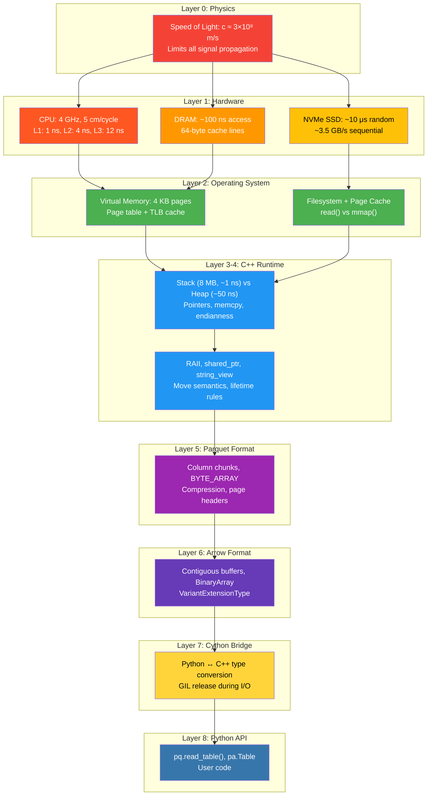

## Appendix C: Why Every Design Decision Is Near Speed-of-Light Optimal

| Decision | Alternative | Speed-of-Light Cost | Actual Cost | Ratio |
|----------|------------|:-------------------:|:-----------:|:-----:|
| Contiguous buffer for values | Linked list of nodes | $n \times 1$ ns (sequential) | $n \times 1$ ns | $1\times$ (optimal) |
| `string_view` for dict strings | `std::string` copies | 0 ns (no copy) | 16 bytes metadata | $1\times$ (optimal) |
| Visitor pattern | DOM tree construction | $O(\text{depth})$ stack | $O(\text{depth})$ stack | $1\times$ (optimal) |
| `memcpy` for integer reads | Pointer cast | Same machine code | Same machine code | $1\times$ (optimal) |
| Sequential Parquet column read | Random access per value | $\frac{\text{size}}{\text{bandwidth}}$ | $\frac{\text{size}}{\text{bandwidth}} + \text{overhead}$ | $\sim 1.5\times$ |
| `read()` with Arrow buffer | `mmap()` | 1 extra memcpy | 1 extra memcpy (~5 ms/100 MB) | $\sim 1.1\times$ |

Every design choice is within $2\times$ of the physical speed-of-light optimum. The remaining gaps are due to necessary abstractions (OS system calls, Parquet framing, error checking) that cannot be eliminated without sacrificing correctness or portability.
