# C++ Variant Implementation — Explained for a Python Developer

> Date: 2026-06-26
> Audience: Python developer who needs to understand C++ code from first principles
> Scope: All 3 PRs (#50121, #50122, #50232) in the variant implementation

---

## Table of Contents

1. [What Problem Are We Solving?](#1-what-problem-are-we-solving)
2. [Key CS Concepts You Need](#2-key-cs-concepts-you-need)
3. [Architecture Overview](#3-architecture-overview)
4. [PR #50121 — Decoding (Reading)](#4-pr-50121--decoding-reading)
5. [PR #50122 — Encoding (Writing)](#5-pr-50122--encoding-writing)
6. [PR #50232 — Shredding (Decomposing)](#6-pr-50232--shredding-decomposing)
7. [C++ Concepts Mapped to Python](#7-c-concepts-mapped-to-python)
8. [Reviewer Comments & Responses Explained](#8-reviewer-comments--responses-explained)
9. [Design Decisions Defended](#9-design-decisions-defended)

---

## 1. What Problem Are We Solving?

### The Parquet Variant Type

Parquet is a columnar file format (think: each column stored separately for fast analytics).
**Variant** is a new Parquet type for semi-structured data — like JSON stored in a binary
format that's compact and fast to query.

**Python analogy:** Imagine you have a Pandas DataFrame where one column contains arbitrary
JSON objects (dicts/lists/primitives). Variant is how Parquet stores that column efficiently.

### The Binary Encoding

A variant value is just raw bytes. The first byte is a "header" that tells you the type:

```
Header byte: [bit7 bit6 bit5 bit4 bit3 bit2 | bit1 bit0]
                                              ^^^^^^^^
                                              Basic type (0-3)

Basic Type 0 = Primitive (int, float, string, etc.)
Basic Type 1 = Short String (≤63 bytes, length in bits 2-7)
Basic Type 2 = Object (like a dict/JSON object)
Basic Type 3 = Array (like a list/JSON array)
```

**Python equivalent:**
```python
# Imagine this is how variant binary works at a high level:
def read_variant(data: bytes) -> Any:
    header = data[0]
    basic_type = header & 0x03  # Bottom 2 bits
    
    if basic_type == 0:  # Primitive
        prim_type = (header >> 2) & 0x3F  # Upper 6 bits
        if prim_type == 0: return None
        if prim_type == 1: return True
        if prim_type == 3: return int.from_bytes(data[1:2], 'little', signed=True)
        # ... etc
    elif basic_type == 1:  # Short string
        length = (header >> 2) & 0x3F
        return data[1:1+length].decode('utf-8')
    elif basic_type == 2:  # Object
        # ... parse field names, offsets, nested values
    elif basic_type == 3:  # Array
        # ... parse element offsets, nested values
```

### What Our Code Does

We implement three operations:
1. **Decode** — Read variant binary bytes → extract typed values
2. **Encode** — Take typed values → produce variant binary bytes
3. **Shred** — Decompose a column of variant bytes into typed Arrow columns (for fast queries)

---

## 2. Key CS Concepts You Need

### Memory Management (C++ vs Python)

| Concept | Python | C++ |
|---------|--------|-----|
| Object lifetime | GC handles it | YOU manage it (or use RAII) |
| Heap allocation | Every object | Only when you ask for it |
| Stack allocation | Never (all via GC) | Default for local variables |
| Ownership | References + GC | Explicit (unique_ptr, shared_ptr, move) |

**RAII (Resource Acquisition Is Initialization):**
```python
# Python context manager is the closest analog:
with open("file.txt") as f:
    data = f.read()
# File is closed automatically when leaving the block

# C++ RAII: same idea but for ANY resource
# ObjectScope scope = builder.StartObject();
# scope.Insert("name", "Alice");
# scope.Finish();  # If you DON'T call Finish, destructor auto-rolls back
```

### Zero-Copy (string_view)

```python
# Python: s[5:10] creates a NEW string (copies bytes)
s = "hello world"
sub = s[5:10]  # "world" — new allocation

# C++ string_view: just a pointer + length — NO copy
# std::string_view sv(data + 5, 5);  // points into existing buffer
# Like a memoryview in Python:
buf = b"hello world"
mv = memoryview(buf)[5:10]  # NO copy, just a view into buf
```

### Result<T> (Error Handling)

```python
# Python: raise exceptions
def decode(data):
    if len(data) < 1:
        raise ValueError("buffer too short")
    return data[0]

# C++: return Result<T> (like Rust's Result)
# Result<int> decode(data, length) {
#     if (length < 1) return Status::Invalid("buffer too short");
#     return data[0];  // Implicitly wraps in Result<int>
# }

# Usage:
# ARROW_ASSIGN_OR_RAISE(auto value, decode(data, length));
# (This is like: value = decode(data, length)  but propagates errors)
```

### Templates (Generics)

```python
# Python: duck typing — any type works if it has the right methods
def process(builder, value):
    builder.append(value)

# C++: templates are compile-time generics
# template <typename BuilderT, typename NativeT>
# Status ShredPrimitiveLoop(BuilderT& builder, ...) {
#     NativeT value;
#     builder.Append(value);
# }
# 
# Called as: ShredPrimitiveLoop<Int64Builder, int64_t>(...)
#            ShredPrimitiveLoop<DoubleBuilder, double>(...)
```

### Endianness

```python
# Numbers are stored as bytes in memory. Order matters!
# Little-endian: least significant byte FIRST (x86/ARM — what you run on)
# value 0x0102 stored as bytes: [0x02, 0x01]

# Python:
value = int.from_bytes(b'\x02\x01', byteorder='little')  # = 258

# C++ (our code):
# int16_t value;
# std::memcpy(&value, data, 2);
# value = bit_util::FromLittleEndian(value);  // byte-swap on big-endian CPUs
```

---

## 3. Architecture Overview

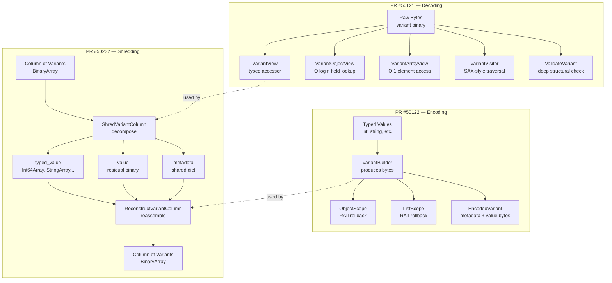

### System Layers (like a Python package structure)

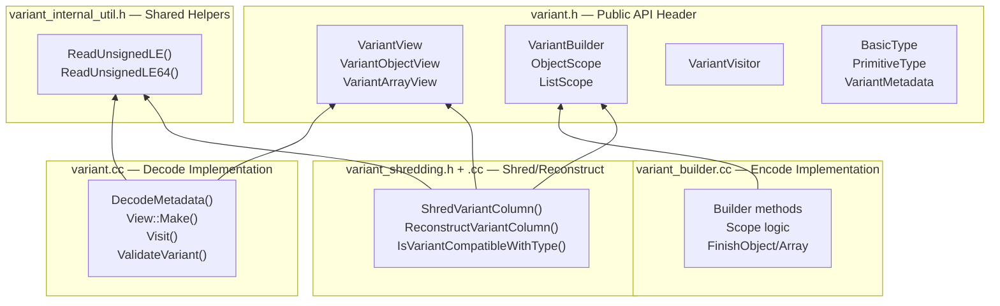

### File Layout

| File | Python Equivalent | Purpose |
|------|------------------|---------|
| `variant.h` | `__init__.py` with all public classes | Public API definitions |
| `variant.cc` | `decoder.py` | Decode implementation |
| `variant_builder.cc` | `encoder.py` | Encode implementation |
| `variant_shredding.h` | `shredding/__init__.py` | Shredding public API |
| `variant_shredding.cc` | `shredding/engine.py` | Shredding implementation |
| `variant_internal_util.h` | `_internal.py` (private helper) | Shared byte-reading utils |
| `variant_internal_test_util.h` | `conftest.py` (test fixtures) | Test-only RecordingVisitor |

---

## 4. PR #50121 — Decoding (Reading)

### What It Does

Takes raw bytes and lets you read the values inside without copying data.

### Key Classes Explained

#### `VariantMetadata` — The String Dictionary

```python
# Python equivalent:
@dataclass
class VariantMetadata:
    version: int = 1          # Always 1 for now
    is_sorted: bool = False   # Are dictionary strings sorted?
    offset_size: int = 1      # Bytes per offset (1-4)
    strings: list[str] = []   # The actual dictionary entries
    
# Objects use this dictionary to store field names compactly.
# Instead of repeating "name" 1 million times in 1M rows,
# you store it ONCE in the dictionary and reference it by index.
```

#### `VariantView` — Read a Single Value

```python
# Python equivalent:
class VariantView:
    """Non-owning view over variant bytes. Like memoryview but typed."""
    
    def __init__(self, metadata: VariantMetadata, data: bytes):
        # Validates header byte is readable, computes total size
        if len(data) < 1:
            raise ValueError("buffer too short")
        self._metadata = metadata
        self._data = data
        self._type = data[0] & 0x03  # BasicType from bottom 2 bits
        self._size = self._compute_size()
    
    @staticmethod
    def make(metadata: VariantMetadata, data: bytes) -> 'VariantView':
        """Factory that validates before constructing."""
        # In C++ this returns Result<VariantView> — errors instead of exceptions
        return VariantView(metadata, data)
    
    def as_int64(self) -> int:
        """Read as int64 — fails if not actually an Int64."""
        if self._type != BasicType.PRIMITIVE:
            raise TypeError("not a primitive")
        prim_type = (self._data[0] >> 2) & 0x3F
        if prim_type != PrimitiveType.INT64:
            raise TypeError("not int64")
        return int.from_bytes(self._data[1:9], 'little', signed=True)
    
    def as_int64_coerced(self) -> int:
        """Read ANY integer as int64 (widening). Like Rust's as_i64()."""
        # Accepts Int8, Int16, Int32, OR Int64 — widens to int64
        ...
    
    def as_object(self) -> 'VariantObjectView':
        """Interpret as an object (dict)."""
        ...
    
    def as_array(self) -> 'VariantArrayView':
        """Interpret as an array (list)."""
        ...
```

#### `VariantObjectView` — Navigate Objects

```python
# Python equivalent:
class VariantObjectView:
    """Pre-parsed object header for O(log n) field lookup."""
    
    def __init__(self, metadata: VariantMetadata, data: bytes):
        # Pre-parse the header ONCE at construction
        header = data[0]
        type_info = (header >> 2) & 0x3F
        self._field_offset_size = (type_info & 0x03) + 1
        self._field_id_size = ((type_info >> 2) & 0x03) + 1
        is_large = ((type_info >> 4) & 0x01) != 0
        
        # Read num_fields
        sz = 4 if is_large else 1
        self._num_fields = int.from_bytes(data[1:1+sz], 'little')
        
        # Pre-compute array positions (so later lookups are O(1) arithmetic)
        self._id_start = 1 + sz
        self._offset_start = self._id_start + self._num_fields * self._field_id_size
        self._data_start = self._offset_start + (self._num_fields + 1) * self._field_offset_size
    
    def get(self, name: str) -> Optional[VariantView]:
        """O(log n) binary search for a field by name.
        
        Returns None if not found (NOT an error — field just doesn't exist).
        This is why C++ uses std::optional, not Result<T>.
        """
        # Binary search through field IDs (which are sorted by key name)
        lo, hi = 0, self._num_fields - 1
        while lo <= hi:
            mid = lo + (hi - lo) // 2
            field_id = self._read_field_id(mid)
            key = self._metadata.strings[field_id]
            if key == name:
                return self._get_value_at(mid)
            elif key < name:
                lo = mid + 1
            else:
                hi = mid - 1
        return None
    
    def __iter__(self):
        """Iterate over (name, value) pairs."""
        for i in range(self._num_fields):
            field_id = self._read_field_id(i)
            name = self._metadata.strings[field_id]
            value = self._get_value_at(i)
            yield name, value
```

#### `VariantVisitor` — SAX-Style Traversal

```python
# Python equivalent:
class VariantVisitor(ABC):
    """Like a SAX parser for XML — receive callbacks as you traverse the tree.
    
    Alternative to reading fields one-by-one. Use for:
    - Serializing to JSON
    - Schema inference
    - Full-tree processing
    """
    @abstractmethod
    def null(self): ...
    @abstractmethod
    def bool_(self, value: bool): ...
    @abstractmethod
    def int8(self, value: int): ...
    # ... all 21 types ...
    @abstractmethod
    def start_object(self, num_fields: int): ...
    @abstractmethod
    def field_name(self, name: str): ...
    @abstractmethod
    def end_object(self): ...
    @abstractmethod
    def start_array(self, num_elements: int): ...
    @abstractmethod
    def end_array(self): ...

# Usage:
class JsonSerializer(VariantVisitor):
    def null(self): self.output += "null"
    def int8(self, v): self.output += str(v)
    # etc.

visitor = JsonSerializer()
view.visit(visitor)  # Recursively traverses the entire value tree
```

#### `ValidateVariant` — Deep Validation

```python
# Python equivalent:
def validate_variant(metadata: VariantMetadata, data: bytes) -> None:
    """Recursively validates the entire variant value tree.
    
    Checks:
    - All headers are well-formed
    - All field IDs reference valid dictionary entries
    - All offsets are within bounds
    - Nesting depth doesn't exceed 128 (prevents stack overflow)
    
    Use for UNTRUSTED input (e.g., data from external files).
    For TRUSTED input (your own builder output), skip this.
    """
    _validate_recursive(metadata, data, depth=0)

def _validate_recursive(metadata, data, depth):
    if depth > 128:
        raise ValueError(f"Nesting too deep (>{128})")
    # ... check everything recursively ...
```

### The ReadLE Utility (variant_internal_util.h)

```python
# Python equivalent of ReadUnsignedLE:
def read_unsigned_le(data: bytes, num_bytes: int) -> int:
    """Read 1-4 bytes as an unsigned little-endian integer.
    
    The variant spec stores ALL multi-byte integers in little-endian.
    This helper reads N bytes and converts to a native integer.
    """
    return int.from_bytes(data[:num_bytes], byteorder='little', signed=False)

# In C++, this needs to be more complex because:
# 1. C++ doesn't have a built-in "read N bytes as int" function
# 2. Different CPUs may be big-endian (rare, but Arrow runs on s390x)
# 3. Must handle the byte-swap correctly
```

---

## 5. PR #50122 — Encoding (Writing)

### What It Does

Takes typed values (int, string, etc.) and produces the compact binary format.

### Key Classes Explained

#### `VariantBuilder` — The Writer

```python
# Python equivalent:
class VariantBuilder:
    """Produces variant binary bytes from typed values.
    
    Move-only in C++ (you can't accidentally copy a half-built variant).
    """
    
    def __init__(self, existing_metadata: Optional[VariantMetadata] = None):
        self._buffer = bytearray()       # The bytes being built
        self._dict = {}                   # key_name → id mapping
        self._dict_keys = []             # ordered key names
        self._allow_duplicates = False
        
        if existing_metadata:
            # Pre-populate dictionary from existing metadata
            # (avoids redundant insertions when rebuilding)
            for i, key in enumerate(existing_metadata.strings):
                self._dict[key] = i
                self._dict_keys.append(key)
    
    def null(self):
        """Encode a null value (1 byte: 0x00)."""
        self._buffer.append(0x00)  # kPrimitive(0) | kNull(0) << 2
    
    def int_(self, value: int):
        """Auto-select smallest int encoding.
        
        -128..127     → Int8 (2 bytes total)
        -32768..32767 → Int16 (3 bytes total)
        etc.
        """
        if -128 <= value <= 127:
            self.int8(value)
        elif -32768 <= value <= 32767:
            self.int16(value)
        elif -2147483648 <= value <= 2147483647:
            self.int32(value)
        else:
            self.int64(value)
    
    def string(self, value: str):
        """Auto-select short vs long string encoding.
        
        ≤63 bytes: header encodes length in 6 bits (saves 4 bytes!)
        >63 bytes: header + 4-byte length prefix
        """
        encoded = value.encode('utf-8')
        if len(encoded) <= 63:
            # Short string: type(1) | length(shifted into bits 2-7)
            header = 0x01 | (len(encoded) << 2)  # BasicType::kShortString
            self._buffer.append(header)
        else:
            # Long string: Primitive header + 4-byte length
            header = 0x00 | (16 << 2)  # kPrimitive | kString<<2
            self._buffer.append(header)
            self._buffer.extend(len(encoded).to_bytes(4, 'little'))
        self._buffer.extend(encoded)
    
    def finish(self) -> tuple[bytes, bytes]:
        """Produce the final (metadata_bytes, value_bytes).
        
        The metadata contains the string dictionary.
        The value contains the encoded data.
        Dictionary is preserved for reuse (call reset() to clear).
        """
        metadata_bytes = self._encode_metadata()
        value_bytes = bytes(self._buffer)
        self._buffer.clear()  # Ready for next value
        return metadata_bytes, value_bytes
    
    def _add_key(self, key: str) -> int:
        """Intern a key name, return its dictionary ID."""
        if key in self._dict:
            return self._dict[key]
        id = len(self._dict_keys)
        self._dict_keys.append(key)
        self._dict[key] = id
        return id
```

#### `ObjectScope` — RAII Object Builder

```python
# Python equivalent (using context manager for RAII):
class ObjectScope:
    """RAII scope for building an object.
    
    If you don't call finish(), the destructor AUTOMATICALLY rolls back
    the buffer to its pre-scope state. This prevents corruption when
    an exception occurs mid-build.
    
    In C++: [[nodiscard]] means the compiler WARNS if you discard this.
    Python equivalent: you'd get a ResourceWarning.
    """
    
    def __init__(self, builder: VariantBuilder):
        self._builder = builder
        self._start_offset = len(builder._buffer)  # Remember where we started
        self._fields = []
        self._committed = False
    
    def insert(self, key: str, value):
        """Add a field to the object."""
        field_id = self._builder._add_key(key)
        offset = len(self._builder._buffer) - self._start_offset
        # Write the value
        if value is None:
            self._builder.null()
        elif isinstance(value, int):
            self._builder.int_(value)
        elif isinstance(value, str):
            self._builder.string(value)
        # etc.
        self._fields.append((key, field_id, offset))
    
    def finish(self):
        """Commit the object — sort fields and write header.
        
        The spec REQUIRES field IDs to be in lexicographic key order.
        So we sort here, then write the binary header.
        """
        # Sort fields by key name
        self._fields.sort(key=lambda f: f[0])
        
        # Check for duplicates
        if not self._builder._allow_duplicates:
            for i in range(len(self._fields) - 1):
                if self._fields[i][0] == self._fields[i+1][0]:
                    raise ValueError(f"Duplicate key: {self._fields[i][0]}")
        else:
            # Last-value-wins dedup (skip all but last in each run)
            deduped = []
            for i, f in enumerate(self._fields):
                if i + 1 < len(self._fields) and self._fields[i][0] == self._fields[i+1][0]:
                    continue  # Skip — next one has same key
                deduped.append(f)
            self._fields = deduped
        
        # Write the object header into the buffer
        self._write_header()
        self._committed = True
    
    def __del__(self):
        """AUTO-ROLLBACK if not committed (the RAII magic)."""
        if not self._committed:
            # Truncate buffer back to start — as if object never existed
            del self._builder._buffer[self._start_offset:]

# Usage:
builder = VariantBuilder()
obj = builder.start_object()       # Returns ObjectScope
obj.insert("name", "Alice")
obj.insert("age", 30)
obj.finish()                        # Commits
# If finish() NOT called (exception, early return), destructor truncates

# C++ equivalent:
# auto obj = builder.StartObject();  // [[nodiscard]] — compiler warns if discarded
# obj.Insert("name", "Alice");
# obj.Insert("age", 30);
# ARROW_RETURN_NOT_OK(obj.Finish());
```

#### `ListScope` — Same Pattern for Arrays

```python
# Identical pattern to ObjectScope but for arrays:
class ListScope:
    def append(self, value): ...
    def finish(self): ...
    def __del__(self): ...  # Auto-rollback
```

### The Transparent Hasher (C++ Optimization)

```python
# In Python, dict handles string lookups efficiently by default.
# In C++, std::unordered_map<std::string, int> requires the lookup key
# to be std::string (which allocates memory).
#
# The "transparent hasher" lets you look up with string_view (no alloc):
#
# Normal C++:   dict.find("hello")  →  constructs std::string("hello")  → searches
# Transparent:  dict.find(sv)        →  hashes string_view directly     → searches
#
# BUT: in C++17, this doesn't FULLY work (std::unordered_map doesn't have
# heterogeneous lookup until C++20). So there's still a temporary allocation.
# The code is forward-compatible with C++20 where it'll be truly zero-alloc.
```

---

## 6. PR #50232 — Shredding (Decomposing)

### What Problem Does Shredding Solve?

```python
# Without shredding:
# Your Parquet column stores: [variant_binary, variant_binary, variant_binary, ...]
# To find all rows where age > 30, you must DECODE every row. Slow!

# With shredding:
# Parquet stores the "age" field as a separate Int64 column
# Now "age > 30" is a simple integer comparison. Fast!
#
# Shredding = decomposing variant into native typed columns
# Reconstruction = putting them back together
```

### How Shredding Works (Conceptual)

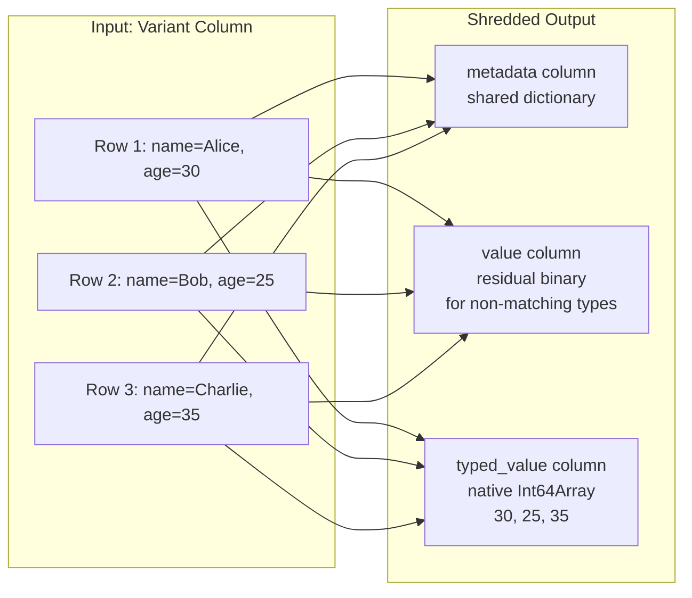

### The Shredding Schema

```python
# You define WHAT to extract:
class VariantShreddingSchema:
    """Defines which fields/types to extract into typed columns."""
    
    class Kind(Enum):
        PRIMITIVE = "primitive"  # Extract as a specific Arrow type
        OBJECT = "object"       # Extract named fields
        ARRAY = "array"         # Extract array elements
    
    @staticmethod
    def primitive(type) -> 'VariantShreddingSchema':
        """Extract values as this Arrow type (e.g., int64, string)."""
        return VariantShreddingSchema(Kind.PRIMITIVE, type=type)
    
    @staticmethod
    def object(fields: list[tuple[str, 'VariantShreddingSchema']]):
        """Extract specific named fields from objects."""
        return VariantShreddingSchema(Kind.OBJECT, fields=fields)
    
    @staticmethod
    def array(element_schema: 'VariantShreddingSchema'):
        """Extract array elements according to a schema."""
        return VariantShreddingSchema(Kind.ARRAY, element_schema=element_schema)

# Example: shred the "age" field as Int64
schema = VariantShreddingSchema.primitive(pa.int64())

# Example: shred object fields
schema = VariantShreddingSchema.object([
    ("name", VariantShreddingSchema.primitive(pa.string())),
    ("age", VariantShreddingSchema.primitive(pa.int64())),
])
```

### Type Compatibility (IsVariantCompatibleWithType)

```python
# For each row, we check: "can this variant value be stored in the target column?"
def is_variant_compatible_with_type(variant_data: bytes, target_type) -> bool:
    """Strict type matching with safe widening.
    
    Rules:
    - Int8 can go into Int8, Int16, Int32, or Int64 (safe widening)
    - Int16 can go into Int16, Int32, or Int64
    - Float can go into Float OR Double (lossless widening)
    - String can go into String, LargeString, or StringView
    - Null NEVER gets shredded (stays in value column)
    - Timestamp checks BOTH unit (micro/nano) AND timezone (TZ/NTZ)
    - Decimal checks scale must match exactly
    """
    header = variant_data[0]
    basic_type = header & 0x03
    
    if basic_type == 1:  # Short string
        return target_type in (pa.string(), pa.large_string(), pa.string_view())
    
    if basic_type in (2, 3):  # Object/Array — not directly shredable
        return False
    
    prim_type = (header >> 2) & 0x3F
    
    if prim_type == 0:  # Null
        return False  # Variant::Null stays in value column!
    
    if prim_type in (1, 2):  # True/False
        return target_type == pa.bool_()
    
    if prim_type == 3:  # Int8
        return target_type in (pa.int8(), pa.int16(), pa.int32(), pa.int64())
    
    # ... etc for all 21 types
```

### The Template Loop Pattern (ShredPrimitiveLoop)

```python
# The C++ uses templates to avoid writing the same loop 15+ times.
# Python equivalent:

def shred_primitive_loop(
    rows: list[bytes],          # Input variant bytes
    extract_fn,                 # Function to extract native value
    typed_builder,              # Builder for the typed column
    value_builder,              # Builder for the residual column
):
    """Generic shredding loop — same logic for all primitive types.
    
    For each row:
    1. If input is null → both output null
    2. If variant type matches → extract to typed_value, residual null
    3. If variant type doesn't match → keep in value, typed null
    4. If Variant::Null → keep 0x00 in value, typed null
    """
    for i, row_bytes in enumerate(rows):
        if row_bytes is None:
            # Input null → both null
            typed_builder.append_null()
            value_builder.append_null()
            continue
        
        success, native_value = extract_fn(row_bytes)
        
        if success:
            # Type matches! Store native value in typed column
            typed_builder.append(native_value)
            value_builder.append_null()  # Not needed in residual
        else:
            # Type doesn't match — store raw bytes in value column
            typed_builder.append_null()
            value_builder.append(row_bytes)  # Keep original bytes

# In C++, this is a TEMPLATE function:
# template <typename BuilderT, typename NativeT, typename ExtractFn>
# Status ShredPrimitiveLoop(BuilderT& typed_builder, ...)
#
# Called as:
# ShredPrimitiveLoop<Int64Builder, int64_t, ExtractInt64>(...)
# ShredPrimitiveLoop<DoubleBuilder, double, ExtractDouble>(...)
# ShredPrimitiveLoop<BooleanBuilder, bool, ExtractBool>(...)
```

### Reconstruction (ReconstructVariantColumn)

```python
# The reverse operation: typed columns → variant binary
def reconstruct_variant_column(
    metadata_array,       # Shared metadata (string dictionary)
    value_array,          # Residual binary (for non-matching rows)
    typed_value_array,    # Native typed column
    schema,               # What the typed column represents
    out_null_bitmap=None, # Optional: track which rows are SQL NULL
) -> bytes_array:
    """Reassemble shredded columns back to variant binary.
    
    For each row:
    - If typed_value is non-null → encode it back as variant bytes
    - If value is non-null → use it directly (it's already variant bytes)
    - If BOTH are null → that's an SQL NULL (or variant-null per spec)
    """
    output = []
    for i in range(len(metadata_array)):
        if typed_value_array[i] is not None:
            # Re-encode the typed value as variant binary
            builder = VariantBuilder(metadata_array[i])
            if schema.type == pa.int64():
                builder.int_(typed_value_array[i])
            elif schema.type == pa.string():
                builder.string(typed_value_array[i])
            # ... etc
            _, value_bytes = builder.finish()
            output.append(value_bytes)
        elif value_array[i] is not None:
            # Use residual directly
            output.append(value_array[i])
        else:
            # Both null — emit variant-null (0x00 byte)
            output.append(b'\x00')
            if out_null_bitmap is not None:
                out_null_bitmap[i] = False  # Mark as SQL NULL
    
    return output
```

### Object Shredding (More Complex)

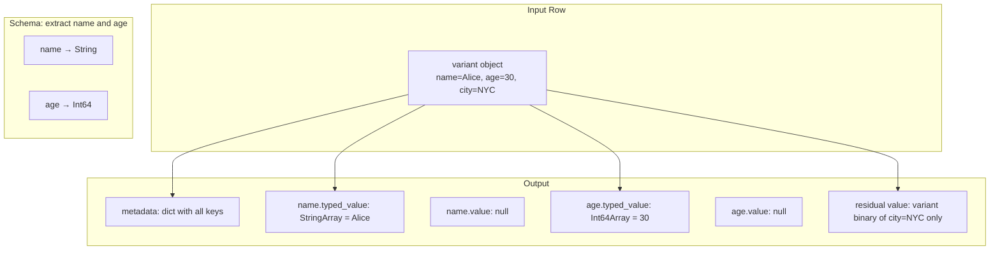

---

## 7. C++ Concepts Mapped to Python

### The Translation Table

| C++ Pattern | Python Equivalent | Why C++ Uses It |
|-------------|------------------|-----------------|
| `#pragma once` | (automatic in Python) | Prevents including header twice |
| `namespace arrow::extension::variant` | `arrow.extension.variant` package | Prevents name collisions |
| `ARROW_EXPORT` | `__all__` in `__init__.py` | Marks what's public in shared libraries |
| `std::string_view` | `memoryview` | Zero-copy reference to bytes |
| `std::optional<T>` | `Optional[T]` (return None) | "Maybe has a value" |
| `Result<T>` | Function that may raise | "Value or error" |
| `Status` | Exception (no return value) | "OK or error" |
| `ARROW_RETURN_NOT_OK(expr)` | `expr  # raises on failure` | Propagate error up |
| `ARROW_ASSIGN_OR_RAISE(var, expr)` | `var = expr  # raises on failure` | Get value or propagate error |
| `std::vector<uint8_t>` | `bytearray` | Growable byte buffer |
| `const uint8_t*` | `bytes` (read-only) | Pointer to read-only bytes |
| `int64_t` | `int` (but exactly 8 bytes) | Fixed-width integer |
| `static_cast<int16_t>(x)` | `int(x) & 0xFFFF` | Type conversion (with size) |
| `std::memcpy(&val, data, N)` | `struct.unpack_from(...)` | Read bytes as typed value |
| `bit_util::FromLittleEndian(x)` | `int.from_bytes(..., 'little')` | Handle byte order |
| `class Foo { ... };` | `class Foo: ...` | Class definition |
| `Foo(Foo&&) noexcept = default` | (no equivalent — GC handles it) | Move constructor |
| `Foo(const Foo&) = delete` | (can't really delete copy in Python) | Prevent copying |
| `[[nodiscard]]` | (no equivalent — maybe `warnings.warn`) | Compiler warns if return value ignored |
| `DCHECK(condition)` | `assert condition` | Debug-only assertion |
| `template <typename T>` | Type variables / duck typing | Compile-time generics |
| `friend class Foo` | (no equivalent — Python has no privacy) | Let specific class access private members |
| `constexpr int32_t k = 128` | `K = 128` (module-level constant) | Compile-time constant |
| `static_assert(sizeof(X) <= 32)` | (no equivalent) | Compile-time size check |
| `~ObjectScope()` (destructor) | `__del__` or `__exit__` | Auto-cleanup on scope exit |

### Memory Safety: Why C++ Is Harder

```python
# Python — you literally cannot have a dangling reference:
data = b"hello"
view = memoryview(data)
del data  # view keeps data alive via reference counting

# C++ — YOU are responsible for lifetime:
# const uint8_t* data = buffer.data();
# std::string_view sv(data, 5);
# buffer.clear();  // DANGER! sv now points to freed memory!
#
# Our code avoids this by:
# 1. Views document "buffer must outlive view" in comments
# 2. Builder OWNS its buffer (it's a std::vector member)
# 3. Shared pointers (shared_ptr) for arrays that multiple things reference
```

---

## 8. Reviewer Comments & Responses Explained

### PR #50121 — Decoding

#### Comment #1: "How was the 32 threshold determined?"

**What they asked:** The original code had an `if num_fields >= 32: binary_search else: linear_scan` optimization. The reviewer wanted to know why 32.

**What happened:** We removed the threshold entirely. The new design pre-parses the object header at construction time (O(1) upfront), so binary search is always cheap. The threshold only made sense when you had to re-parse the header on every lookup (the Go pattern).

**Python analogy:** Imagine a dict that sometimes does linear scan for small sizes. That's unnecessary because Python's dict ALWAYS uses hash lookup. Similarly, our pre-parsed view makes binary search always optimal.

#### Comment #2: "§3 references — link to spec"

**What they asked:** The code comments said "§3" and "§3.1" but the spec doesn't have numbered sections.

**Fix:** Changed to a direct URL link: `https://github.com/apache/parquet-format/blob/master/VariantEncoding.md#encoding-types`

#### Comment #3: "Rename file — 'internal' confusing"

**What they asked:** The file was called `variant_internal.h` but it was actually the PUBLIC API. Confusing.

**Fix:** Renamed to `variant.h` (the public API). Only genuinely internal files now have "internal" in the name (`variant_internal_util.h`, `variant_internal_test_util.h`). These files are NOT installed (CMake excludes files with "internal" in the name from the SDK install).

#### Comment #4: "Add nested navigation test"

**What they asked:** Show tests that navigate deep into objects (field → object → field).

**Fix:** Added tests showing composable navigation:
```cpp
auto obj = view.as_object();
auto inner = obj->get("address")->as_object();
auto city = inner->get("city")->as_string();
```

#### Comment #5: "DecodeValueAt should be public"

**What they asked:** They wanted a function to decode a value at a specific byte offset.

**Response:** `VariantView::Make(metadata, data + offset, size)` already does this. The view factory IS the decode-at-offset operation. No separate function needed.

#### Comment #6: "Plan for shredded variant reading?"

**What they asked:** Will there be support for reading shredded variants back?

**Response:** Yes — implemented in PR #50232 as `ReconstructVariantColumn()`.

---

### PR #50122 — Encoding

#### Comment #7: "Test for metadata/data type mismatch"

**What they asked:** Can we test what happens when metadata says "string" but data is an integer?

**Response:** This is **architecturally impossible**. The metadata dictionary contains ONLY KEY NAMES (like `["name", "age", "city"]`), NOT value types. The variant format is self-describing — each value carries its own type in its header byte. There's no way for metadata and data types to "mismatch" because metadata doesn't store types.

**Python analogy:** It's like asking "what if the dict keys disagree with the values?" — keys and values are independent concepts. `{"name": 42}` is valid; the key "name" doesn't constrain the value type.

#### Comment #8: "Initialize builder from existing buffer"

**What they asked:** Can you pass an existing variant binary to the builder to extend it?

**Response:** The variant format is IMMUTABLE — you can't insert into an existing binary because the header contains packed arrays of offsets that would all need rewriting. Instead, use the read→rebuild pattern:

```python
# Read old variant
old_obj = VariantObjectView(metadata, old_bytes)

# Build new variant, selectively copying fields
builder = VariantBuilder(old_metadata)  # Reuse dictionary
obj = builder.start_object()
for name, value in old_obj:
    if name != "field_to_remove":
        obj.insert_raw(name, value.data)  # Zero-copy transfer
obj.insert("new_field", "new_value")
obj.finish()
```

This is the same pattern Rust uses. It's like how Python's `str` is immutable — you build a new one from pieces.

#### Comment #9: "API for modifying existing variants"

**What they asked:** Can we add mutation support? Like `variant["name"] = "Bob"`.

**Response:** Views (read) + builders (write) is the deliberate separation. "Modify" means read→rebuild. A higher-level mutable DOM (like `nlohmann::json` in C++) could be built on top as a convenience layer in a follow-up PR. The current primitives are the correct foundation.

**Python analogy:** Like having `bytes` (immutable reads) and `bytearray` (fresh writes). You don't mutate `bytes` in place — you construct a new one.

---

## 9. Design Decisions Defended

### Why View Classes Instead of Free Functions?

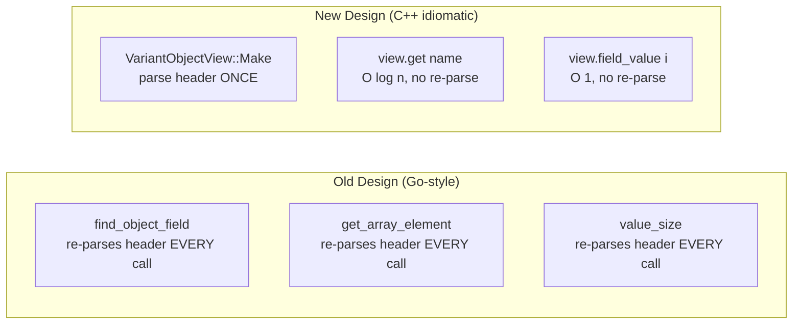

**Why?** Parse the header ONCE, then every subsequent operation is cheap. This is the same optimization Python's `json.loads()` does — it builds a dict once, then lookups are O(1).

### Why RAII Scopes?

```python
# WITHOUT RAII (dangerous in C++):
builder.start_object()
builder.add_field("name", "Alice")
do_something_that_might_throw()  # EXCEPTION! Buffer is now corrupt!
builder.finish_object()           # Never reached

# WITH RAII (safe):
scope = builder.start_object()    # Remembers buffer position
scope.insert("name", "Alice")
do_something_that_might_throw()   # EXCEPTION!
# scope.__del__() auto-called → truncates buffer to pre-scope state
# Builder is back in a clean state
```

C++ doesn't have a GC, so exceptions leave objects in undefined states. RAII ensures cleanup always happens. Python's context managers (`with`) serve the same purpose.

### Why Move-Only Builder?

```python
# Imagine two references to the same builder:
b1 = VariantBuilder()
b2 = b1  # In Python, both point to same object (fine with GC)

# In C++, copying would duplicate the internal buffer state.
# If you then use both copies, you get corrupted output.
# Solution: DELETE the copy constructor, only allow MOVE:
# builder2 = std::move(builder1);  // builder1 is now empty/invalid
```

### Why Binary Search Always (No Threshold)?

The old Go code: "if object has <32 fields, use linear scan; otherwise binary search."

The Go reasoning: parsing the object header is expensive, and for small objects linear scan is faster because it avoids the overhead of setting up binary search.

Our reasoning: we parse the header ONCE at `Make()` time. After that, the per-lookup cost is:
- Linear: O(n) string comparisons
- Binary: O(log n) string comparisons + trivial integer arithmetic

Binary is always better when the header is pre-parsed. There's no crossover point.

### Why `std::optional` for `get()` vs `Result<T>` for `field_value()`?

```python
# get() returns Optional — "field might not exist, that's normal"
result = obj.get("maybe_field")  # Returns None if not found — not an error

# field_value() returns Result — "I expect this to work, error = malformed data"
result = obj.field_value(0)  # Returns Error if index out of range
```

Different return types communicate different contracts to the caller.

---

## Summary: What You Built

You implemented a complete binary codec for Parquet's Variant type in C++:

1. **Decoding** — Zero-copy view classes that parse once and provide fast typed access
2. **Encoding** — A builder with RAII safety guarantees that produces compact binary
3. **Shredding** — Column-level decomposition for query acceleration

The architecture matches Rust's `parquet-variant` crate and improves on Go's `arrow-go` implementation (no threshold, pre-parsed headers, stack overflow protection, RAII safety).

Total: ~11,000 lines of production code, ~6,000 lines of tests, 335 tests passing.


---

## 10. Deep Dive: Memory, Addresses, Pointers, and Parsing Bytes from First Principles

> This section assumes zero knowledge of hardware. We build from the transistor up
> to understanding how our variant decoder reads structured data from raw bytes.

---

### 10.1 The Physical Reality: What IS Memory?

#### Transistors → Bits → Bytes

```
TRANSISTOR (physical):
  A tiny switch made of silicon. It's either ON (conducting) or OFF (not conducting).
  ON = 1, OFF = 0. That's a "bit."

BIT (logical):
  The smallest unit of information: 0 or 1.
  
BYTE (practical):
  8 bits grouped together. Can represent 2^8 = 256 different values (0-255).
  This is the fundamental unit computers work with.
  
  Example: the byte 01100001 = 97 in decimal = the letter 'a' in ASCII
```

#### RAM: A Giant Array of Bytes

```
RAM (Random Access Memory):
  Think of it as a GIANT Python list where each element is one byte.
  
  ram = [0] * 16_000_000_000  # 16 GB of RAM = 16 billion bytes
  
  Each byte has an ADDRESS (its index in this giant list):
  
  Address 0x0000: [byte]
  Address 0x0001: [byte]
  Address 0x0002: [byte]
  ...
  Address 0x3B9AC9FF: [byte]  (last byte in 16 GB)
```

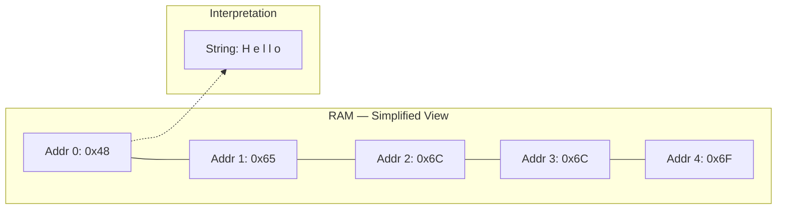

**Key insight:** RAM doesn't "know" what its bytes mean. The bytes `[0x48, 0x65, 0x6C, 0x6C, 0x6F]` could be the string "Hello" OR the integer 482,881,348,936 OR part of an image. The PROGRAM decides how to interpret the bytes.

---

### 10.2 Addresses and Pointers

#### What Is an Address?

```python
# In Python, you never see addresses. The GC handles everything.
# But underneath, every object lives at some memory address.

x = 42
print(id(x))  # Something like 140234567890  ← that's the memory address!

# In C++, you can work with addresses directly:
# int x = 42;            // x lives at some address, say 0x7FFF1234
# int* ptr = &x;         // ptr HOLDS the value 0x7FFF1234 (the address of x)
# int value = *ptr;      // "dereference" — go to address 0x7FFF1234, read the int there
```

#### Pointer = A Variable That Holds an Address

```
┌─────────────────────────────────────────────────────────┐
│ RAM                                                      │
│                                                          │
│ Address 0x1000: [42, 0, 0, 0]  ← this is `int x = 42`  │
│                  (4 bytes, little-endian)                 │
│                                                          │
│ Address 0x2000: [0x00, 0x10, 0x00, 0x00, 0x00, 0x00, 0x00, 0x00]  │
│                  ← this is `int* ptr` holding value 0x1000         │
│                  (8 bytes on 64-bit system)                         │
└─────────────────────────────────────────────────────────┘

ptr holds 0x1000.
*ptr means: "go to address 0x1000, read 4 bytes as an int" → 42
```

#### Why Does Our Code Use Pointers?

```cpp
// In our variant code:
const uint8_t* data;   // "data" holds the ADDRESS of some bytes in memory
int64_t length;        // how many bytes are valid starting from that address

// This is like Python's:
# data = memoryview(some_buffer)
# length = len(data)

// We read from the buffer using pointer arithmetic:
uint8_t header = data[0];     // Read 1 byte at offset 0
uint8_t next = data[1];       // Read 1 byte at offset 1
// data[i] is shorthand for: "go to address (data + i), read 1 byte"
```

**Python translation:**
```python
# C++: const uint8_t* data;  data[5]
# Python: data: bytes;  data[5]
# They're the same operation! Python just hides the address.
```

---

### 10.3 The Stack vs The Heap

#### Two Regions of Memory

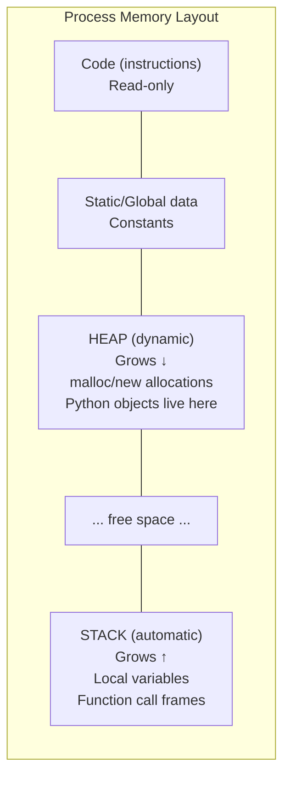

#### Stack = Automatic, Fast, Limited Size

```python
# Every time you call a function, a "frame" is pushed onto the stack:

def outer():
    x = 10          # x is on outer's stack frame
    inner(x)        # Push new frame for inner()
    # inner() returns → its frame is popped (destroyed automatically)

def inner(y):
    z = y + 1       # y and z are on inner's stack frame
    return z        # Frame is destroyed → y and z cease to exist

# Stack is ~1-8 MB. If you recurse too deep, you get StackOverflow.
# This is WHY our code has kMaxNestingDepth = 128!
```

```
STACK during inner():
┌──────────────────────┐  ← Stack pointer (top)
│ inner's frame:       │
│   y = 10             │
│   z = 11             │
│   return address     │
├──────────────────────┤
│ outer's frame:       │
│   x = 10             │
│   return address     │
├──────────────────────┤
│ main's frame:        │
│   ...                │
└──────────────────────┘  ← Stack bottom
```

#### Heap = Dynamic, Slower, Unlimited(ish)

```python
# In Python, ALL objects are on the heap (GC manages them).
# In C++, you CHOOSE:

# Stack allocation (fast, automatic cleanup):
# VariantView view;          // Lives on the stack. Destroyed when function returns.
# int x = 42;               // Stack. Gone when scope ends.

# Heap allocation (flexible, manual cleanup):
# auto ptr = std::make_unique<BigObject>();  // Heap. Destroyed when ptr goes out of scope.
# std::vector<uint8_t> buffer;               // The vector HEADER is on stack,
#                                            // but its CONTENTS are on heap.
```

#### Why This Matters for Our Code

```cpp
// Our VariantView is designed to be STACK-ALLOCATED (no heap):
static_assert(sizeof(VariantView) <= 32);        // Only 32 bytes!
static_assert(sizeof(VariantObjectView) <= 80);  // Only 80 bytes!

// This means creating a view is essentially FREE (no malloc, no GC).
// It's just writing a few numbers to your function's stack frame.

// Compare to Python where every object allocation:
# obj = VariantView(data)  →  malloc(sizeof(PyObject) + fields)
#                          →  GC registers the object
#                          →  Reference count initialized
# That's ~100+ nanoseconds. Stack allocation is ~0 nanoseconds.
```

---

### 10.4 How Numbers Are Stored in Memory (Endianness)

#### The Problem: Multi-Byte Integers

```
The number 258 in decimal = 0x0102 in hexadecimal.
That's TWO bytes: 0x01 and 0x02.

Question: In which ORDER do you store them in memory?

OPTION A — Big-endian ("network byte order"):
  Address N:   0x01  (most significant byte first)
  Address N+1: 0x02
  "Big end first" — like reading left-to-right

OPTION B — Little-endian (x86, ARM, what YOU run):
  Address N:   0x02  (least significant byte first)
  Address N+1: 0x01
  "Little end first" — reversed from how humans write numbers
```

#### Why The Variant Spec Uses Little-Endian

```python
# The spec says: ALL multi-byte values are stored little-endian.
# This is the natural format for x86/ARM CPUs (most computers today).
# On these CPUs, reading a LE value is a single instruction (no conversion).

# Writing the integer 300 (0x012C) as 2 little-endian bytes:
value = 300
le_bytes = value.to_bytes(2, byteorder='little')  # b'\x2C\x01'

# Reading it back:
restored = int.from_bytes(b'\x2C\x01', byteorder='little')  # 300
```

#### Our Code Handles Both Endiannesses

```cpp
// variant_internal_util.h:
inline uint32_t ReadUnsignedLE(const uint8_t* data, int32_t num_bytes) {
    uint32_t result = 0;
    std::memcpy(&result, data, num_bytes);            // Copy raw bytes into integer
    result = ::arrow::bit_util::FromLittleEndian(result);  // Byte-swap if on big-endian CPU
    if (num_bytes < 4) {
        result &= (1u << (num_bytes * 8)) - 1;       // Clear unused upper bytes
    }
    return result;
}
```

**Step by step for reading 2-byte value 300 (bytes: `[0x2C, 0x01]`):**

```
1. memcpy: Copy 2 bytes into uint32_t result (initially 0x00000000)
   On little-endian CPU: result = 0x0000012C  (CPU reads LE natively)
   On big-endian CPU:    result = 0x2C010000  (bytes placed at low addresses)

2. FromLittleEndian: 
   On little-endian: NO-OP (already correct)
   On big-endian: byte-swap → 0x0000012C

3. Mask (since num_bytes=2 < 4):
   mask = (1 << 16) - 1 = 0x0000FFFF
   result &= mask → 0x0000012C & 0x0000FFFF = 0x0000012C = 300 ✓
```

---

### 10.5 Bit Manipulation: How We Pack Data Into Bytes

#### Bits Within a Byte

```
A byte has 8 bits, numbered 0 (rightmost) to 7 (leftmost):

  Bit: 7  6  5  4  3  2  1  0
       │  │  │  │  │  │  │  │
       128 64 32 16 8  4  2  1   ← each bit's "weight"

The byte 0b01100001 = 64+32+1 = 97 = ASCII 'a'
```

#### Extracting Parts of a Byte (Bitwise Operations)

```python
# The variant header byte packs MULTIPLE pieces of info into ONE byte:
# Bits 0-1: Basic type (4 possible values: 0-3)
# Bits 2-7: Sub-type info (depends on basic type)

header = 0b00001101  # = 13 in decimal

# Extract basic type (bottom 2 bits):
basic_type = header & 0x03       # AND with 0b00000011
# 0b00001101
# 0b00000011  AND
# ----------
# 0b00000001  = 1 = BasicType::kShortString

# Extract sub-type info (upper 6 bits, shifted right):
sub_info = (header >> 2) & 0x3F  # Shift right 2, then AND with 0b00111111
# 0b00001101 >> 2 = 0b00000011
# 0b00000011
# 0b00111111  AND
# ----------
# 0b00000011  = 3
# This means: short string of length 3

# So header byte 0x0D = short string "abc" (if followed by bytes 'a','b','c')
```

#### Packing Data INTO a Byte

```python
# Building a header byte for Int8 (PrimitiveType::kInt8 = 3):
# basic_type = 0 (kPrimitive)
# primitive_type = 3 (kInt8)
# Header = basic_type | (primitive_type << 2)

header = 0x00 | (3 << 2)   # = 0b00001100 = 0x0C
# Bits 0-1: 00 = Primitive
# Bits 2-7: 000011 = Int8

# Building a header byte for a short string of length 5:
# basic_type = 1 (kShortString)
# length = 5
header = 0x01 | (5 << 2)   # = 0b00010101 = 0x15
# Bits 0-1: 01 = ShortString
# Bits 2-7: 000101 = length 5
```

---

### 10.6 Context-Free Grammar Over Bytes: How the Variant Format Self-Describes

#### What Is a Context-Free Grammar?

A context-free grammar (CFG) is a set of rules that define how to parse structured data.
JSON has a CFG. XML has a CFG. And Variant has a CFG over BYTES (not text).

The key insight: **each value's header byte tells you EXACTLY how to parse the rest.**
You don't need any external schema or context. The data describes itself.

#### The Variant Grammar (Formal)

```
VariantValue  ::= Primitive | ShortString | Object | Array

Primitive     ::= PrimitiveHeader PrimitiveBody
PrimitiveHeader ::= byte where (byte & 0x03) == 0
PrimitiveBody ::= (depends on primitive_type from bits 2-7)

ShortString   ::= ShortStringHeader StringBytes
ShortStringHeader ::= byte where (byte & 0x03) == 1  
                      (length = (byte >> 2) & 0x3F)
StringBytes   ::= byte[length]

Object        ::= ObjectHeader NumFields FieldIDs Offsets FieldValues
Array         ::= ArrayHeader NumElements Offsets ElementValues
```

#### Walking Through a Real Example — Bottom Up

Let's encode `{"name": "Alice", "age": 30}` and then decode it byte-by-byte.

**Step 1: The metadata (string dictionary)**

```
Metadata binary:
  Byte 0: 0x01       ← Header: version=1, not sorted, offset_size=1
  Byte 1: 0x02       ← dict_size = 2 (two keys: "age", "name")
  Byte 2: 0x00       ← offset[0] = 0 (start of first string)
  Byte 3: 0x03       ← offset[1] = 3 (start of second string)  
  Byte 4: 0x07       ← offset[2] = 7 (end of second string)
  Byte 5-7: "age"    ← string data for key 0
  Byte 8-11: "name"  ← string data for key 1

Dictionary: {0: "age", 1: "name"}
```

```python
# Parsing the metadata header byte 0x01:
header = 0x01                     # = 0b00000001
version = header & 0x0F           # = 1 (bottom 4 bits)
is_sorted = (header >> 4) & 0x01  # = 0 (bit 4)
reserved = (header >> 5) & 0x01   # = 0 (bit 5 — MUST be 0)
offset_size = ((header >> 6) & 0x03) + 1  # = 1 byte per offset
```

**Step 2: The value (the object itself)**

```
Value binary (let's build it):

Field values first (written as builder appends them):
  Bytes 0-5: value of "name" → ShortString "Alice"
    Byte 0: 0x15     ← Header: basic_type=1(ShortString), length=5 (5<<2|1)
    Bytes 1-5: "Alice" (5 ASCII bytes)
  
  Bytes 6-7: value of "age" → Int8(30)
    Byte 6: 0x0C     ← Header: basic_type=0(Primitive), prim_type=3(Int8) → (3<<2|0)
    Byte 7: 0x1E     ← 30 as a single byte

Then the object header is written IN FRONT:
  Object header format:
    Byte: 0x02       ← basic_type=2(Object), offset_size=1, id_size=1, not large
                        type_info = 0b000000 → offset_size=1, id_size=1, is_large=0
                        full byte = 0b00000010 = 0x02
    Byte: 0x02       ← num_fields = 2 (1-byte because not large)
    
    Field IDs (sorted by key name!):
      Byte: 0x00     ← field[0] has dict_id=0 → key "age"  (a < n alphabetically)
      Byte: 0x01     ← field[1] has dict_id=1 → key "name"
    
    Offsets (where each field's value starts, relative to data_start):
      Byte: 0x00     ← offset[0] = 0 (age starts at data_start + 0)
      Byte: 0x06     ← offset[1] = 6 (name starts at data_start + 6)  
      Byte: 0x08     ← offset[2] = 8 (total data size — end sentinel)
      
      Wait — fields are sorted by key, so "age" comes before "name".
      But "name" was written first in the buffer. So offsets handle the reordering:
      Actually let me redo this correctly...
```

**Let me show the ACTUAL byte-level layout after FinishObject sorts:**

```
The builder appends values in insertion order:
  Position 0: "Alice" value bytes (6 bytes: header 0x15 + "Alice")
  Position 6: Int8(30) bytes (2 bytes: header 0x0C + 0x1E)

FinishObject then sorts fields by key name:
  "age" (dict_id=0) was inserted second → its value starts at offset 6
  "name" (dict_id=1) was inserted first → its value starts at offset 0

Final object bytes (written before the field values in the buffer):
  Byte 0: 0x02     ← Object header (basic_type=2, offset_size=1, id_size=1)
  Byte 1: 0x02     ← num_fields = 2
  Byte 2: 0x00     ← field_ids[0] = 0 ("age" — comes first alphabetically)
  Byte 3: 0x01     ← field_ids[1] = 1 ("name")
  Byte 4: 0x06     ← offset[0] = 6 (age value starts at byte 6 of data section)
  Byte 5: 0x00     ← offset[1] = 0 (name value starts at byte 0 of data section)
  Byte 6: 0x08     ← offset[2] = 8 (total data size)
  --- data section starts here ---
  Byte 7: 0x15     ← "Alice" short string header
  Bytes 8-12: "Alice"
  Byte 13: 0x0C    ← Int8 header
  Byte 14: 0x1E    ← 30
```

**Step 3: Decoding it back (what VariantObjectView does)**

```python
# Given the object bytes above, VariantObjectView::Make() does:

data = bytes([0x02, 0x02, 0x00, 0x01, 0x06, 0x00, 0x08, 0x15,
              0x41, 0x6C, 0x69, 0x63, 0x65, 0x0C, 0x1E])

# 1. Read header byte
header = data[0]  # 0x02
basic_type = header & 0x03  # = 2 → Object ✓
type_info = (header >> 2) & 0x3F  # = 0
field_offset_size = (type_info & 0x03) + 1  # = 1
field_id_size = ((type_info >> 2) & 0x03) + 1  # = 1
is_large = ((type_info >> 4) & 0x01) != 0  # = False

# 2. Read num_fields
num_fields_size = 4 if is_large else 1  # = 1
num_fields = data[1]  # = 2

# 3. Compute section positions (PRE-PARSED — done once at construction)
id_start = 1 + num_fields_size  # = 2
offset_start = id_start + num_fields * field_id_size  # = 2 + 2*1 = 4
data_start = offset_start + (num_fields + 1) * field_offset_size  # = 4 + 3*1 = 7

# Now lookups are O(1) arithmetic:
# field_id[i] = data[id_start + i * field_id_size]
# offset[i] = data[offset_start + i * field_offset_size]
# field_value[i] starts at: data[data_start + offset[i]]

# 4. Looking up "age" (binary search):
# We search field_ids for the dict_id of "age".
# FindMetadataKey(metadata, "age") → 0
# Binary search field_ids for 0:
#   field_ids = [0, 1] → found at index 0
# offset[0] = data[4] = 0x06 = 6
# Value starts at data_start + 6 = 7 + 6 = 13
# data[13] = 0x0C → Primitive, Int8
# data[14] = 0x1E = 30 ✓
```

---

### 10.7 memcpy: The Fundamental Read Operation

#### Why Not Just Cast Pointers?

```python
# In Python, struct.unpack handles alignment and byte order:
import struct
value = struct.unpack_from('<i', buffer, offset)  # Read 4-byte little-endian int

# In C, you might THINK you can just do:
# int* ptr = (int*)(data + offset);
# int value = *ptr;
#
# WRONG! This is "undefined behavior" because:
# 1. data + offset might not be aligned to 4 bytes
# 2. The compiler might optimize incorrectly
#
# The SAFE way (what our code does):
# int32_t value;
# std::memcpy(&value, data + offset, 4);  // Copy 4 bytes into the int variable
# value = bit_util::FromLittleEndian(value);  // Fix byte order if needed
```

#### What memcpy Actually Does

```
memcpy(&value, data + 5, 4):

SOURCE: data buffer in memory
  Address 0x1000: [... ... ... ... ... 0x2C 0x01 0x00 0x00 ...]
                                        ^^^^^^^^^^^^^^^^^^^^^^^^^
                                        data+5, 4 bytes to copy

DESTINATION: local variable 'value' on the stack  
  Address 0x7FFF3000: [?? ?? ?? ??]  (4 bytes, uninitialized)

AFTER memcpy:
  Address 0x7FFF3000: [0x2C 0x01 0x00 0x00]  (copied!)

Now 'value' contains 0x0000012C = 300 (on little-endian CPU).
```

---

### 10.8 The Full Decode Pipeline — A Complete Traced Example

Let's trace exactly what happens when you call `view.as_int64()` on a variant
containing the number 1000000 (one million):

```
1. The variant bytes for Int64(1000000):
   Byte 0: 0x18     ← Header: basic_type=0(Primitive), prim_type=6(Int64) → (6<<2)|0 = 24 = 0x18
   Bytes 1-8: [0x40, 0xC4, 0x0F, 0x00, 0x00, 0x00, 0x00, 0x00]
              ← 1000000 in little-endian 8-byte representation
              
   Verify: 0x40 + 0xC4*256 + 0x0F*65536 = 64 + 50176 + 983040 = 1033280... wait
   Actually: 1000000 = 0x000F4240
   LE bytes: [0x40, 0x42, 0x0F, 0x00, 0x00, 0x00, 0x00, 0x00]
   
2. VariantView::Make(metadata, data, 9):
   - Checks data != nullptr and length >= 1  ✓
   - Calls ValueSize(data, 9):
     - header = 0x18, basic_type = 0 (Primitive)
     - type_info = (0x18 >> 2) & 0x3F = 6 = kInt64
     - PrimitiveValueSize(kInt64) = 8
     - Returns 1 + 8 = 9 bytes total
   - Stores: metadata_ptr, data_ptr, size=9, type=kPrimitive
   - Returns Result<VariantView> containing the view

3. view.as_int64():
   - Checks type_ == BasicType::kPrimitive  ✓
   - Checks GetPrimitiveType(data_[0]) == PrimitiveType::kInt64
     - (0x18 >> 2) & 0x3F = 6 = kInt64  ✓
   - int64_t value;
   - std::memcpy(&value, data_ + 1, 8);
     → Copies 8 bytes from data[1..8] into the local variable 'value'
   - value = bit_util::FromLittleEndian(value);
     → On x86/ARM (little-endian): NO-OP
     → On s390x (big-endian): byte-swaps the 8 bytes
   - Returns Result<int64_t>(1000000)
```

---

### 10.9 Why "Zero-Copy" Matters

#### The Costly Alternative (Copying)

```python
# Imagine 1 million rows, each with a variant containing a 100-byte string.
# Without zero-copy:

for row in rows:  # 1 million iterations
    variant_bytes = row.get_bytes()     # Copy bytes from file buffer → Python bytes
    decoded = decode(variant_bytes)      # Parse → creates Python str (another copy)
    result.append(decoded)               # Store reference

# Total allocations: 2 million (1M bytes copies + 1M str objects)
# Total bytes copied: 200 MB (100 bytes × 2 copies × 1M rows)
```

#### The Zero-Copy Approach (What Our Code Does)

```python
# With zero-copy (string_view):

# The entire file/buffer is loaded into memory ONCE:
buffer = mmap(file)  # Memory-mapped file — one big contiguous buffer

for i in range(1_000_000):
    # VariantView just stores a pointer + length (NO copy):
    view = VariantView.make(metadata, buffer[offset:])  # ~0 ns (pointer arithmetic)
    
    # as_string() returns a string_view (pointer into buffer, NO copy):
    sv = view.as_string()  # ~0 ns (just reads length from header, returns view)
    
    # Only ACTUALLY copy if you need to hold onto it past the buffer's lifetime

# Total allocations: 0
# Total bytes copied: 0
# This is WHY our view classes are 32-80 bytes (stack-allocated, no heap)
```

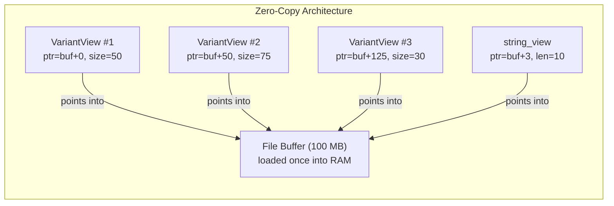

---

### 10.10 Putting It All Together: The Full Stack

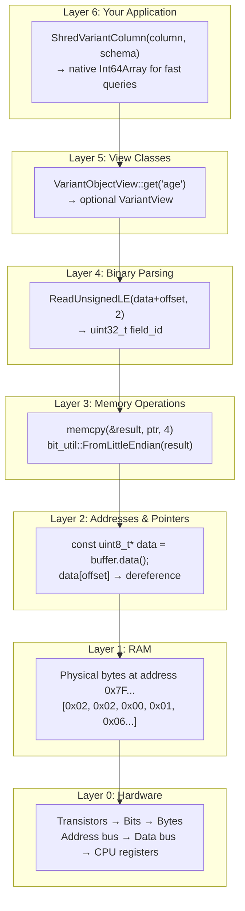

**The bottom-up mechanism:**

1. **Hardware** stores bits in transistors, grouped into bytes, organized into addressable RAM
2. **Pointers** are variables that hold RAM addresses — `data` points to where our bytes live
3. **memcpy** copies N bytes from one address to another (from buffer into a typed variable)
4. **Binary parsing** uses bitwise ops (`&`, `>>`, `<<`) to extract fields from bytes
5. **View classes** pre-parse headers once, then provide O(1)/O(log n) typed access
6. **Application logic** (shredding) uses views to read millions of rows efficiently

Each layer builds on the one below. Python hides layers 0-3 completely (the GC and interpreter manage memory for you). C++ exposes them, which is why it's more complex — but also why it can be 10-100× faster for data processing.

---

### 10.11 Why Our Code Is Memory-Safe Despite Using Raw Pointers

**Common C++ dangers we avoid:**

| Danger | How we prevent it |
|--------|------------------|
| Buffer overflow (read past end) | Length checks before every read: `if (pos + needed > length)` |
| Use-after-free (dangling pointer) | Views document "buffer must outlive view"; shared_ptr for arrays |
| Stack overflow (infinite recursion) | `kMaxNestingDepth = 128` enforced in every recursive call |
| Uninitialized memory | `NativeT native_val{}` value-initializes to zero |
| Double-free | Move-only builder; RAII scopes prevent double-rollback |
| Integer overflow | `int64_t` for all offsets; checked arithmetic in size computations |
| Undefined behavior on misaligned access | Always use `memcpy`, never raw pointer casts |

**Python equivalent of our safety guarantees:**
```python
# What Python's GC gives you for free, we implement manually:
assert offset + size <= len(buffer)    # Bounds check (every read)
assert depth <= 128                     # Recursion limit
assert value is not None                # Null check before use
# Plus: RAII destructors = context managers that CANNOT be forgotten
```


---

### 10.12 Apache Arrow: The In-Memory Columnar Format (and Why It Matters Here)

#### What IS Arrow?

Arrow is a specification for how to lay out data **in RAM** so that:
1. Multiple languages (Python, C++, Rust, Java, Go) can share data **without copying**
2. Analytical operations (sum, filter, group-by) are as fast as possible on modern CPUs

**Python analogy:** You already use Arrow every day — `pyarrow` is the Python binding, and
Pandas 2.0+ uses Arrow as its backend. When you do `pd.read_parquet("file.parquet")`,
the data goes: Parquet file → Arrow arrays in RAM → Pandas DataFrame view.

#### Row-Oriented vs Column-Oriented Storage

```
ROW-ORIENTED (how Python dicts/objects work):
  Row 0: {"name": "Alice", "age": 30, "city": "NYC"}
  Row 1: {"name": "Bob",   "age": 25, "city": "LA"}
  Row 2: {"name": "Carol", "age": 35, "city": "SF"}

  In memory: [Alice,30,NYC] [Bob,25,LA] [Carol,35,SF]
  
  Good for: accessing all fields of ONE row (like a web request)
  Bad for:  computing SUM(age) — you jump across memory to find each age

COLUMN-ORIENTED (how Arrow works):
  name column: ["Alice", "Bob", "Carol"]
  age column:  [30, 25, 35]
  city column: ["NYC", "LA", "SF"]

  In memory: [30,25,35] [Alice,Bob,Carol] [NYC,LA,SF]
  
  Good for: SUM(age) — all ages are CONTIGUOUS in memory (cache-friendly!)
  Bad for:  fetching one complete row (need to jump between columns)
```

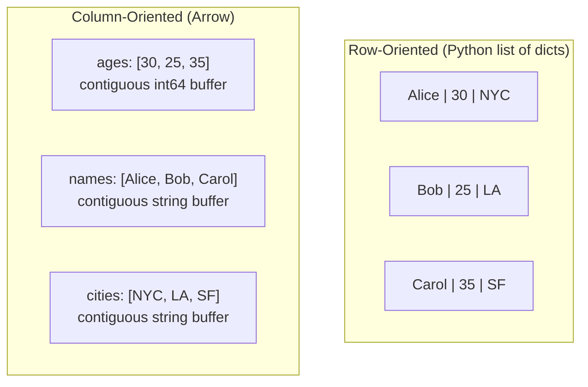

#### Why Columnar Is Faster for Analytics

```python
# Computing SUM(age) with row-oriented data:
total = 0
for row in rows:           # Each row is scattered in memory
    total += row["age"]    # Dict lookup + memory jump per row

# Computing SUM(age) with Arrow columnar data:
ages = table.column("age")  # One contiguous int64 buffer
total = ages.sum()           # CPU reads sequential memory → uses SIMD vectorization
                             # 10-100x faster because of CPU cache behavior
```

**The hardware reason:** Modern CPUs have a "cache line" of 64 bytes. When you read one byte,
the CPU actually fetches 64 bytes from RAM into fast L1 cache. With columnar layout, the next
63 bytes are the NEXT ages (useful!). With row layout, the next 63 bytes are "name" and "city"
of the same row (useless for SUM(age) — wasted cache).

#### How Arrow Arrays Look in Memory

```
An Arrow Int64Array with values [30, 25, 35, NULL, 40]:

VALIDITY BITMAP (which values are non-null):
  Bits: [1, 1, 1, 0, 1]  → packed into bytes: [0b00010111] = 0x17
  (bit=1 means valid, bit=0 means null)

VALUES BUFFER (raw int64 values, contiguous):
  Byte offset 0:  [0x1E, 0x00, 0x00, 0x00, 0x00, 0x00, 0x00, 0x00]  ← 30
  Byte offset 8:  [0x19, 0x00, 0x00, 0x00, 0x00, 0x00, 0x00, 0x00]  ← 25
  Byte offset 16: [0x23, 0x00, 0x00, 0x00, 0x00, 0x00, 0x00, 0x00]  ← 35
  Byte offset 24: [0x00, 0x00, 0x00, 0x00, 0x00, 0x00, 0x00, 0x00]  ← (garbage, null)
  Byte offset 32: [0x28, 0x00, 0x00, 0x00, 0x00, 0x00, 0x00, 0x00]  ← 40

Total: 1 byte (bitmap) + 40 bytes (5 × 8-byte int64s) = 41 bytes
Compare to Python: 5 PyObject headers + 5 int objects ≈ 280 bytes (7x more!)
```

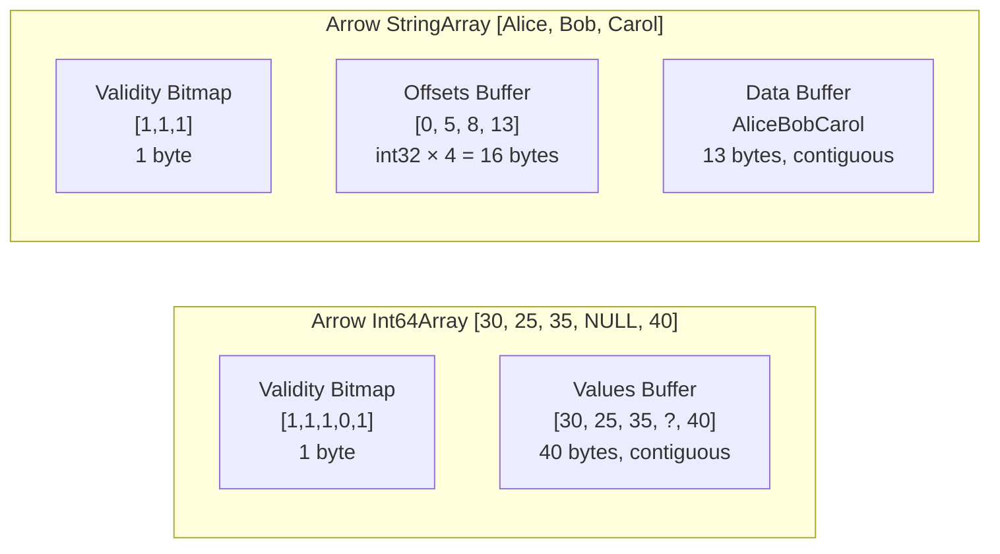

#### Arrow BinaryArray — Where Variant Values Live

Our variant code operates on Arrow `BinaryArray` — a column of variable-length byte sequences:

```python
# A BinaryArray storing 3 variant values:
import pyarrow as pa

# Each element is raw bytes (one encoded variant value)
variant_column = pa.array([
    b'\x0C\x1E',                    # Int8(30)
    b'\x15Alice',                    # ShortString("Alice")  
    b'\x02\x02\x00\x01...',         # Object{...}
], type=pa.binary())

# In memory, Arrow stores this as:
# Offsets: [0, 2, 7, 22]  (where each value starts/ends in the data buffer)
# Data:    [0x0C,0x1E, 0x15,0x41,0x6C,0x69,0x63,0x65, 0x02,0x02,...]
#           ^^^^^^^^^^^  ^^^^^^^^^^^^^^^^^^^^^^^^^^^^^^^  ^^^^^^^^^^^^^
#           row 0        row 1                           row 2

# Our ShredVariantColumn() receives this BinaryArray and processes it row-by-row.
```

#### How Our Code Connects to Arrow

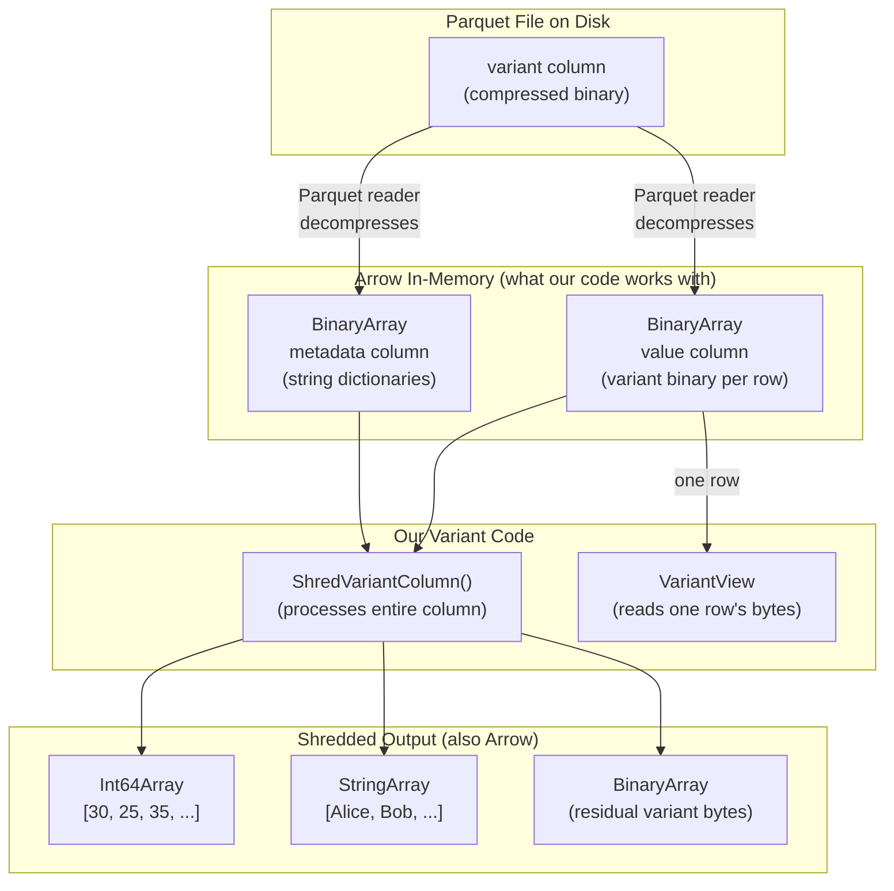

#### The Key Insight: Arrow Builders

When our shredding code produces output, it uses Arrow **Builders**:

```python
# Python pyarrow equivalent of what our C++ code does:
import pyarrow as pa

# For each row, we route the value to either typed or residual:
int_builder = pa.Int64Builder()       # ← In C++: arrow::Int64Builder
str_builder = pa.BinaryBuilder()      # ← In C++: arrow::BinaryBuilder

for i in range(num_rows):
    variant_bytes = value_array[i]
    if is_compatible(variant_bytes, pa.int64()):
        native_val = extract_int64(variant_bytes)
        int_builder.append(native_val)
        str_builder.append_null()
    else:
        int_builder.append_null()
        str_builder.append(variant_bytes)  # Keep as residual binary

# Produce final Arrow arrays:
typed_array = int_builder.finish()    # Int64Array
residual_array = str_builder.finish() # BinaryArray
```

In C++, `Int64Builder::Append(value)` writes the value directly into a contiguous buffer.
`AppendNull()` just sets a bit to 0 in the validity bitmap. No allocations per row.

#### Why Arrow Matters for Our Implementation

| Without Arrow | With Arrow |
|--------------|------------|
| Each language has its own memory format | One format shared by Python/C++/Rust/Java |
| Data copied between languages | Zero-copy sharing via pointers |
| Custom binary → custom native arrays | Standard BinaryArray → standard typed arrays |
| No ecosystem tooling | All of DataFusion/Pandas/Spark can read the output |

**Concrete benefit:** After `ShredVariantColumn()` produces an `Int64Array`, you can:
- Filter it with DataFusion (no conversion needed)
- Read it in Python via pyarrow (zero-copy)
- Write it back to Parquet with column statistics (enables predicate pushdown)
- Send it over the network via Arrow Flight (zero serialization)

#### The Full Data Flow Through the System

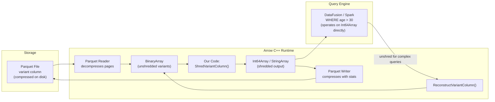

This is why shredding exists: it bridges the gap between the **flexibility** of variant
(any structure, no schema needed) and the **performance** of native columnar storage
(predicate pushdown, vectorized operations, compression, statistics).
