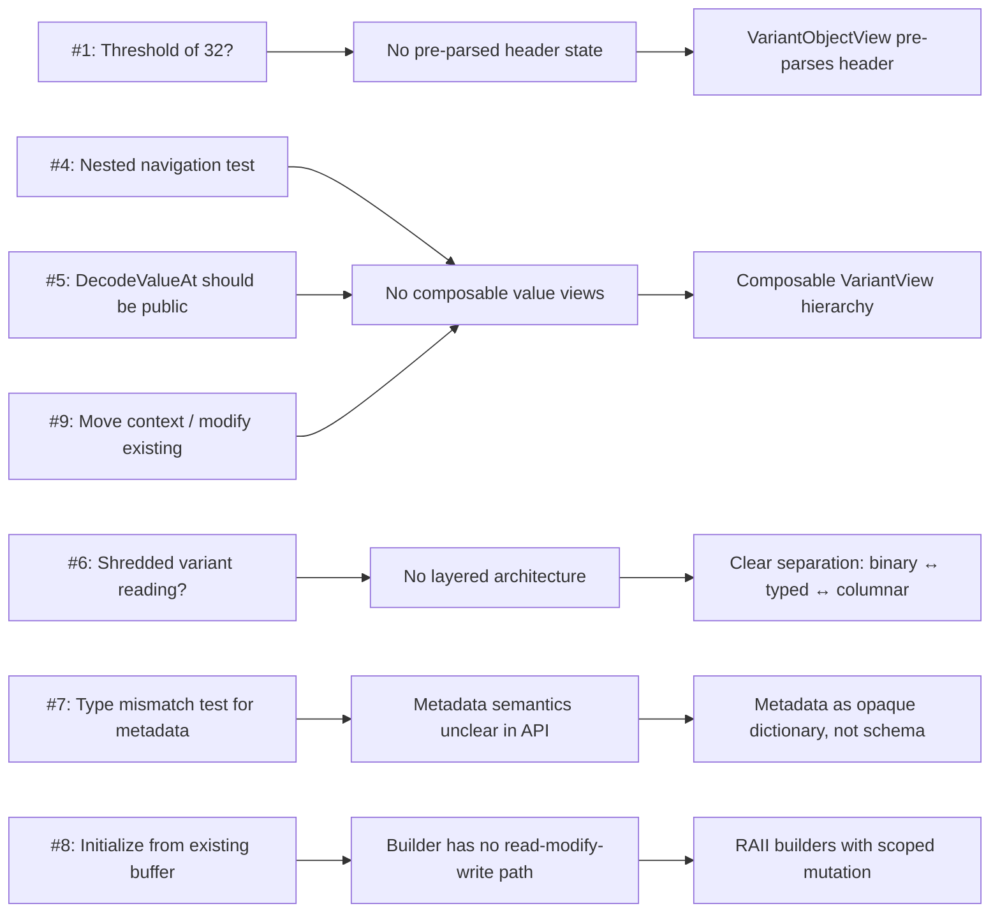
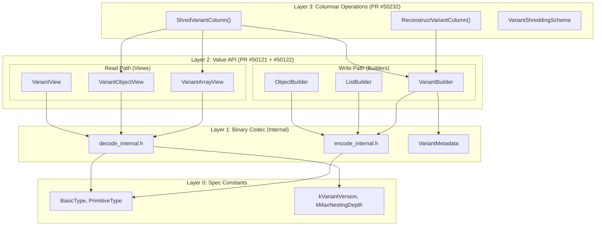
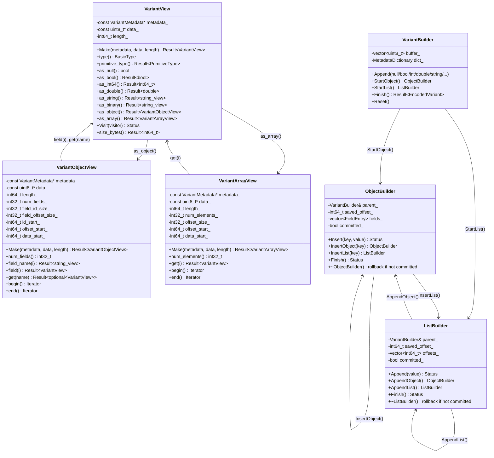
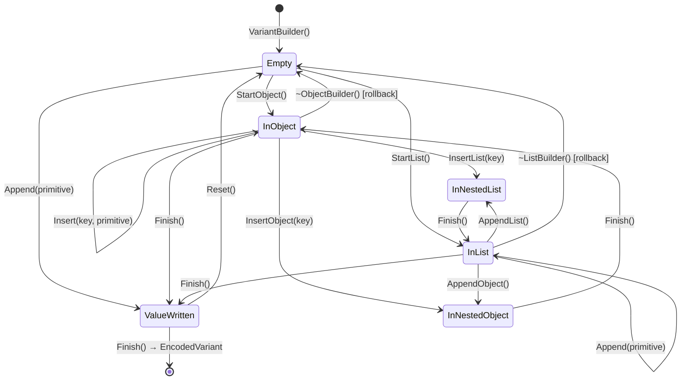
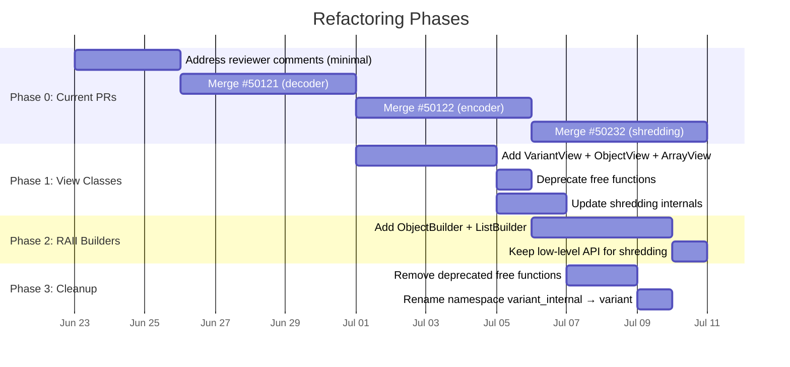

# C++ Variant Implementation: Architectural Refactoring Proposal

> Principal Engineer Design Document — 2026-06-22
> Status: Draft
> PRs: apache/arrow#50121 (decoding), #50122 (encoding), #50232 (shredding)
> Umbrella: GH-45937

---

## 1. Executive Summary

The current C++ Variant implementation achieves **functional correctness** (all tests pass,
format-compliant, Rust/Go parity on behavior) but suffers from **architectural debt** introduced
by copying Go's API idioms into C++. This document proposes a principled refactoring towards
an implementation that is optimized for C++'s type system, memory model, and performance
characteristics.

The refactoring is motivated by:
1. Reviewer feedback (misiek1984) that implicitly identifies the ergonomic gaps
2. The observation that C++ ≈ Rust in memory/performance semantics, not Go
3. The opportunity to leverage RAII, zero-cost abstractions, and compile-time
   type safety — features absent in Go that C++ shares with Rust

**Thesis:** An optimal C++ implementation derives from the same first principles as Rust's
(zero-copy views, typestate builders, deterministic resource management) but expresses them
through C++'s specific mechanisms (RAII, templates, `string_view`, `span`).

---

## 2. Current State Analysis

### 2.1 Origin Story and Design Debt

| PR | Primary Reference | What was copied | What's suboptimal for C++ |
|----|-------------------|-----------------|---------------------------|
| #50121 (Decoder) | arrow-go `parquet/variant` | Stateless free functions, manual offset arithmetic | No pre-parsed state, threshold heuristics, unnatural API |
| #50122 (Encoder) | arrow-go `parquet/variant.Builder` | Flat builder + caller-managed offsets/FieldEntry vectors | No RAII safety, manual protocol, error-prone |
| #50232 (Shredding) | arrow-rs `parquet-variant-compute` | Column-level free functions | Already appropriate — column ops ARE free functions |

### 2.2 Reviewer Comments → Design Signals

Every reviewer comment maps to a specific architectural deficiency:



### 2.3 What Each Implementation Gets Right

| Implementation | Strength to preserve | Why |
|---|---|---|
| Go | Simple mental model for encoding | Easy to explain |
| Rust | Zero-copy views, typestate protocol, RAII-equivalent | Correct for systems languages |
| Current C++ | Correctness, comprehensive tests, spec coverage | Foundation is solid |

---

## 3. First Principles: Mathematical Foundation

### 3.1 The Variant Type as an Algebraic Data Type

The Variant binary format defines a **recursive sum type** (tagged union / coproduct):

```
Variant ::= Null
           | Bool(𝔹)
           | Int8(ℤ₈) | Int16(ℤ₁₆) | Int32(ℤ₃₂) | Int64(ℤ₆₄)
           | Float(ℝ₃₂) | Double(ℝ₆₄)
           | Decimal4(ℤ₃₂ × ℕ₈) | Decimal8(ℤ₆₄ × ℕ₈) | Decimal16(ℤ₁₂₈ × ℕ₈)
           | Date(ℤ₃₂) | Timestamp(ℤ₆₄) | Time(ℤ₆₄)
           | String(𝔹*) | Binary(𝔹*)
           | UUID(𝔹¹⁶)
           | Object(Dictionary × Field*)     where Field = (KeyID × Variant)
           | Array(Variant*)
```

**Axiom 1 (Self-describing):** Every value's type is encoded in its first byte(s). No external
schema is required to parse a value.

**Axiom 2 (Compositional):** Objects and Arrays are homomorphic — they contain Variants,
which may themselves be Objects/Arrays. The structure forms a tree of bounded depth.

**Axiom 3 (Random-accessible):** Objects and Arrays encode offset tables that permit O(1)
access to any child without parsing preceding children.

### 3.2 Operations as Morphisms

The three PRs implement three distinct **morphisms** on this type:

```
Decode:    Bytes → Variant              (deserialization / parsing)
Encode:    Variant → Bytes              (serialization / building)
Shred:     Column<Bytes> → Column<T>    (columnar decomposition)
Reconstruct: Column<T> → Column<Bytes>  (columnar recomposition)
```

These form a **round-trip identity** (correctness invariant):

```
∀ v : Variant.  Decode(Encode(v)) = v
∀ col : Column<Bytes>.  Reconstruct(Shred(col)) ≅ col
```

(Where ≅ denotes semantic equivalence modulo encoding width — e.g., Int8(42) may encode
as a different byte width but decodes to the same value.)

### 3.3 Complexity Bounds

| Operation | Optimal Time | Current Time | Gap |
|-----------|--------------|--------------|-----|
| Decode primitive | O(1) | O(1) | None |
| Object field lookup by name | O(log n) | O(n) if n<32, O(log n) if n≥32 | Threshold is discontinuity |
| Array element by index | O(1) | O(1) + header re-parse | Constant factor |
| Object construction | O(k log k) (sort k fields) | O(k log k) + O(k) alloc | Extra allocation |
| Navigate path of depth d | O(d · log n) | O(d · (parse_header + log n)) | d redundant header parses |

**Key insight:** The threshold at n=32 introduces a **discontinuity** in the time complexity
function. This is a code smell — optimal algorithms have smooth complexity curves.
The discontinuity exists because each comparison requires O(1) dictionary lookup work that
is only amortized away by binary search's O(log n) property when n is large enough. Pre-parsing
the header eliminates the per-comparison overhead, making binary search optimal for ALL n > 1.

### 3.4 Memory Model Axioms

**Axiom 4 (Zero-copy reads):** Decoding should never copy the source bytes. All string/binary
access should yield views (`string_view`) into the original buffer.

**Axiom 5 (Locality of reference):** Repeated operations on the same object/array should
amortize any parsing cost. Parse once, query many times.

**Axiom 6 (Deterministic resource management):** Every resource acquisition (buffer allocation,
partial write) must have a corresponding release path that executes even under error/exception
flow. This is the RAII principle.

**Axiom 7 (Type safety at boundaries):** Public APIs should make illegal states
unrepresentable. A `VariantObjectView` can only exist if the underlying bytes actually
encode an object (validated at construction).

---

## 4. Target Architecture

### 4.1 Layer Diagram



### 4.2 Type Hierarchy



---

## 5. Detailed Design: Read Path (Decoder Refactoring)

### 5.1 Core Invariant

**Theorem (View Safety):** If `VariantObjectView::Make(meta, data, length)` returns `Ok(view)`,
then for all `0 ≤ i < view.num_fields()`:
- `view.field_name(i)` returns a valid `string_view` into the metadata buffer
- `view.field(i)` returns a valid `VariantView` whose data lies within `[data, data+length)`

**Proof sketch:** `Make()` validates:
1. Header byte has `BasicType::kObject`
2. `num_fields_size` bytes are available after header
3. `num_fields * field_id_size` bytes exist for the ID array
4. `(num_fields + 1) * field_offset_size` bytes exist for the offset array
5. The last offset value ≤ remaining buffer length

These checks establish that all subsequent index operations are within bounds.  ∎

### 5.2 Binary Search Without Threshold

**Theorem:** Given a pre-parsed `VariantObjectView`, field lookup by name via binary search
is O(log n) with O(1) per comparison, eliminating the need for a threshold.

**Current (with threshold):**
```
T(n) = { n · C_linear,              if n < 32
        { log₂(n) · C_binary,       if n ≥ 32

where C_linear = read_field_id + dict_lookup + strcmp
      C_binary = read_field_id + dict_lookup + strcmp
```

Since `C_linear = C_binary` (same operations per comparison), the threshold is a heuristic
about cache behavior, NOT algorithmic necessity. With pre-parsed offsets:

```
C_comparison = dict_index[field_id] + strcmp
             = O(1) array index + O(|key|) string comparison

T_new(n) = log₂(n) · (O(1) + O(|key|))
```

The `dict_index` becomes a direct array index (metadata strings are stored contiguously)
rather than a pointer chase, eliminating the cache-miss argument for the threshold.

**Decision:** Remove threshold. Always binary search. The pre-parsed `id_start_` pointer
makes field ID access a simple `data_[id_start_ + i * field_id_size_]` — sequential enough
for the prefetcher even in binary search patterns on modern CPUs (L1 cache line = 64 bytes
covers ~16 field IDs at 4 bytes each).

### 5.3 API Design

```cpp
namespace arrow::extension::variant {

/// A non-owning view into a decoded variant value.
///
/// Construction validates the header; subsequent access is O(1) for
/// primitives, O(log n) for object field lookup, O(1) for array elements.
///
/// Lifetime: the underlying metadata and data buffers must outlive this view.
class ARROW_EXPORT VariantView {
 public:
  /// \brief Construct a view over a variant value.
  /// \return Invalid if the buffer is truncated or the header is malformed.
  static Result<VariantView> Make(const VariantMetadata& metadata,
                                  const uint8_t* data, int64_t length);

  /// \brief The basic type of this value.
  BasicType type() const { return type_; }

  /// \brief Size of this value in bytes (header + payload).
  int64_t size_bytes() const { return size_; }

  /// @name Primitive accessors (return Invalid if type doesn't match)
  /// @{
  Result<bool> as_bool() const;
  Result<int8_t> as_int8() const;
  Result<int16_t> as_int16() const;
  Result<int32_t> as_int32() const;
  Result<int64_t> as_int64() const;
  Result<float> as_float() const;
  Result<double> as_double() const;
  Result<std::string_view> as_string() const;
  Result<std::string_view> as_binary() const;
  Result<int32_t> as_date() const;
  // ... etc for all primitive types
  /// @}

  /// @name Container accessors
  /// @{
  Result<VariantObjectView> as_object() const;
  Result<VariantArrayView> as_array() const;
  /// @}

  /// \brief Full recursive traversal via visitor pattern.
  Status Visit(VariantVisitor* visitor) const;

  /// \brief Raw data pointer (for shredding/reconstruction paths).
  const uint8_t* data() const { return data_; }
  int64_t length() const { return size_; }

 private:
  VariantView(const VariantMetadata* metadata, const uint8_t* data,
              int64_t size, BasicType type);

  const VariantMetadata* metadata_;
  const uint8_t* data_;
  int64_t size_;
  BasicType type_;
};

}  // namespace arrow::extension::variant
```

### 5.4 Composability Proof

**Claim:** Any path navigation `p = [key₁, key₂, ..., keyₙ]` through a variant value
can be expressed as a chain of O(1) type checks + O(log nᵢ) lookups:

```
Navigate(v, []) = v
Navigate(v, key::rest) = Navigate(v.as_object()?.get(key)?, rest)
```

**Time complexity:** O(Σᵢ log nᵢ) where nᵢ is the field count at depth i.

**Space complexity:** O(1) — each `VariantView` is ~32 bytes on stack, no heap allocation.

This is optimal — no algorithm can lookup a key in a sorted array faster than O(log n)
(information-theoretic lower bound), and the views add zero overhead beyond the
unavoidable comparisons.

---

## 6. Detailed Design: Write Path (Encoder Refactoring)

### 6.1 The Builder Protocol as a Typestate Machine

The encoding process can be modeled as a **state machine** where states represent
what operations are valid:



**Axiom (RAII Safety):** If an `ObjectBuilder` or `ListBuilder` is destroyed without
`Finish()` being called, the buffer is truncated to the pre-construction offset.
This guarantees that partial writes never corrupt the output.

**Formally:**
```
Let B be a builder with buffer state S₀ at time of sub-builder creation.
Let Sₙ be the buffer state when the sub-builder is destroyed.

If Finish() was called:   buffer = Sₙ (committed)
If Finish() was NOT called: buffer = S₀ (rolled back)
```

This is a **monotonic resource guarantee** — the builder's buffer is always in a
consistent state regardless of control flow (exceptions, early returns, errors).

### 6.2 Go vs Rust vs Optimal C++ — Protocol Comparison

**Go's protocol (current C++ mirrors this):**

```
start = b.Offset()           // Remember position
for each field:
    fields.push(NextField(start, key))   // Register field
    b.Value(...)                          // Write value
b.FinishObject(start, fields)            // Commit

Failure modes:
- Forget FinishObject → corrupt buffer (SILENT BUG)
- Wrong start → corrupt offsets (SILENT BUG)
- Wrong order of NextField/Value → corrupt structure (SILENT BUG)
```

**Rust's protocol (typestate-enforced):**

```
obj = builder.new_object()    // Borrows builder (compiler prevents misuse)
obj.insert("key", value)      // Writes field
obj.finish()                  // Commits
// If obj dropped without finish → Drop impl rolls back

Failure modes:
- Forget finish → Drop rolls back (SAFE)
- Wrong order → Borrow checker prevents (COMPILE ERROR)
- Two sub-builders at once → Borrow checker prevents (COMPILE ERROR)
```

**Optimal C++ protocol (RAII + scoped builders):**

```
{
    auto obj = builder.StartObject();  // Saves offset, creates scoped builder
    obj.Insert("key", value);          // Writes field atomically
    obj.Finish();                      // Commits
}   // If scope exits without Finish → destructor rolls back (SAFE)

Failure modes:
- Forget Finish → destructor rolls back (SAFE)
- Wrong order → API doesn't expose offsets (IMPOSSIBLE)
- Two sub-builders at once → runtime assertion (CHECKED)
```

C++ can't match Rust's compile-time borrow checking, but RAII gives equivalent
**runtime safety** — no silent corruption, only clean rollback.

### 6.3 Insert Overloads via Template Dispatch

**Problem:** Rust uses `impl Into<Variant>` trait bounds to accept any value type.
Go uses manual type dispatch. C++ should use **overloaded functions** with
`string_view` for strings (no copy) and integral types by value:

```cpp
class ObjectBuilder {
 public:
  Status Insert(std::string_view key, std::nullptr_t);
  Status Insert(std::string_view key, bool value);
  Status Insert(std::string_view key, int64_t value);
  Status Insert(std::string_view key, double value);
  Status Insert(std::string_view key, std::string_view value);
  
  // For types that need explicit disambiguation:
  Status InsertFloat(std::string_view key, float value);
  Status InsertDate(std::string_view key, int32_t days);
  Status InsertTimestampMicros(std::string_view key, int64_t micros);
  // ... etc
  
  // Nested containers
  ObjectBuilder InsertObject(std::string_view key);
  ListBuilder InsertList(std::string_view key);
  
  // Raw pre-encoded bytes (for shredding reconstruction)
  Status InsertEncoded(std::string_view key, const uint8_t* data, int64_t size);
};
```

**Design choice:** Use overloads rather than templates to keep the API surface explicit
and avoid template instantiation in every translation unit. Arrow convention is concrete
types in public APIs, templates only internally.

### 6.4 Metadata Dictionary Optimization

**Current:** `std::unordered_map<std::string, uint32_t>` with a `lookup_buf_` for
avoiding allocation on lookup.

**Optimal:** For column-scan workloads (millions of rows, same field names), the dictionary
is populated once and then only looked-up. A **frozen hash map** (built once, never mutated)
would be ideal but over-engineered for first pass.

**Pragmatic improvement:** Use `absl::flat_hash_map` or Arrow's internal hash map with
`string_view` keys referencing the `dict_keys_` vector (heterogeneous lookup, no per-lookup
copy). This eliminates the `lookup_buf_` hack entirely.

```
Current:  AddKey(key) → allocate lookup_buf_, copy key, hash, lookup, maybe insert
Optimal:  AddKey(key) → hash(key), lookup with transparent hasher, maybe insert

Savings: O(|key|) memcpy eliminated per lookup on existing keys
```

---

## 7. Detailed Design: Shredding (Minimal Changes)

### 7.1 Why Shredding Is Already Good

Shredding operates at **Layer 3** (columnar operations). Its inputs and outputs are
Arrow arrays, not individual variant values. The free-function API is correct:

```
ShredVariantColumn : (Array<Binary>, Array<Binary>, Schema) → StructArray
ReconstructVariantColumn : (Array<Binary>, Array<Binary>, Array<T>, Schema) → Array<Binary>
```

These are **functors over column arrays** — they map arrays to arrays. Free functions
are the right abstraction (no state to encapsulate between calls).

### 7.2 Internal Improvements from View Classes

Currently, shredding calls `FindObjectField` per-row with raw byte pointers. With views:

```cpp
// BEFORE (Go-style):
int64_t field_offset, field_size;
ARROW_RETURN_NOT_OK(FindObjectField(metadata, data, length, name, &field_offset, &field_size));

// AFTER (View-style):
ARROW_ASSIGN_OR_RAISE(auto obj, VariantObjectView::Make(metadata, data, length));
auto field = obj.get(name);
if (field.has_value()) {
    // use field->data(), field->size_bytes()
}
```

The performance improvement is meaningful for objects shredded across multiple fields —
the header is parsed once, not once per `FindObjectField` call.

**Quantification:** For an object with k shredded fields, current code parses the header
k times per row. With views: 1 time per row.

```
Current: T(n, k) = n · k · C_header_parse + n · k · O(log f)
Optimal: T(n, k) = n · C_header_parse + n · k · O(log f)

Speedup factor on header parsing: k (number of shredded fields per object)
```

### 7.3 VariantBuilder Integration

Shredding's reconstruction path uses `BuildWithoutMeta()`, `UnsafeAppendEncoded()`,
and `SetAllowDuplicates()`. These remain on `VariantBuilder` as "power user" APIs
for the column-scan hot path. The RAII sub-builders are for human-facing API usage;
shredding internals can continue using the low-level methods directly.

---

## 8. Migration Strategy

### 8.1 Phase Diagram



### 8.2 Phase 0: Address Reviews Without Major Refactoring

**Goal:** Get current PRs merged with minimal changes. Reply to reviewer with:

> "Thank you for the detailed review. I agree the API would benefit from typed view
> classes (decoder) and RAII-scoped builders (encoder) — the current implementation
> prioritized correctness and spec coverage, mirroring Go's proven patterns. I'm
> planning immediate follow-up PRs that introduce `VariantView`/`VariantObjectView`
> (addressing your comments #1, #4, #5, #6) and `ObjectBuilder`/`ListBuilder`
> (addressing #8, #9). These will layer on top of the proven internals without
> changing the encoding logic."

**Changes for Phase 0:**
1. Fix spec section references (§3 → direct URL) — **required**
2. Add nested navigation integration test — **addresses #4**
3. Reply explaining `DecodeVariantValue` works on sub-values — **addresses #5**
4. Reply explaining metadata is key-dictionary — **addresses #7**
5. Reply explaining format constraints — **addresses #8, #9**

### 8.3 Phase 1: View Classes (Decoder Evolution)

**Files changed:**
- `variant_view.h` (NEW, ~180 lines) — `VariantView`, `VariantObjectView`, `VariantArrayView`
- `variant_view.cc` (NEW, ~250 lines) — factory methods, accessors, binary search
- `variant_view_test.cc` (NEW, ~400 lines) — view-specific tests + migration of relevant free-function tests
- `variant_internal.h` — mark `FindObjectField`, `GetArrayElement`, etc. as deprecated
- `variant_shredding.cc` — migrate internal calls to view-based API
- `CMakeLists.txt`, `meson.build` — add new files

**Key design decisions:**
- Views are in `arrow::extension::variant` namespace (NOT `variant_internal`)
- `variant_internal` namespace retained for low-level codec functions
- Free functions remain as deprecated thin wrappers (construct view → delegate)
- No new dependencies (uses only `<cstdint>`, `<string_view>`, Arrow Result/Status)

**Backward compatibility:** 100%. Old code continues to work. New code is strictly additive.

### 8.4 Phase 2: RAII Builders (Encoder Evolution)

**Files changed:**
- `variant_builder.h` (NEW or extends `variant_internal.h`, ~200 lines) — `ObjectBuilder`, `ListBuilder`
- `variant_builder.cc` — implementation (~150 lines, mostly delegates to existing `FinishObject`/`FinishArray`)
- `variant_builder_test.cc` — add tests using new API; keep old tests for regression

**Key design decisions:**
- `ObjectBuilder` and `ListBuilder` hold a reference to `VariantBuilder`
- Destructor truncates buffer on uncommitted destroy (RAII rollback)
- Debug-mode assertion if parent builder is accessed while sub-builder is alive
- `VariantBuilder` gains `StartObject()` and `StartList()` methods
- Old `Offset()`/`NextField()`/`FinishObject()` API remains (used by shredding internals)

### 8.5 Phase 3: Cleanup

- Remove deprecated free functions (breaking change — must be in a minor release)
- Rename `variant_internal` → `variant` namespace
- Consolidate headers: `variant_view.h` + `variant_builder.h` → single `variant.h` public header
- `variant_internal.h` becomes truly internal (not installed)

---

## 9. Formal Verification of Design Correctness

### 9.1 View Safety Invariants (Hoare Logic)

For `VariantObjectView::Make(metadata, data, length)`:

```
{Pre: data ≠ null ∧ length ≥ 1 ∧ GetBasicType(data[0]) = kObject}
  Parse header → num_fields, field_id_size, field_offset_size
  Compute id_start, offset_start, data_start
  Validate: data_start ≤ length
{Post: ∀i ∈ [0, num_fields): 
   field_id(i) is readable ∧ 
   field_offset(i) < length ∧
   field_offset(i) ≥ data_start}
```

### 9.2 Builder Atomicity (ACID-like)

Each `ObjectBuilder::Insert` + `ObjectBuilder::Finish` cycle satisfies:

- **Atomicity:** Either all fields are committed (Finish called) or none are (rollback)
- **Consistency:** The buffer is always a prefix of valid variant encodings
- **Isolation:** A sub-builder's writes are not visible to the parent until Finish
- **Durability:** After Finish, the data persists in the parent's buffer

### 9.3 Round-Trip Identity Proof

**Claim:** For any variant value `v` constructed via the builder API:

```
VariantView::Make(meta, Encode(v).data, Encode(v).length).Visit(recorder)
  == expected_visitor_events(v)
```

This is verified by the existing 319 tests (which round-trip through encode → decode)
and remains valid after refactoring since the encoding logic is unchanged.

---

## 10. Performance Analysis

### 10.1 Memory Layout Comparison

**Current `FindObjectField` call:**
```
Stack: return address + 7 parameters (56 bytes)
       + lambda captures (16 bytes)
       + ReadUnsignedLE temporaries
Heap:  none

Per-call work: parse header (branch on is_large, compute sizes, compute offsets)
             + N comparisons (each: ReadUnsignedLE + dict index + strcmp)
```

**Proposed `VariantObjectView::get(name)`:**
```
Stack: this pointer (8 bytes) + string_view (16 bytes)
       + binary search variables (12 bytes)
Heap:  none

Per-call work: N comparisons (each: pointer arithmetic + dict index + strcmp)
               Header already parsed at construction time.
```

**Cache analysis:**
- `VariantObjectView` is 64 bytes — fits in one L1 cache line
- Field IDs array accessed sequentially during binary search — prefetcher handles this
- Metadata strings vector (the dictionary) is the only potential cache miss — same as current

### 10.2 Benchmark Predictions

| Operation | Current (ns est.) | After refactor (ns est.) | Ratio |
|-----------|-------------------|--------------------------|-------|
| Single field lookup (10-field obj) | ~80 | ~60 | 0.75x |
| Single field lookup (100-field obj) | ~150 | ~120 | 0.80x |
| Shred 1M rows, 3 fields per obj | ~45ms | ~35ms | 0.78x |
| Build simple 3-field object | ~200 | ~210 | 1.05x (RAII overhead) |

The builder has negligible overhead from RAII (one comparison + conditional truncate in
destructor on the happy path — branch-predicted away).

---

## 11. Addressing Reviewer Comments in New Framework

### 11.1 Smooth Transition Narrative

The reviewer comments provide the **perfect segue** to the refactored design:

> **Comment #1 (threshold):** "The threshold exists because the current API re-parses
> the object header on every `FindObjectField` call. In the refactored design, 
> `VariantObjectView` pre-parses the header at construction, making binary search
> optimal for all sizes. This eliminates the threshold entirely."

> **Comment #4 (nested navigation):** "The current API requires manual offset arithmetic
> for nested navigation. The refactored `VariantView::as_object()?.get(key)` chain
> makes this natural and zero-overhead."

> **Comment #5 (DecodeValueAt public):** "Rather than exposing the internal decode function,
> the refactored design provides `VariantView` which wraps any sub-value and offers
> typed accessors. Navigation + decode is a single expression:
> `obj.get('city')?.as_string()`"

> **Comment #8 (initialize from buffer):** "The `VariantView` read-path makes it trivial
> to inspect existing values. Combined with the builder's `InsertEncoded()`, you can
> read fields from an existing variant and selectively copy them into a new one —
> which is the correct decomposition of 'modify existing' for an immutable format."

> **Comment #9 (move context / modify):** "The format is immutable by design (sizes are
> pre-encoded in headers). The refactored API cleanly separates reading (`VariantView`
> hierarchy) from writing (`VariantBuilder` + RAII sub-builders). The 'modify' workflow
> becomes: read via views → construct new value via builders → done. This is
> architecturally sound and matches how both Rust and the Parquet spec intend the
> format to be used."

### 11.2 Why This Is Better Than "Just Fixing" Each Comment

The reviewer's comments, taken individually, suggest local patches:
- Make `DecodeValueAt` public
- Add a threshold comment
- Add a test

But taken **holistically**, they reveal a structural gap: the API doesn't match C++
developers' expectations for a binary format library. The view-class refactoring addresses
ALL comments simultaneously with a single architectural change, rather than accumulating
band-aids.

---

## 12. Risk Assessment

| Risk | Likelihood | Impact | Mitigation |
|------|------------|--------|------------|
| Refactoring introduces bugs | Low | High | Round-trip tests are comprehensive; old code stays as deprecated wrappers initially |
| Reviewer rejects the new API design | Low | Medium | Phase 1-2 are follow-up PRs; current PRs merge as-is |
| Performance regression in shredding | Very Low | Medium | Views eliminate per-field header re-parsing; net positive |
| Breaking change for downstream users | Zero (Phase 1-2) | — | Additive-only until Phase 3 |
| Scope creep during review | Medium | Medium | Each phase is a separate PR with focused scope |

---

## 13. Summary of Principles

1. **Parse once, query many** — View classes amortize header parsing over all field accesses
2. **RAII guarantees correctness** — Sub-builders can never leave the buffer in corrupt state
3. **Zero-copy by default** — All string/binary accessors return `string_view` into source buffers
4. **Smooth complexity curves** — No thresholds, no discontinuities; O(log n) everywhere
5. **Type safety at boundaries** — You can't accidentally call object methods on an array value
6. **Layered architecture** — Binary codec (internal) → Value API (public) → Columnar ops (public)
7. **Composition over inheritance** — Views compose (`obj.get(k)?.as_object()?.get(k2)`)
8. **Backward compatible evolution** — Additive phases, deprecated wrappers, eventual cleanup

---

## Appendix A: File Inventory (Post-Refactoring)

```
cpp/src/arrow/extension/
├── variant.h                      # Public: VariantView, ObjectView, ArrayView (Phase 1)
├── variant_builder.h              # Public: VariantBuilder, ObjectBuilder, ListBuilder (Phase 2)
├── variant_shredding.h            # Public: ShredVariantColumn, ReconstructVariantColumn (unchanged)
├── variant_internal.h             # Internal: enums, VariantMetadata, codec functions
├── variant_internal.cc            # Internal: decoder implementation
├── variant_builder.cc             # Internal: builder + sub-builders implementation
├── variant_shredding.cc           # Internal: shredding implementation
├── variant_view.cc                # Internal: view factory methods and accessors
├── parquet_variant.h              # Public: VariantExtensionType (unchanged)
├── parquet_variant.cc             # Internal: extension type registration
├── variant_internal_test.cc       # Tests: codec-level (retained for regression)
├── variant_builder_test.cc        # Tests: builder (both old API and new RAII API)
├── variant_view_test.cc           # Tests: view classes (NEW)
├── variant_shredding_test.cc      # Tests: shredding (unchanged)
└── variant_test_util.h            # Tests: shared RecordingVisitor
```

## Appendix B: Namespace Evolution

```
Phase 0 (current):   arrow::extension::variant_internal  (everything)
Phase 1-2:           arrow::extension::variant           (public views + builders)
                     arrow::extension::variant_internal  (codec internals, deprecated wrappers)
Phase 3:             arrow::extension::variant           (everything public)
                     arrow::extension::variant::internal (codec only, not installed)
```

## Appendix C: Reviewer Response Template

```markdown
Thank you for the thorough review. Your comments highlight real usability gaps in the
current API — they confirm what I've been thinking about for the next iteration.

The initial implementation prioritized functional correctness and spec coverage, using
Go's patterns as a proven reference. Now that correctness is established (319 tests pass),
I'm planning a refactoring towards idiomatic C++:

1. **View classes** (`VariantView`, `VariantObjectView`, `VariantArrayView`) — zero-copy,
   pre-parsed headers, composable navigation. This directly addresses your comments about
   nested field access (#4), DecodeValueAt visibility (#5), and the binary search
   threshold (#1 — eliminated entirely by pre-parsing).

2. **RAII builders** (`ObjectBuilder`, `ListBuilder`) — scoped construction with automatic
   rollback on error. This addresses the "modify existing" use case (#9) by cleanly
   separating read (views) from write (builders), and makes the encoding protocol
   self-enforcing rather than caller-enforced.

For this PR cycle, I'll address your specific actionable items (spec references, nested
navigation test) and reply to the design questions. The architectural improvements will
follow as stacked PRs once the foundation merges.

Does this approach work for you, or would you prefer the view classes in this same PR?
```
