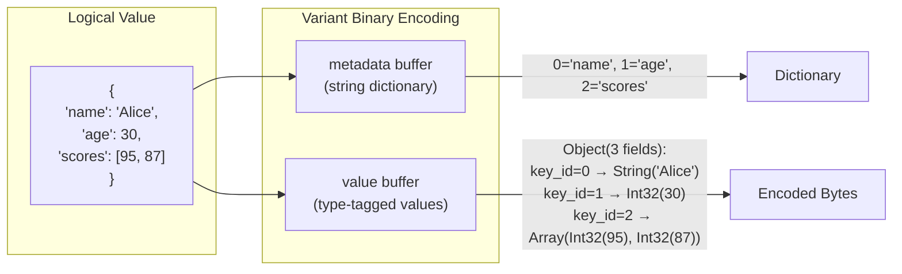
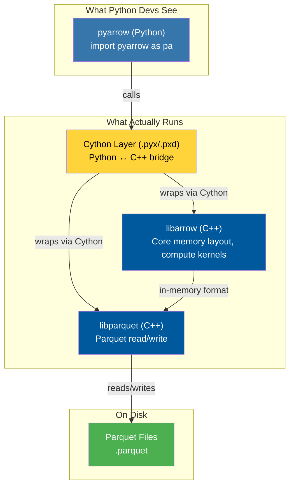
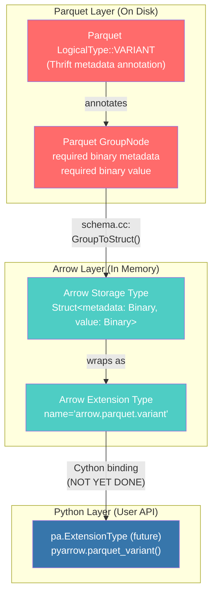
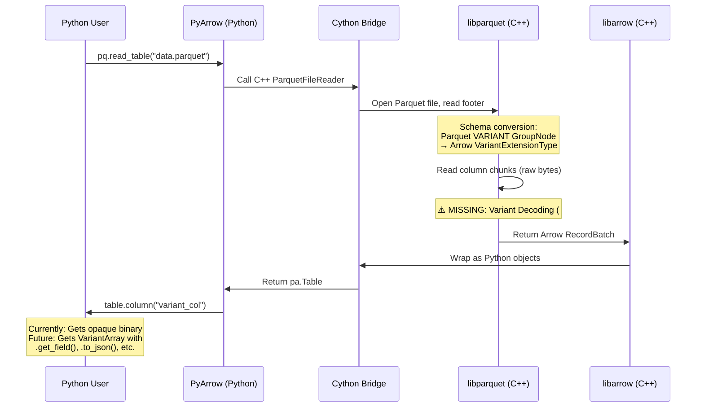
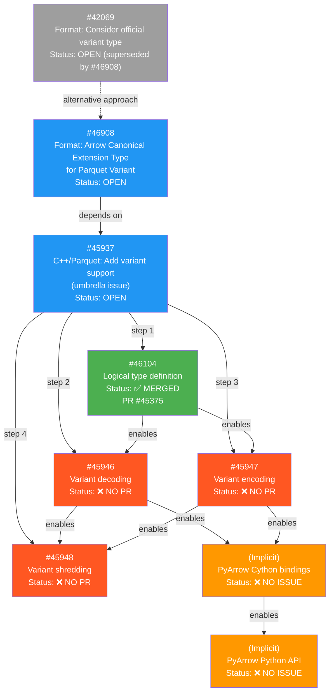
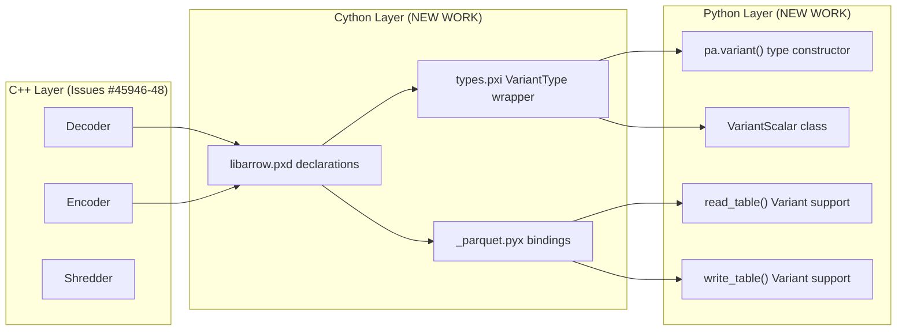
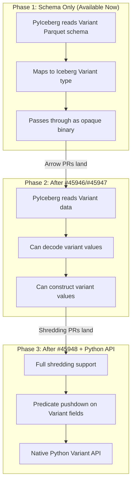

# PyArrow Variant Type: Architectural Analysis & Implementation Status

> **Last Updated**: 2026-06-04
> **Goal**: Understand the state of Variant in `apache/arrow` to unblock Variant in PyIceberg (`apache/iceberg-python`)
> **Audience**: Python developer with limited C++/Rust background

---

## Table of Contents

1. [Executive Summary](#1-executive-summary)
2. [First Principles: What is a Variant?](#2-first-principles-what-is-a-variant)
3. [The Arrow Monorepo: Architecture for Python Developers](#3-the-arrow-monorepo-architecture-for-python-developers)
4. [Canonical vs Extension Types: The Type Theory](#4-canonical-vs-extension-types-the-type-theory)
5. [The Implementation Stack: From Parquet to PyArrow](#5-the-implementation-stack-from-parquet-to-pyarrow)
6. [Issue Dependency Graph & Current Status](#6-issue-dependency-graph--current-status)
7. [What Issue #46104 Did (And Why It Matters)](#7-what-issue-46104-did-and-why-it-matters)
8. [Remaining Work: Issues #45946, #45947, #45948](#8-remaining-work-issues-45946-45947-45948)
9. [Beyond the Three Issues: The Full Path to PyArrow API](#9-beyond-the-three-issues-the-full-path-to-pyarrow-api)
10. [Mathematical Formalism: Variant as an Algebraic Data Type](#10-mathematical-formalism-variant-as-an-algebraic-data-type)
11. [Contributor Guide: How to Submit the PRs](#11-contributor-guide-how-to-submit-the-prs)
12. [Impact on PyIceberg](#12-impact-on-pyiceberg)

---

## 1. Executive Summary

**Current Status**: The Arrow Variant implementation is approximately **30-40% complete**. The foundational type system work is done, but the critical data path (encoding/decoding/shredding) and all Python bindings remain unimplemented.

**What's Done** (✅):
- Parquet `VARIANT` logical type definition in C++ Thrift layer (#46104 via PR #45375)
- Arrow `VariantExtensionType` C++ class (canonical extension type for in-memory representation)
- Parquet → Arrow schema conversion (reading a Variant-typed Parquet schema produces an Arrow `VariantExtensionType`)
- Arrow → Parquet schema conversion (writing an Arrow `VariantExtensionType` produces a Parquet VARIANT group)
- Go implementation reference (arrow-go by @zeroshade)

**What's NOT Done** (❌):
- **#45946**: Variant binary decoding (Parquet bytes → structured Arrow arrays) — **No PR**
- **#45947**: Variant binary encoding (Arrow arrays → Parquet bytes) — **No PR**
- **#45948**: Variant shredding (column-level decomposition for query optimization) — **No PR**
- **#46908**: Formal Arrow Canonical Extension Type specification (format-level standard)
- **PyArrow bindings**: No Python-level `pa.variant()` type, no Cython wrappers
- **PyArrow read/write**: Cannot read/write Variant Parquet files from Python

**Bottom Line for PyIceberg**: You **cannot** currently use PyArrow to read or write Variant-typed Parquet files. The schema plumbing exists, but without the encoder/decoder (#45946/#45947), data cannot flow through the system. There are at minimum **5-6 PRs** needed before PyArrow has usable Variant support, not just 3.

---

## 2. First Principles: What is a Variant?

### 2.1 The Problem: Semi-Structured Data in Columnar Storage

Columnar formats like Parquet are optimized for **homogeneous** data — every value in a column has the same type. But real-world data (JSON APIs, event logs, IoT telemetry) is often **heterogeneous**: a field might be a string in one row, a number in another, and a nested object in a third.

### 2.2 Formal Definition

A Variant is a **tagged union** (also called a sum type) over a finite set of primitive types, plus recursive composition via arrays and objects.

**Definition (Variant Value Space)**: Let `V` be the set of all valid Variant values. Then:

```
V = Null
  | Boolean
  | Int8 | Int16 | Int32 | Int64
  | Float | Double
  | Decimal4 | Decimal8 | Decimal16
  | Date | Timestamp | TimestampNTZ
  | Binary | String
  | Array(V*)          — ordered sequence of Variant values
  | Object(String → V) — unordered map of string keys to Variant values
```

In type theory notation, this is a **recursive algebraic data type (ADT)**:

```
V ≅ 1 + 𝔹 + ℤ₈ + ℤ₁₆ + ℤ₃₂ + ℤ₆₄ + 𝔽₃₂ + 𝔽₆₄ + ... + V* + (String × V)*
```

The `≅` (isomorphism) is critical: the **encoding** is an **injection** from this mathematical space into `byte[]`, and the **decoding** is the corresponding **surjection** back. Correctness requires that `decode(encode(v)) = v` for all `v ∈ V` — this is the **round-trip invariant** that every test must verify.

### 2.3 Binary Encoding: Two Buffers

A Variant is encoded as two binary blobs:

| Buffer | Purpose | Analogy for Python Devs |
|--------|---------|------------------------|
| **metadata** | Dictionary of all string keys used anywhere in the value | Like Python's `sys.intern()` — a string pool |
| **value** | The actual data, using indices into the metadata dictionary | Like a `pickle` bytestream, but simpler |

**Why two buffers?** This is a space optimization based on the **pigeonhole principle**: in deeply nested JSON, the same keys ("id", "name", "timestamp") repeat across every object. By interning them once in metadata, each occurrence in the value buffer costs only `O(log n)` bits (an index) instead of `O(k)` bytes (the full string).



---

## 3. The Arrow Monorepo: Architecture for Python Developers

### 3.1 Why a Monorepo with C++?

The `apache/arrow` repository is a **monorepo** containing implementations in multiple languages. The key insight is the **layered architecture**:



**Python analogy**: Think of it like:
- `libarrow` (C++) = NumPy's C core that does actual array operations
- `libparquet` (C++) = The Parquet I/O engine (like `pandas.read_parquet` internals)
- Cython layer = The `_cython_` modules that bridge Python objects to C pointers
- `pyarrow` (Python) = The nice `pa.Table`, `pa.array()` API you actually use

### 3.2 Directory Structure Map

```
apache/arrow/
├── format/                    # Arrow IPC format specification (Flatbuffers)
├── cpp/
│   └── src/
│       ├── arrow/             # libarrow - core Arrow C++ library
│       │   ├── type.h/cc      # Arrow type definitions (Int32, String, etc.)
│       │   ├── extension_type.h  # ExtensionType base class
│       │   ├── extension/     # Canonical extension type implementations
│       │   │   ├── parquet_variant.h/cc  # ← THE VARIANT EXTENSION TYPE
│       │   │   ├── uuid.h/cc
│       │   │   └── json.h/cc
│       │   └── ...
│       └── parquet/           # libparquet - Parquet I/O library
│           ├── types.h/cc     # Parquet logical types (including VARIANT)
│           └── arrow/         # Parquet ↔ Arrow conversion bridge
│               ├── schema.cc  # Schema conversion (Parquet ↔ Arrow types)
│               └── variant_test.cc
├── python/
│   └── pyarrow/               # PyArrow Python package
│       ├── includes/
│       │   └── libarrow.pxd   # Cython declarations for C++ classes
│       ├── types.pxi          # Python type wrappers
│       ├── _parquet.pyx       # Cython Parquet bindings
│       └── tests/
└── ...
```

### 3.3 What "C++ Implementation" Means for a Python Developer

When you see "C++ implementation needed," here's the mental model:

| Concept | Python Equivalent | C++ Reality |
|---------|-------------------|-------------|
| Class definition | `class Foo:` | `class Foo { ... };` in `.h`, implemented in `.cc` |
| Memory management | GC handles it | `std::shared_ptr<>` reference counting (like Python's refcount!) |
| Error handling | `raise ValueError(...)` | `return Status::Invalid(...)` or `Result<T>` |
| Generics | `list[int]` | `template <typename T>` |
| Build system | `pip install` | CMake → compile → link |
| Testing | `pytest` | Google Test (`TEST(...)`) |

The C++ code uses RAII (Resource Acquisition Is Initialization) — **constructors acquire resources, destructors release them**. In Python terms: every `__init__` has an implicit `__del__` that C++ guarantees will run, even on exceptions. `std::shared_ptr` is essentially Python's reference counting (`sys.getrefcount()`), just explicit.

---

## 4. Canonical vs Extension Types: The Type Theory

This is the concept that causes the most confusion. Let me explain it rigorously.

### 4.1 Arrow's Type System: Built-in vs Extension

Arrow defines a **fixed set of built-in types** in its format specification (Int32, String, Binary, Struct, List, etc.). These are baked into every Arrow implementation worldwide. Adding a new built-in type requires changing the Arrow format spec — a multi-year, cross-language coordination effort.

**Extension types** are Arrow's escape hatch: a way to give **semantic meaning** to data that's **physically stored** using existing built-in types.

**Formal Definition**: An extension type `E` is a triple:

```
E = (name: String, storage_type: ArrowType, serialized_params: bytes)
```

Where:
- `name` is a globally unique identifier (e.g., `"arrow.parquet.variant"`)
- `storage_type` is how the data is physically laid out in memory (e.g., `Struct<metadata: Binary, value: Binary>`)
- `serialized_params` encodes any type-specific parameters

**Python analogy**: It's like Python's `__class__` attribute. You can have two objects with identical `__dict__` contents, but different `__class__` gives them different behavior:

```python
# This is what extension types do conceptually:

class RawStruct:
    """Just a struct with metadata and value fields"""
    def __init__(self, metadata: bytes, value: bytes):
        self.metadata = metadata
        self.value = value

class Variant(RawStruct):
    """Same physical layout, but now we KNOW it's a Variant"""
    def get_field(self, path: str) -> Any:
        return decode_variant(self.metadata, self.value, path)
```

### 4.2 Canonical Extension Types

**Canonical** extension types are the **officially standardized** ones — blessed by the Arrow project. They have guaranteed names and semantics across all implementations. Current canonical extensions include:

| Extension Name | Storage Type | Purpose |
|---------------|-------------|---------|
| `arrow.uuid` | `FixedSizeBinary(16)` | UUID values |
| `arrow.json` | `String` or `LargeString` | JSON text |
| `arrow.bool8` | `Int8` | Boolean as full byte |
| `arrow.opaque` | varies | Unknown types |
| `arrow.fixed_shape_tensor` | `FixedSizeList` | ML tensors |

**The Variant Question**: Issue [#42069](https://github.com/apache/arrow/issues/42069) asked whether Variant should be a **built-in format type** (like adding `INT32`). Issue [#46908](https://github.com/apache/arrow/issues/46908) is the alternative: make it a **canonical extension type** (like UUID).

The community chose **canonical extension type** because:

1. **Backward compatibility**: Old Arrow readers can still read the data (they see a `Struct<metadata, value>`)
2. **No format change needed**: The Arrow IPC format doesn't need updating
3. **Faster to implement**: Only the C++ library and language bindings need changes, not every Arrow implementation worldwide

The Variant's extension name is: **`arrow.parquet.variant`**

This means it lives in the `arrow::extension` namespace and the C++ class is `VariantExtensionType`.

### 4.3 The Type Layering Diagram



**Key insight**: The Parquet VARIANT logical type and the Arrow extension type are **not the same thing**, but they are **bijectively mapped** through the schema conversion code in `schema.cc`. The Parquet type lives on disk; the Arrow type lives in memory. The conversion functions (`GroupToStruct` and `VariantToNode`) are the **isomorphisms** between these two representations.

---

## 5. The Implementation Stack: From Parquet to PyArrow

### 5.1 The Full Data Flow

To read a Variant column from a Parquet file in Python, data must flow through this pipeline:



### 5.2 Layer-by-Layer Status

| Layer | Component | Status | What It Does |
|-------|-----------|--------|-------------|
| L0 | Parquet Format Spec | ✅ Done | Defines VARIANT as a Thrift logical type |
| L1 | `parquet::VariantLogicalType` | ✅ Done (#46104) | C++ class representing the Parquet logical type |
| L2 | `arrow::extension::VariantExtensionType` | ✅ Done | C++ class for in-memory Arrow representation |
| L3 | Schema conversion (`schema.cc`) | ✅ Done | Bidirectional Parquet ↔ Arrow schema mapping |
| L4 | Variant Decoder | ❌ Not started (#45946) | Parses variant binary encoding into queryable form |
| L5 | Variant Encoder | ❌ Not started (#45947) | Serializes Arrow data into variant binary encoding |
| L6 | Variant Shredding | ❌ Not started (#45948) | Decomposes variants into typed columns for performance |
| L7 | Cython bindings | ❌ Not started | Exposes C++ types to Python |
| L8 | PyArrow Python API | ❌ Not started | `pa.variant()`, `VariantScalar`, etc. |
| L9 | PyArrow Parquet integration | ❌ Not started | Read/write Variant columns in `.parquet` files |

---

## 6. Issue Dependency Graph & Current Status

### 6.1 The Dependency DAG



### 6.2 Key People

| Person | Role | Context |
|--------|------|---------|
| @CurtHagenlocher | Original proposer | Filed #42069 for native Arrow format support |
| @alamb | Arrow PMC / DataFusion lead | Filed #46908 for canonical extension approach |
| @zeroshade | Arrow Go maintainer | Wrote the reference implementation + formal proposal doc |
| @neilechao | Implementer | Filed #45937 umbrella + subtasks, did #46104 |
| @wgtmac | Assignee on #45937 | Parquet C++ maintainer |

---

## 7. What Issue #46104 Did (And Why It Matters)

Issue [#46104](https://github.com/apache/arrow/issues/46104), resolved by [PR #45375](https://github.com/apache/arrow/pull/45375), established the **type system foundation**. Here's exactly what it did, explained for a Python developer:

### 7.1 Parquet Side: `VariantLogicalType`

**File**: `cpp/src/parquet/types.h` (lines 500-510)

This is the Parquet-layer type. Think of it as adding a new entry to an enum — telling Parquet "VARIANT is a thing that exists."

```cpp
// Python equivalent:
// class VariantLogicalType(LogicalType):
//     def __init__(self, spec_version=1):
//         self._spec_version = spec_version
//
//     def spec_version(self) -> int:
//         return self._spec_version
```

It added `VARIANT` to the `LogicalType::Type::type` enum (line 164 in `types.h`) and implemented `VariantLogicalType::Make()` which creates a `VARIANT` annotation that gets written into Parquet file metadata (the Thrift footer).

### 7.2 Arrow Side: `VariantExtensionType`

**File**: `cpp/src/arrow/extension/parquet_variant.h` + `.cc`

This is the Arrow in-memory representation. It extends `ExtensionType` (Arrow's plugin mechanism for custom types):

```cpp
// Python-equivalent pseudocode:
class VariantExtensionType(pa.ExtensionType):
    extension_name = "arrow.parquet.variant"

    def __init__(self, storage_type):
        # storage_type must be Struct<metadata: Binary, value: Binary>
        assert storage_type == pa.struct([
            pa.field("metadata", pa.binary(), nullable=False),
            pa.field("value", pa.binary(), nullable=False),
        ])
        self._metadata_field = storage_type.field("metadata")
        self._value_field = storage_type.field("value")
        # Note: TODO GH-45948 will add shredded_value field

    @staticmethod
    def is_supported_storage_type(storage_type) -> bool:
        """Validates that the struct has exactly metadata + value fields"""
        # Currently only supports UNSHREDDED variants
        ...

    def serialize(self) -> bytes:
        return b""  # No parameters needed (for now)

    @classmethod
    def deserialize(cls, storage_type, serialized) -> 'VariantExtensionType':
        return cls(storage_type)
```

### 7.3 Bridge: Schema Conversion

**File**: `cpp/src/parquet/arrow/schema.cc`

Two critical functions were added:

1. **`GroupToStruct`** (line 602-610): When reading a Parquet file, if a GroupNode has `VARIANT` logical type, wrap the resulting Arrow struct type with `VariantExtensionType`:

```python
# Pseudocode for what schema.cc does:
def parquet_group_to_arrow_type(group_node):
    arrow_struct = convert_children_to_arrow_struct(group_node)
    if group_node.logical_type == VARIANT:
        return VariantExtensionType(arrow_struct)
    return arrow_struct
```

2. **`VariantToNode`** (lines 133-151): When writing, convert an Arrow `VariantExtensionType` back to a Parquet GroupNode with `VARIANT` annotation:

```python
# Pseudocode:
def arrow_variant_to_parquet_node(variant_type, name, nullable):
    metadata_node = field_to_parquet("metadata", variant_type.metadata_field)
    value_node = field_to_parquet("value", variant_type.value_field)
    return GroupNode(name, nullable, [metadata_node, value_node],
                     logical_type=LogicalType.Variant())
```

### 7.4 Why This Matters

Without #46104, the entire type system was unaware of Variant. Now:
- A Parquet file with a VARIANT column can be opened and its schema inspected
- The Arrow schema correctly reflects that it's a Variant (not just a plain struct)
- Write path knows how to produce correct Parquet metadata

But you **still can't read or write the actual data** — the schema says "this is a Variant" but no code knows how to interpret the bytes inside `metadata` and `value`.

---

## 8. Remaining Work: Issues #45946, #45947, #45948

### 8.1 Issue #45946: Variant Decoding

**What it needs to do**: Parse the two binary buffers (`metadata` + `value`) according to the [Variant Encoding Spec](https://github.com/apache/parquet-format/blob/master/VariantEncoding.md) and make the contents queryable.

**Formal specification**:

```
decode: (metadata: byte[], value: byte[]) → V
```

Where `V` is the Variant ADT defined in Section 2.2.

**Metadata decoding** involves parsing:
1. Header byte: version (4 bits) + sorted flag (1 bit) + offset_size (2 bits)
2. Dictionary size: `offset_size` bytes, little-endian unsigned
3. String offsets: `(dict_size + 1)` × `offset_size` bytes
4. String data: UTF-8 encoded strings concatenated

```
metadata_decode(bytes) = {
    version: bytes[0] & 0x0F,           -- Must be 1
    sorted:  (bytes[0] >> 4) & 0x01,    -- Boolean
    offset_size: ((bytes[0] >> 6) & 0x03) + 1,  -- 1, 2, 3, or 4
    strings: [s₀, s₁, ..., sₙ₋₁]       -- Decoded from offsets + data
}
```

**Value decoding** is recursive:
- Each value starts with a header byte encoding `basic_type` (2 bits) and type-specific info (6 bits)
- Primitive values are inline
- Objects and Arrays use offsets for random access

**Implementation approach** (C++):

```cpp
// Conceptual structure (Python-equivalent pseudocode):
class VariantDecoder:
    def decode_metadata(self, buf: bytes) -> VariantMetadata:
        header = buf[0]
        version = header & 0x0F
        assert version == 1, "Unsupported variant version"
        offset_size = ((header >> 6) & 0x03) + 1
        dict_size = int.from_bytes(buf[1:1+offset_size], 'little')
        # ... parse offsets and strings
        return VariantMetadata(strings=[...])

    def decode_value(self, metadata: VariantMetadata, buf: bytes) -> VariantValue:
        header = buf[0]
        basic_type = header & 0x03  # 0=primitive, 1=short_string, 2=object, 3=array
        if basic_type == 0:
            return self._decode_primitive(header, buf[1:])
        elif basic_type == 1:
            length = (header >> 2) & 0x3F
            return VariantString(buf[1:1+length].decode('utf-8'))
        elif basic_type == 2:
            return self._decode_object(metadata, header, buf)
        elif basic_type == 3:
            return self._decode_array(metadata, header, buf)
```

**Estimated complexity**: ~800-1200 lines of C++ (including tests). This is the most algorithmically intensive of the three remaining issues.

### 8.2 Issue #45947: Variant Encoding

**What it needs to do**: The reverse of decoding — take structured data and serialize it into the two-buffer variant encoding.

```
encode: V → (metadata: byte[], value: byte[])
```

**Key algorithmic challenges**:

1. **String interning**: Build the metadata dictionary by collecting all unique string keys across the entire value tree:

```
collect_keys: V → Set(String)
collect_keys(Primitive(_)) = ∅
collect_keys(Array(vs)) = ⋃ᵢ collect_keys(vᵢ)
collect_keys(Object(kvs)) = {k | (k, _) ∈ kvs} ∪ ⋃ᵢ collect_keys(vᵢ)
```

2. **Offset calculation**: Compute byte offsets for random-access navigation of nested structures. This requires a two-pass algorithm:
   - Pass 1: Compute sizes of all sub-values (bottom-up)
   - Pass 2: Write bytes with correct offsets (top-down)

3. **Offset size optimization**: Choose the minimum `offset_size` (1, 2, 3, or 4 bytes) that can address all data — a form of **entropy coding**.

**Estimated complexity**: ~600-900 lines of C++.

### 8.3 Issue #45948: Variant Shredding

**What it needs to do**: Decompose a Variant column into separate typed Parquet columns for query performance.

**Formal definition**: Shredding is a **projection** from the variant value space to typed column space:

```
shred: V → (metadata: byte[],
            value: Optional[byte[]],        -- fallback for non-shredded values
            typed_value: Optional[T])        -- shredded typed column

-- Invariant: for each row, exactly one of:
--   (value ≠ null, typed_value = null)  → value is not of shredded type
--   (value = null, typed_value ≠ null)  → value matches shredded type
--   (value = null, typed_value = null)  → value is missing (object fields only)
--   (value ≠ null, typed_value ≠ null)  → partially shredded object
```

**Why shredding matters for performance** (CS theory: **column pruning**):

Without shredding, to read a single field from a Variant, you must:
1. Load the entire `value` binary blob
2. Parse the variant encoding
3. Navigate to the desired field

With shredding, frequently accessed fields become regular Parquet columns, enabling:
- **Column pruning**: Only read the columns you need → O(1) per field vs O(n) for full variant
- **Predicate pushdown**: Use Parquet statistics to skip row groups
- **Encoding efficiency**: Typed columns use type-specific encodings (delta, dictionary, RLE)

**Estimated complexity**: ~1000-1500 lines of C++. This is the most complex issue and depends on #45946 and #45947.

**Note**: The current `VariantExtensionType` has a TODO comment (line 73 of `parquet_variant.h`):
```cpp
// TODO GH-45948 added shredded_value
```

This will require expanding the storage type to support optional `typed_value` fields.

---

## 9. Beyond the Three Issues: The Full Path to PyArrow API

### 9.1 The Complete Work Items

Even after #45946, #45947, and #45948 are done, PyArrow still needs additional work:



### 9.2 Detailed Work Breakdown

#### Work Item A: Cython Declarations (libarrow.pxd)

Add C++ class declarations so Cython knows about `VariantExtensionType`:

```cython
# In python/pyarrow/includes/libarrow.pxd (conceptual):
cdef extern from "arrow/extension/parquet_variant.h" namespace "arrow::extension":
    cdef cppclass CVariantExtensionType "arrow::extension::VariantExtensionType"(CExtensionType):
        CVariantExtensionType(shared_ptr[CDataType] storage_type)
        c_string extension_name()
        shared_ptr[CField] metadata()
        shared_ptr[CField] value()

        @staticmethod
        CResult[shared_ptr[CDataType]] Make(shared_ptr[CDataType] storage_type)

        @staticmethod
        c_bool IsSupportedStorageType(shared_ptr[CDataType] storage_type)
```

#### Work Item B: Python Type Wrapper

```python
# Conceptual PyArrow API (what it would look like):
import pyarrow as pa

# Creating a variant type
variant_type = pa.variant()  # Unshredded, default storage

# Reading Parquet with Variant columns
table = pq.read_table("events.parquet")
variant_col = table.column("event_data")  # Returns VariantArray

# Accessing variant data
for variant_value in variant_col:
    # variant_value is a VariantScalar
    event_type = variant_value.get("event_type")  # Returns Python str/int/etc.
    nested = variant_value.get("payload.user.name")  # Path navigation
    as_dict = variant_value.to_pydict()  # Full materialization
```

#### Work Item C: Parquet I/O Integration

The Parquet reader/writer needs to understand how to serialize/deserialize the `VariantExtensionType` — this is where the decoder (#45946) and encoder (#45947) get wired into the read/write pipeline.

### 9.3 Estimated Total Remaining Work

| Work Item | Issues | Estimated LOC | Estimated Effort |
|-----------|--------|---------------|-----------------|
| Variant Decoder | #45946 | ~1000 C++ | 2-3 weeks |
| Variant Encoder | #45947 | ~800 C++ | 2-3 weeks |
| Variant Shredding | #45948 | ~1200 C++ | 3-4 weeks |
| Cython Bindings | (new issue needed) | ~200 Cython | 1 week |
| PyArrow Python API | (new issue needed) | ~500 Python | 1-2 weeks |
| Tests & Integration | included above | ~1000 mixed | included |
| **Total** | | **~4700** | **~10-14 weeks** |

---

## 10. Mathematical Formalism: Variant as an Algebraic Data Type

### 10.1 Category-Theoretic View

The Variant type forms a **free monad over a polynomial functor**. More concretely:

Let `P` be the set of primitive types: `P = {Null, Bool, Int8, ..., String, Binary}`

The Variant functor `F` is:
```
F(X) = P + X* + (String × X)*
```
Where `X*` is the Kleene star (finite sequences) and `(String × X)*` is finite maps.

The Variant type `V` is the **least fixed point** of `F`:
```
V = μX. F(X) = μX. P + X* + (String × X)*
```

This is significant because it guarantees:
- **Structural induction**: Any proof about Variants can proceed by cases on the constructor (Primitive/Array/Object)
- **Termination**: All variant values are finite (no infinite recursion)
- **Catamorphism existence**: Any function `V → R` can be uniquely defined by specifying how to handle each constructor

### 10.2 Encoding as an Injection

The encoding function `enc: V → byte[]` must satisfy:

1. **Injectivity**: `enc(v₁) = enc(v₂) ⟹ v₁ = v₂` (lossless encoding)
2. **Computability**: `enc` is total and computable
3. **Self-describing**: `dec(enc(v))` can determine the type without external schema
4. **Compositionality**: For arrays/objects, `enc(Array([v₁, v₂])) = header ∘ enc(v₁) ∘ enc(v₂) ∘ offsets`

### 10.3 Shredding as a Natural Transformation

Shredding can be formalized as a **natural transformation** between functors:

```
shred: Variant^n → (Binary^n × Optional[T]^n)
```

This preserves the **naturality condition**: for any morphism `f: V → V'`, shredding commutes with the transformation. In practice, this means shredding is purely structural and doesn't depend on the actual values — only on their types.

The key **information-theoretic** constraint is:
```
H(variant) = H(value) + H(typed_value)
```
No information is lost; it's redistributed across columns. This is a consequence of the shredding invariant table in the spec.

### 10.4 Complexity Analysis

| Operation | Unshredded | Shredded |
|-----------|-----------|----------|
| Full scan | O(N × avg_size) | O(N × avg_size) |
| Single field access | O(N × avg_size) | O(N × field_size) |
| Type-filtered query | O(N × avg_size) | O(N × 1) via stats |
| Storage overhead | 1× | ~1.05× (offset overhead) |

Where `N` = number of rows, `avg_size` = average variant size in bytes, `field_size` = average shredded field size.

The shredding advantage comes from **column pruning**: reading only the needed columns reduces I/O by a factor of `avg_size / field_size`, which for typical JSON data (where you access 1-2 fields out of 20+) is a **10-20× speedup**.

---

## 11. Contributor Guide: How to Submit the PRs

### 11.1 Development Environment Setup

```bash
# Clone the repo (you already have it)
cd /Users/jaredyu/Desktop/open_source/arrow

# Build C++ with Parquet support
mkdir -p cpp/build && cd cpp/build
cmake .. -DARROW_PARQUET=ON \
         -DARROW_PYTHON=ON \
         -DARROW_BUILD_TESTS=ON \
         -DCMAKE_BUILD_TYPE=Debug
make -j$(sysctl -n hw.ncpu)

# Run variant tests to verify baseline
./debug/parquet-arrow-variant-test

# Build PyArrow (after C++ is built)
cd ../../python
pip install -e ".[test]" --no-build-isolation
```

### 11.2 PR Strategy: Recommended Order

Given your Python background, here's a strategic ordering:

1. **Start with the Cython/Python layer for the existing extension type** — this is mostly Python/Cython work that doesn't require C++ expertise, and gets you familiar with the codebase structure.

2. **Then tackle #45946 (Decoder)** — this is the most self-contained C++ work. The spec is well-defined, and there's a Go reference implementation to study.

3. **Then #45947 (Encoder)** — largely the reverse of the decoder, benefiting from your decoder experience.

4. **Finally #45948 (Shredding)** — the most complex, builds on both encoder and decoder.

### 11.3 Reference Implementations to Study

| Language | Repository | Key Files |
|----------|-----------|-----------|
| Go | [apache/arrow-go](https://github.com/apache/arrow-go) | Commit `5240503` — full Variant extension type implementation |
| Spark (Java) | [apache/spark](https://github.com/apache/spark) | `common/variant/` — the original Variant implementation |

### 11.4 Code Style & Conventions

The Arrow C++ codebase follows specific patterns:

```cpp
// Error handling: Use Result<T> or Status, never exceptions
arrow::Result<std::shared_ptr<DataType>> result = VariantExtensionType::Make(storage);
ARROW_ASSIGN_OR_RAISE(auto variant_type, result);  // macro for error propagation

// Memory: Use shared_ptr everywhere
std::shared_ptr<Buffer> metadata_buf = ...;

// Testing: Google Test with Arrow helpers
TEST(VariantDecoding, BasicPrimitive) {
    // Build test variant bytes
    auto metadata = BuildTestMetadata({});
    auto value = BuildPrimitiveValue(42);
    ASSERT_OK_AND_ASSIGN(auto decoded, DecodeVariant(metadata, value));
    ASSERT_EQ(decoded.type(), VariantType::INT32);
    ASSERT_EQ(decoded.as_int32(), 42);
}
```

### 11.5 Key Files You'll Modify

| File | Layer | What to Add |
|------|-------|------------|
| `cpp/src/arrow/extension/parquet_variant.h` | Arrow C++ | Decoder/encoder API, expanded storage type for shredding |
| `cpp/src/arrow/extension/parquet_variant.cc` | Arrow C++ | Implementation |
| `cpp/src/parquet/arrow/variant_test.cc` | Tests | Decode/encode/shred tests |
| `python/pyarrow/includes/libarrow.pxd` | Cython | C++ class declarations |
| `python/pyarrow/types.pxi` | Cython/Python | `VariantType` Python class |
| `python/pyarrow/tests/test_types.py` | Python tests | Python API tests |

---

## 12. Impact on PyIceberg

### 12.1 What PyIceberg Needs

PyIceberg needs to:
1. **Read** Parquet files containing Variant columns into PyArrow tables
2. **Write** PyArrow tables with Variant columns to Parquet
3. **Map** Iceberg's Variant type to/from the PyArrow/Parquet Variant type

### 12.2 Current Blocker

The immediate blocker is simple: **PyArrow cannot decode Variant data from Parquet files**. Even though the schema conversion works (you'd see a `VariantExtensionType` in the schema), the actual binary data in the `metadata` and `value` columns is returned as opaque `pa.BinaryArray` — there's no way to interpret it.

### 12.3 Incremental Path Forward

You don't need to wait for full PyArrow Variant support. A pragmatic path:



**Phase 1** can be implemented now in PyIceberg using the existing `VariantExtensionType`. The data round-trips correctly at the binary level — you just can't inspect the contents from Python yet.

### 12.4 Workaround: Pure-Python Variant Decoder

If you need Variant decoding before the C++ work lands, you could implement a pure-Python decoder. The encoding spec is straightforward enough that a Python implementation is feasible (though ~100× slower than C++):

```python
# Sketch of a pure-Python variant decoder
import struct

def decode_variant_metadata(buf: bytes) -> dict:
    header = buf[0]
    version = header & 0x0F
    assert version == 1
    offset_size = ((header >> 6) & 0x03) + 1
    dict_size = int.from_bytes(buf[1:1+offset_size], 'little')

    offsets = []
    pos = 1 + offset_size
    for i in range(dict_size + 1):
        offsets.append(int.from_bytes(buf[pos:pos+offset_size], 'little'))
        pos += offset_size

    strings = []
    string_data_start = pos
    for i in range(dict_size):
        start = string_data_start + offsets[i]
        end = string_data_start + offsets[i + 1]
        strings.append(buf[start:end].decode('utf-8'))

    return {"version": version, "strings": strings}

def decode_variant_value(metadata: dict, buf: bytes, offset: int = 0):
    header = buf[offset]
    basic_type = header & 0x03

    if basic_type == 0:  # Primitive
        ptype = (header >> 2) & 0x3F
        if ptype == 0:  return None           # null
        elif ptype == 1: return True           # true
        elif ptype == 2: return False          # false
        elif ptype == 5: return struct.unpack_from('<i', buf, offset + 1)[0]  # int32
        elif ptype == 6: return struct.unpack_from('<q', buf, offset + 1)[0]  # int64
        elif ptype == 7: return struct.unpack_from('<d', buf, offset + 1)[0]  # double
        # ... more types
    elif basic_type == 1:  # Short string
        length = (header >> 2) & 0x3F
        return buf[offset+1:offset+1+length].decode('utf-8')
    elif basic_type == 2:  # Object
        # ... parse object with field IDs from metadata
        pass
    elif basic_type == 3:  # Array
        # ... parse array elements recursively
        pass
```

This could live in PyIceberg as a temporary bridge until the Arrow C++ work lands.

---

## Appendix A: Complete Issue Cross-Reference

| Issue | Title | Status | Depends On | PR |
|-------|-------|--------|-----------|-----|
| [#42069](https://github.com/apache/arrow/issues/42069) | [Format] Consider adding official variant type | Open (superseded) | — | — |
| [#46908](https://github.com/apache/arrow/issues/46908) | [Format] Add Arrow Canonical Extension Type for Parquet Variant | Open | #45937 | — |
| [#45937](https://github.com/apache/arrow/issues/45937) | [C++][Parquet] Add variant support (umbrella) | Open | — | — |
| [#46104](https://github.com/apache/arrow/issues/46104) | [C++][Parquet] Logical type definition for variant | ✅ Closed | — | [#45375](https://github.com/apache/arrow/pull/45375) |
| [#45946](https://github.com/apache/arrow/issues/45946) | [C++][Parquet] Variant decoding | Open | #46104 | None |
| [#45947](https://github.com/apache/arrow/issues/45947) | [C++][Parquet] Variant encoding | Open | #46104 | None |
| [#45948](https://github.com/apache/arrow/issues/45948) | [C++][Parquet] Variant shredding | Open | #45946, #45947 | None |

## Appendix B: Key Commits in Arrow Repository

| Commit | Description |
|--------|-------------|
| `68f1a0f4e0` | GH-45937: [C++][Parquet] Variant logical type definition (#45375) |
| `ca21204cb7` | GH-47241: [C++][Parquet] Fix VariantExtensionType conversion (#47242) |
| `e04fafb124` | GH-47838: [C++][Parquet] Set Variant spec version to 1 |
| `a82edf90ce` | GH-49081: [C++][Parquet] Correct variant's extension name |
| `a6b45b6d65` | GH-49081: [C++][Parquet][FOLLOWUP] Correct variant's extension name |

## Appendix C: Glossary

| Term | Definition |
|------|-----------|
| **ADT (Algebraic Data Type)** | A composite type formed by combining types with sum (OR) and product (AND) operations |
| **Canonical Extension Type** | An officially standardized Arrow extension type with guaranteed cross-language interoperability |
| **Catamorphism** | A generalization of fold — a function that recursively destructs an ADT |
| **Extension Type** | A mechanism to attach semantic meaning to Arrow data without changing the physical layout |
| **Injection** | A function where distinct inputs always produce distinct outputs (lossless) |
| **Logical Type** | Parquet's annotation system — adds semantic meaning (e.g., "this INT32 is actually a DATE") |
| **Monorepo** | A single repository containing multiple projects/languages |
| **Shredding** | Decomposing semi-structured data into separate typed columns for performance |
| **Storage Type** | The underlying Arrow type that physically holds the data for an extension type |
| **Thrift** | The serialization framework Parquet uses for file metadata |
